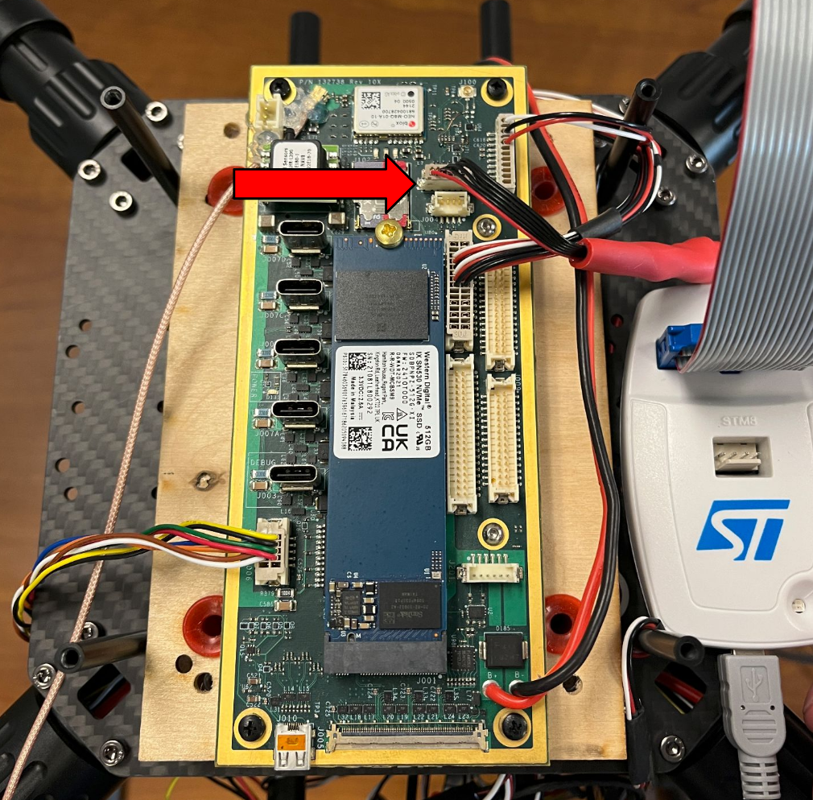
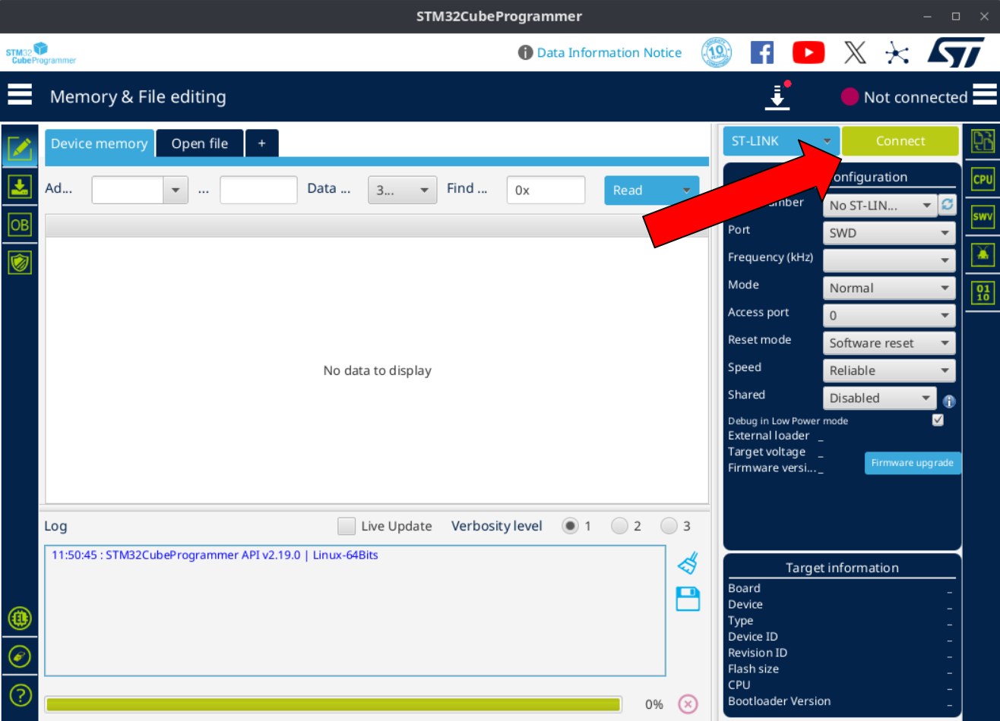
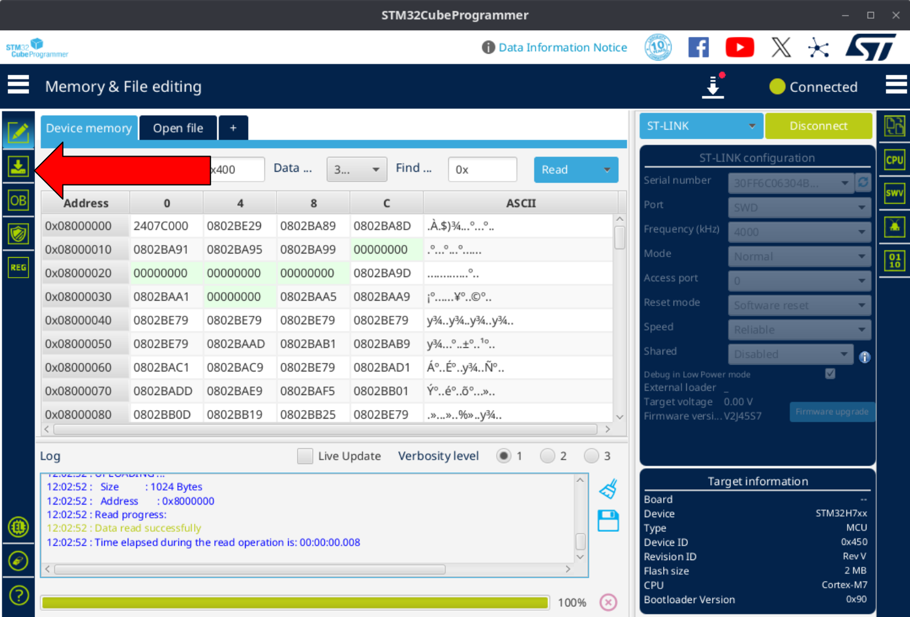
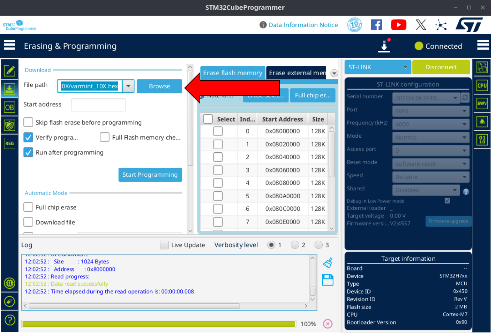
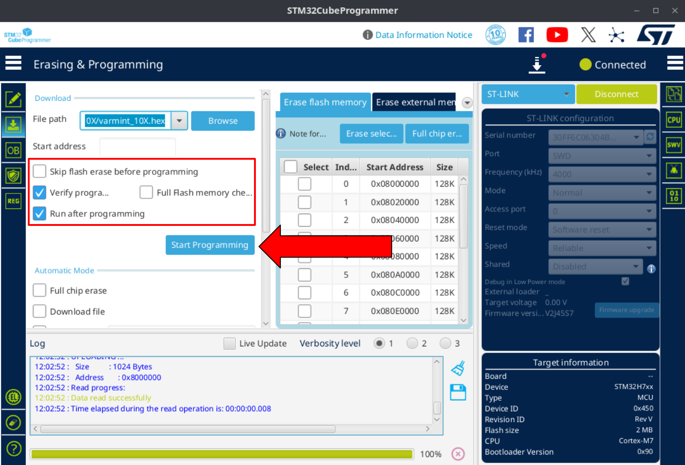
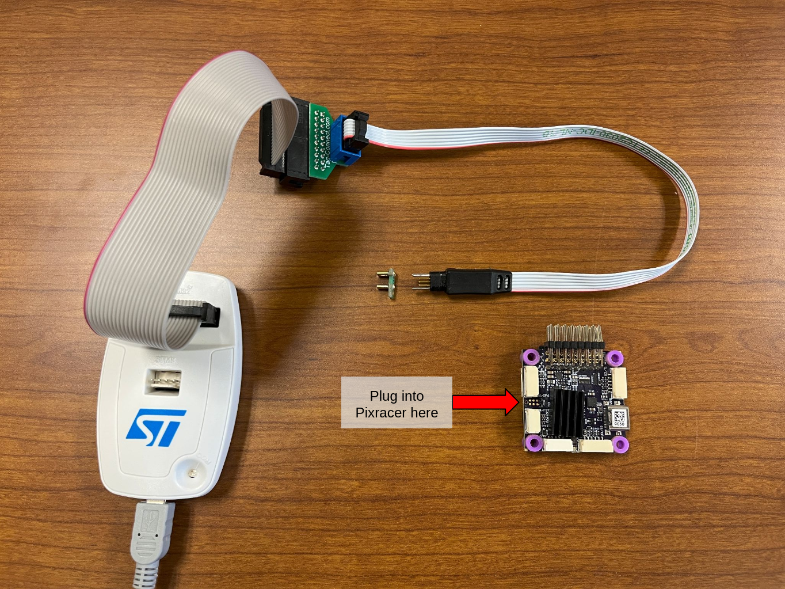

# Building and Flashing the Firmware


This guide assumes you are running Ubuntu 22.04 LTS, which is the currently supported development environment.

## Installing the ARM Embedded Toolchain

``` bash
sudo apt install gcc-arm-none-eabi
```

You can test the installation and check which version is installed by running `arm-none-eabi-gcc --version`.

## Building the Firmware from Source

1. To build the firmware, first clone the firmware repository:
    ```bash
    git clone --recursive https://github.com/rosflight/rosflight_firmware
    ```
1. Create build directory:
    ```bash
    cd rosflight_firmware && mkdir build && cd build
    ```
1. Build using: (`board_name` should be either `varmint` or `pixracer_pro`)
    ```bash
    cmake .. -DBOARD_TO_BUILD=<board_name> && make -j
    ```

## Flashing firmware

### Install STM32CubeProgrammer

We use the STM32CubeProgrammer to flash the flight controller.

1. Download the programmer [here](https://www.st.com/en/development-tools/stm32cubeprog.html#get-software).
    You may have to enter your email to download the software.
1. Install the software by following the instructions in the downloaded package.

### Flashing the Varmint

!!! warning "Needed tools"

    You will need an ST-Link STM programmer to flash the firmware.
    We use ST-Link V2, and you can find it [on Mouser](https://www.mouser.com/ProductDetail/STMicroelectronics/ST-LINK-V2?qs=H4BOwPtf9MC1sDQ8j3cy4w%3D%3D&mgh=1&utm_id=22314976717&utm_source=google&utm_medium=cpc&utm_marketing_tactic=amercorp&gad_source=1&gad_campaignid=22304734959).

1. Plug the end of the ribbon cable into the 6-pin slot on the Varmint.
    You may have to make your own cable that connects the ST-Link to the 6-pin connector.

    !!! danger

        The Varmint has 2 6-pin connectors.
        **Do not** connect the ribbon cable to the port closest to the power wires.

    

1. Power on the Varmint by connecting a battery to the board.

1. Open STM32CubeProgrammer.

1. Plug in the USB connector from the ST-Link to the computer. Select "Connect" in the STM32CubeProgrammer. This should detect the ST-Link and connect automatically.
    

1. Navigate to the programming page.
    

1. Select the hex file that was just built and click "Open".
    ```
    /path/to/rosflight_firmware/build/boards/varmint_h7/varmint_10X/varmint10X.hex
    ```
    

1. Select the appropriate options and press "Start Programming"
    

### Flashing the Pixracer Pro

Flashing the Pixracer Pro is a very similar process to flashing the Varmint.

1. The Pixracer Pro does not use the same 6-pin connector to connect to the ST-Link.
    Instead, it uses a TC2030 connector with retaining clips.

    !!! tip "Connectors we use"

        In addition to the ST-Link V2 board linked above, we use these cables to flash the Pixracer Pro:

        1. [20-pin ribbon adapter board](https://www.tag-connect.com/product/arm20-ctx-m) (connect the ST-Link to this adapter)
        2. [Programming cable](https://www.tag-connect.com/product/tc2030-idc-nl) that connects to the adapter board
        3. [TC2030 clip](https://www.tag-connect.com/product/tc2030-retaining-clip-board-3-pack) to attach the programming cable to the board

    

1. Power on the Pixracer Pro using a USB-C port.

2. Follow the instructions from the [Varmint flashing guide](#flashing-the-varmint).
