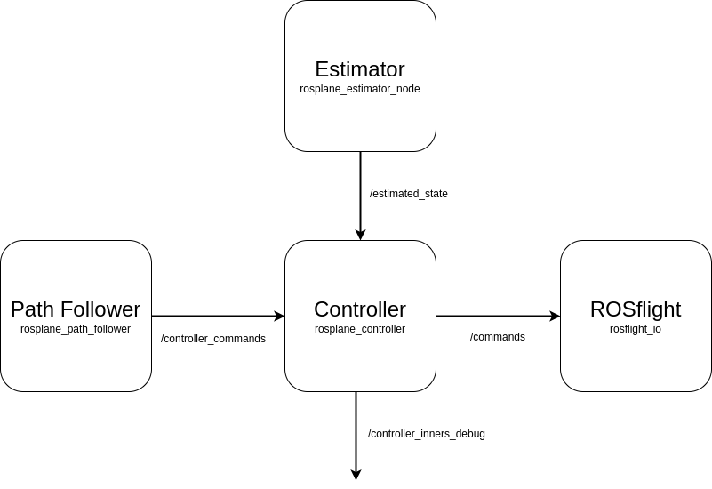

# Controller Base

## Overview

The controller base implements the basic ROS interfaces for the controller.
This includes setting up subscribers, publishers and initializing parameter management.
The idea of the base class, is that all interfacing with ROS and shared resources across all inheritance levels happens or are contained in this class.

## ROS interfaces

The controller base has the following ROS interactions.

|  |
|:--:|
|*Figure 1: Controller's ROS interactions.*|

The controller has four ROS interfaces that are tracked as member variables of the class.
These interfaces are the only points of contact that influence the every layer of the controller along side the node parameters.
Each of the callbacks for the subscribers are also contained in `controller_base`.

| ROS Interface | Topic | Explanation | Message Type |
|:------:|:-------:| :---: | :---: |
| 
`actuators_pub_`
 | `/command` | Publishes the acutator commands for the aircraft. The publishing rate is controller by the `timer_` object. | Command.msg |
| 
`internals_pub_`
 | `/controller_inners_debug` | Publishes the intermediate values created by the outer control loops. Published simultaneously as the commands when there is at least one subscriber to the topic. | ControllerInnersDebug.msg |
| 
`controller_commands_sub_`
 | `/controller_commands` | Subscribes to the commands for the controller. | ControllerCommands.msg |
| 
`vehicle_state_sub_`
 | `/estimated_state` | Subscribes to the estimated state of the aircraft. | State.msg |

Note, the command message is from the `rosflight_msgs` package.

## Parameter Management

<!-- TODO: add info about parameter manager. -->
See the Parameter Management page for more details on how parameter management works.

### List of Parameters

| Parameter | Explanation | Range |
|:--:|:--:|:--:|
| pwm_rad_e | Radian to PWM conversion for the elevator. | $\geq 1.0$ (double) |
| pwm_rad_a | Radian to PWM conversion for the ailerons. | $\geq 1.0$ (double) |
| pwm_rad_r | Radian to PWM conversion for the rudder. | $\geq 1.0$ (double) |
| frequency | Frequency of the timer, effective control loop closure frequency. | $\geq 100$ (hertz, int) |

## Modifying Controller Base

The `controller_base` class should only contain things that are necessary for each layer of the controller.
If you are considering adding something to the controller, but it only applies to one layer, perhaps reconsider.
All ROS related items should also be stored here.
For example, if you needed to use another topic subscription, the new subscriber should be created and stored in `controller_base`.

As shown in the [Controller Software Architecture](./controller-software-architecture.md) page, you may need to modify the `main` function in `controller_base.cpp` to use a newly implemented controller.

