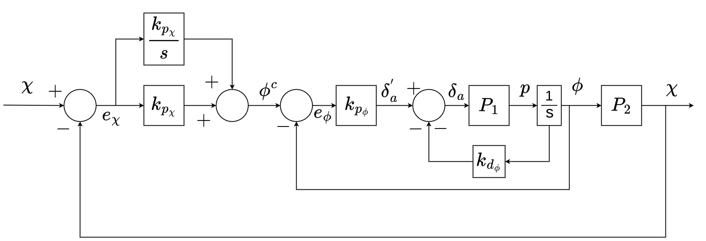

# Successive Loop Closure Controller

## Overview

The control scheme used by default in ROSplane comes from the book *Small Unmannded Aircraft: Theory and Practice* by Randal Beard and Timothy McLain.
A full and in depth description of the theory behind this controller is outlined in chapter 6.
Additionally, many simplifing assumptions are made some of which will be mentioned, but the rationale not explored.
These too are found in the book, in chapters 3, 4 and 5.
A link to the most up to date book can be found on the [GitHub page](https://github.com/randybeard/mavsim_public) for the book.
This section of the documentation is to briefly outline the important, practical parts of the controller to be useful in understanding how to tune or modify the existing code or algorithm for a developer.
A good primer on PID control can be found [here](https://www.youtube.com/watch?v=UR0hOmjaHp0).

The control algortihm is split into two parts:
**Lateral-directional Autopilot** and **Longitudinal Autopilot**.
The lateral and longitudinal dynamics are assumed to be decoupled as discussed in Section 6.1 of *Small Unmannded Aircraft*.
This allows us to develop a controller for each set of dynamics to simplify the controller design.

## Successive Loop Closure

For a full discussion of PID successive loop closure, which is used heavily through out the entire controller, read section 6.1 in the book.
One major assumption used is that the inner loops are much faster (more than ten times faster) than the outer loops.
This means that the bandwidth seperation should be seperated by a factor of 10.
See end of section 6.1.1 *Course Hold using Commanded Roll* in the book for a more thorough discussion.
A significant advantage of successive loop closure is that gains are tuned independently.
Starting from the inner loops, tune the response and then tune the outer loop.

## Nomenclature

| Symbol | Meaning | Range |
|:------:|:-------:| :---: |
|$\large{\boldsymbol{\chi}}$| Course/Heading | $[-\pi,\pi)$ |
|$\large{\boldsymbol{\phi}}$| Roll | $[-\pi,\pi)$ |
|$\large{p}$| Roll Rate |  |
|$\large{\boldsymbol{\delta_i}}$| Command percent defelection of control surface $i$ | $[-1.0,1.0]$ |
|$\large{\boldsymbol{e_a}}$| Error in state variable $a$ |
|$\large{\boldsymbol{a^c}}$| Commanded value of state variable $a$ |
|$\large{\boldsymbol{k_{p_{a}}}}$| Proportional gain for state variable $a$ |
|$\large{\boldsymbol{k_{d_{a}}}}$| Derivative gain for state variable $a$ |
|$\large{\boldsymbol{k_{i_{a}}}}$| Integral gain for state variable $a$ |
|$\large{\boldsymbol{P}}$| Plant transfer function |
|$\large{\boldsymbol{s}}$| Laplace operator | 

## Lateral-directional Autopilot

The autopilot uses induced roll to control changes in course.
The Lateral-directional Autopilot also uses a yaw damper to damp the dutch roll mode that can be induced by changes in roll.

### Course Loop

In figure 1, the entire control loop for the course is shown.
This loop allows for tracking of ramp and step commands in course.
Since the inner loop is tuned first and influences the outer loop tune, we will discuss it first.

<!-- TODO Add phi_ff to the mix -->

|  |
|:--:|
|*Figure 1: Lateral-directional Autopilot Control Loop*|

#### Inner Loop

The inner loop calculates the required percent deflection in the ailerons, $\boldsymbol{\delta_a}$, to acheive the commanded roll angle.
This loop is a PD loop, meaning that it uses only a proportional and derivative control.
Note that the derivative gain does not act on the rate of change of the error but of the direct roll rate, $p$.
The proportional gain acts on the error given by the estimated roll and the commanded roll.
This loop does not use integral contol to ensure that it closes much faster than the outer loop.
This bandwidth seperation helps the controller perform smoothly.
See the specific page on the Course Inner Loop for details on tuning and common pitfalls.
For more details on how the roll rate and the roll angle are calculated see the Estimator page.

#### Outer Loop

The outer loop calculates the commanded roll angle, $\boldsymbol{\phi}$, based on the error in the course, $\boldsymbol{\chi}$.
This is a PI loop, meaning that it uses only proportional and integral control.

