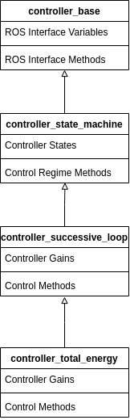
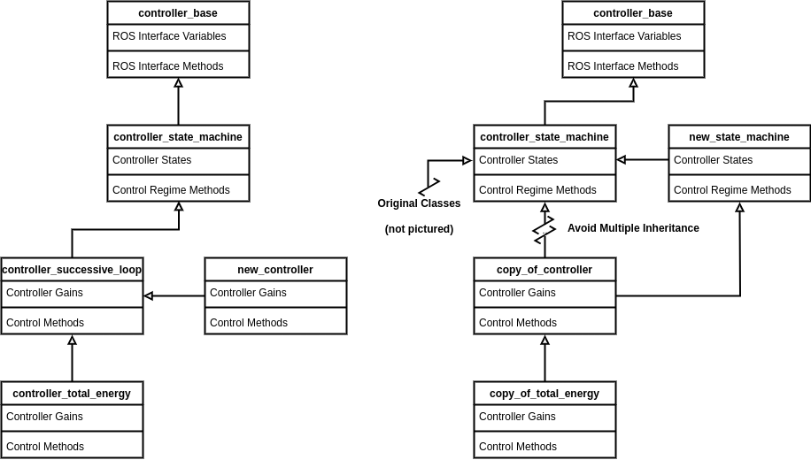
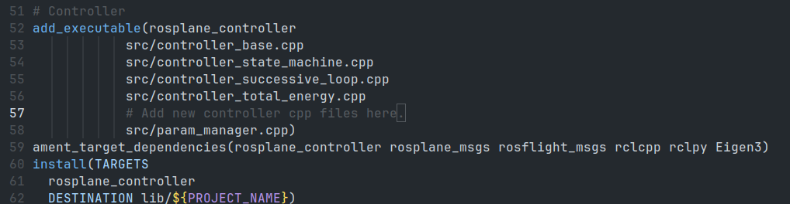
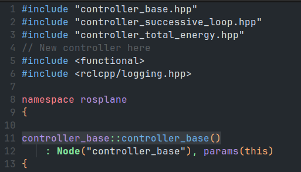
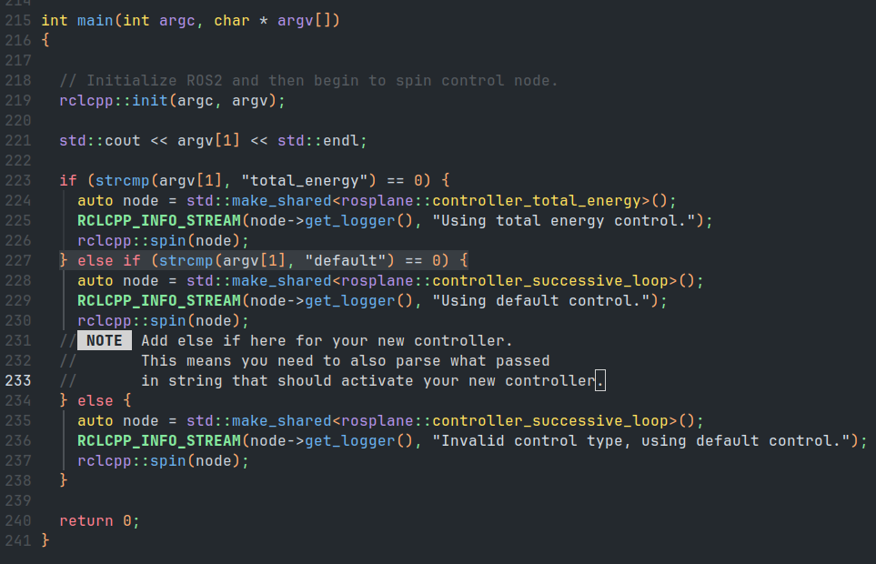

# Controller Software Architecture

## Overview

The controller makes use of inheritance to make the controller more modular.
This creates a hierarchy of classes that each take on a responsibility.
This means that a user that modifies the controller only has to inherit from a particular class make the modifications only to the portions of the code that matter to them, and then continue to use the other parts of the controller.
An example of this is provided in the code.
The total energy controller exemplifies this by inheriting and only changing just a few key functions.
The aim of this architecture is to make the developer's job easier.

## Inheritance Scheme

The controller starts off with the `controller_base` class.
This contains all of the interface with ROS.
The next layer, `controller_state_machine`, implements a basic state machine for the controller.
These states control which commands are happening at what time.
An example of how this may be used is, ensuring the aircraft is at altitude before attempting major maneuvers.
Following the state machine is the actual control scheme.
By default we use a successive loop closure scheme, `controller_successive_loop`.
This layer calculates the control errors and necessary actuator deflections to track commands.

|  |
|:--:|
|*Figure 1: Controller class inheritance structure.*|

## Implementing A New Controller 

|  |
|:--:|
|*Figure 2: Options for implementing a new controller.*|

The total energy controller in the `rosplane` package, shows in a practical way how to implement a new controller.
This section is meant to only give a high level overview of how this can be done.
The first step is to identify where your changes should be made.
This means determining which class the change belongs in.
Consult the class pages for more information on where the best fit for your controller would be.
The next step is to define a new class that inherits from class you are changing.
Override the functions of interest.
Next if the inherited class is not at the bottom of the inheritance chain, you will have to modify (duplicate but only change the inheritance, this is to not break default behavior) the controller classes further down the chain to inherit from your class rather than the original.
This is to avoid a multiple inheritance problem (inheritance diamond).

To add your new controller as an option to be launched you will need to make a few edits.
To be clear, you add your new final controller, (`new_controller` or `copy_of_controller` in the diagram) as an option.
These edits are as follows:

* Add new controller to the CMakeLists.txt.
    * The best examples are found in the CMakeLists.txt.
    * Be sure to include the `.cpp` files.

|  |
|:--:|
|*Figure 3: Location in `CMakeLists.txt` to add the new controller's `.cpp` file(s).*|

* First import the new controller by adding its header file to `controller_base.cpp`.

|  |
|:--:|
|*Figure 4: Location in `controller_base.cpp` to import new controller's header file.*|

* Next you need to add the new controller as an option to the `main` function. The argument to the main function is the name/activation string for the control. This is passed in on launch of ROSplane (see Launching ROSplane in the User Guide for more details).

|  |
|:--:|
|*Figure 5: Location in `controller_base.cpp` to add option to select control type.*|

<!-- TODO: add screenshots of where to make changes. -->

If this is done correctly, then you should be able to simply change between control schemes with only an argument to a launch file.
This will allow for easier testing where you can use a more tested controller initially and but swap to a new controller when convenient.

