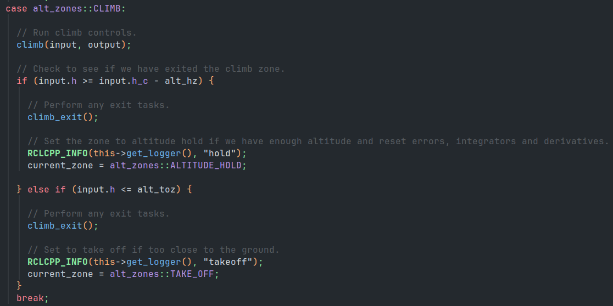

# Controller State Machine

## State Machine Overview

The controller state machine uses discrete states to turn on and off particular controls for a more stable flight.
These regimes are designed so that particular mission objectives are only activated when particular conditions are met.
In the default implementation this is controlled based on the aircraft's altitude.
Though, in practice these states could be effected by any input from a ROS topic.
The states are pictured below, and the differences in state are explored in the next section.

|  |
|:--:|
|*Figure 1: Controller state machine.*|

## States 

This section describes all of the states and what control is active during that phase of flight.

### Takeoff

In the takeoff state, the commanded airspeed is set to cruise, the commanded pitch is held constant and roll is controlled to zero.
This results in a steady takeoff directly along the runway.
The deactivation of course control means that the aircraft will not attempt to maneuver while too close to the ground.
The takeoff regime is only below a certain cutoff altitude.
After passing this threshold it moves into the climb state.

### Climb 

The climb state commands altitude and airspeed as normal, but still controls roll to zero.
This means that the aircraft will proceed directly ahead until it is withing a cutoff (see Params section) of commanded altitude.
Deactivating course control allows for the aircraft to gain enough altitude to be clear of all obstacles before attempting to follow the waypoint mission.
Once within a cutoff of the commanded altitude, the state transitions to altitude hold.
If the aircraft dips beneath the takeoff threshold, it will enter the takeoff state again.

### Altitude Hold

In altitude hold all control loops are closed normally. 
The aircraft will fly the waypoint mission as normal.
If the aircraft dips beneath the takeoff cutoff, the state transitions to takeoff again.

## Code Architecture

The state machine's architecture allows for different aspects of the control to be modified.
It simply defines a virtual method to be implemented by a child that will control during the particular state the aircraft is in.
The state method is implemented in the child, only using the controls necessary for that phase of flight (see the Architecture section of the [Successive Loop Closure](./controller-outline.md)).

|  |
|:--:|
|*Figure 2: Code snippet from the state machine.*|

## Parameters

| Parameter | Explanation | Range |
|:--:|:--:|:--:|
| alt_toz | The altitude of the takeoff zone cutoff. | $\geq 0.0$ (double) |
| alt_hz | The altitude command saturation limit, and difference required to transition into altitude hold. | $\geq 0.0$ (double) |
