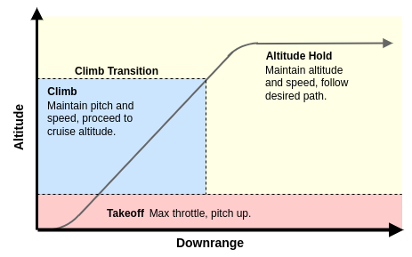

# Contoller State Machine

## State Machine Overview

The controller state machine uses discrete states to turn on and off particular controls for a more stable flight.
These regimes are designed so that particular mission objectives are only activated when particular conditions are met.
In the default implementation this is controlled based on the aircraft's height.
Though, in practice these states could be effected by any input from a ROS topic.
The states are pictured below, and the differences in state are explored in the next section.

|  |
|:--:|
|*Figure 1: Controller state machine.*|
