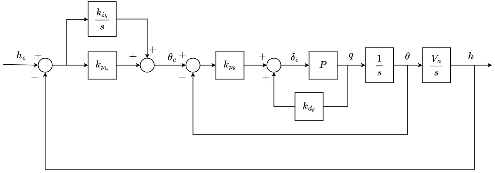

# Successive Loop Closure Controller

## Overview

The control scheme used by default in ROSplane comes from the book *Small Unmannded Aircraft: Theory and Practice* by Randal Beard and Timothy McLain.
A full and in depth description of the theory behind this controller is outlined in chapter 6.
Additionally, many simplifing assumptions are made some of which will be mentioned, but the rationale not explored.
These too are found in the book, in chapters 3, 4 and 5.
A link to the most up to date book can be found on the [GitHub page](https://github.com/randybeard/mavsim_public) for the book.
This section of the documentation is to briefly outline the important, practical parts of the controller to be useful in understanding how to tune or modify the existing code or algorithm for a developer.
A good primer on PID control can be found [here](https://www.youtube.com/watch?v=UR0hOmjaHp0).

The control algortihm is split into two parts:
**Lateral-directional Autopilot** and **Longitudinal Autopilot**.
The lateral and longitudinal dynamics are assumed to be decoupled as discussed in Section 6.1 of *Small Unmannded Aircraft*.
This allows us to develop a controller for each set of dynamics to simplify the controller design.

## Successive Loop Closure

For a full discussion of PID successive loop closure, which is used heavily through out the entire controller, read section 6.1 in the book.
One major assumption used is that the inner loops are much faster (more than ten times faster) than the outer loops.
This means that the bandwidth seperation should be seperated by a factor of 10.
See end of section 6.1.1 *Course Hold using Commanded Roll* in the book for a more thorough discussion.
A significant advantage of successive loop closure is that gains are tuned independently.
Starting from the inner loops, tune the response and then tune the outer loop.

## Nomenclature

| Symbol | Meaning | Range |
|:------:|:-------:| :---: |
|$\large{\boldsymbol{\chi}}$| Course/Heading | $[-\pi,\pi)$ |
|$\large{\boldsymbol{\phi}}$| Roll | $[-\pi,\pi)$ |
|$\large{\boldsymbol{\theta}}$| Theta | $[-\pi,\pi)$ |
|$\large{\boldsymbol{\psi}}$| Yaw | $[-\pi,\pi)$ |
|$\large{\boldsymbol{h}}$| Altitude |  |
|$\large{p}$| Roll Rate |  |
|$\large{q}$| Pitch Rate |  |
|$\large{r}$| Yaw Rate |  |
|$\large{V_a}$| Airspeed |  |
|$\large{\boldsymbol{\delta_i}}$| Command percent defelection of control surface $i$ | $[-1.0,1.0]$ |
|$\large{\boldsymbol{e_a}}$| Error in state variable $a$ |
|$\large{\boldsymbol{a^c}}$| Commanded value of state variable $a$ |
|$\large{\boldsymbol{k_{p_{a}}}}$| Proportional gain for state variable $a$ |
|$\large{\boldsymbol{k_{d_{a}}}}$| Derivative gain for state variable $a$ |
|$\large{\boldsymbol{k_{i_{a}}}}$| Integral gain for state variable $a$ |
|$\large{\boldsymbol{p_{wo}}}$| Washout filter bandwidth |
|$\large{\boldsymbol{P}}$| Plant transfer function |
|$\large{\boldsymbol{s}}$| Laplace operator | 

## Lateral-directional Autopilot

The autopilot uses induced roll to control changes in course.
The Lateral-directional Autopilot also uses a yaw damper to damp the dutch roll mode that can be induced by changes in roll.

### Course Loop

In figure 1, the entire control loop for the course is shown.
This loop allows for tracking of ramp and step commands in course.
Since the inner loop is tuned first and influences the outer loop tune, we will discuss it first.

<!-- TODO Add phi_ff to the mix -->
<!-- TODO Fix typo in /chi on the left, should be /chi^c -->

|  |
|:--:|
|*Figure 1: Lateral-directional Autopilot Control Loop*|

#### Inner Loop

The inner loop calculates the required percent deflection in the ailerons, $\boldsymbol{\delta_a}$, to acheive the commanded roll angle generated by the outer loop.
This loop is a PD loop, meaning that it uses only a proportional and derivative control.
Note that the derivative gain does not act on the rate of change of the error but of the direct roll rate, $p$.
The proportional gain acts on the error given by the estimated roll and the commanded roll.
This loop does not use integral contol to ensure that it closes much faster than the outer loop.
This bandwidth seperation helps the controller perform smoothly.
See the specific page on the Course Loop for details on tuning and common pitfalls.
For more details on how the roll rate and the roll angle are calculated, see the Estimator page.
The output for the inner loop is routed into the outer loop.

#### Outer Loop

The outer loop calculates the commanded roll angle, $\boldsymbol{\phi}$, based on the error in the course, $\boldsymbol{\chi}$.
This is a PI loop, meaning that it uses only proportional and integral control.
The proportional gain acts on the error between the estimated course $\boldsymbol{\chi}$ and the commanded course $\boldsymbol{\chi}$.
The integral gain acts on the same error, ensuring that errors in course are driven to zero.
Note that the PI loop allows for only constant error in ramp inputs (orbits) and for no error to step inputs (path following commands).
See the specific page on the Course Loop for details on tuning and common pitfalls.
For more details on how course is estimated and measured, see the Estimator page.
These loops combine to give complete control of the course of the aircraft.

### Yaw Damper

The yaw damper allows for effective damping of undesirable yaw modes induced by rolling.
This is done by using the rudder to control the yaw rate, $r$, to zero.
Not all yaw rates should be controlled to zero since this would disallow turning.
A washout filter is used to only damp high frequency yaw rates.
In effect, this control only 'turns on' if the frequency of the yaw rate is high enough.
For mor information see the Yaw Damper page.

|  |
|:--:|
|*Figure 2: Yaw Damper Control Loop*|

## Longitudinal Autopilot

The longitudinal autopilot controls the longitudinal dynamics of the aircraft.
This means that the loop controls altitude, pitch and airspeed.

### Altitude Loop

The altitude loop utilizes successive loop closure to control altitude.
It uses the elevator to control the pitch of the aircraft, and then controls using commanded pitch the altitude.
This loop can track step and ramp commands.

|  |
|:--:|
|*Figure 3: Altitude Control Loop*|

#### Inner Loop

The inner loop controls the pitch, $\boldsymbol{\theta}$.
It does so by calculating the necessary $\boldsymbol{\delta_e}$ to acheive the commanded pitch.
This is a PD loop, this means that there is often a small DC offset to the commanded pitch.
This does not affect the performance of the overall altitude loop.
Like the inner loop of the course control, the derivative gain acts on the measured pitch rate rather than the error derivative.

#### Outer Loop

The outer loop is a PI loop.
It uses the error in the altitude, $h$, and integral of the error of altitude to drive the error to zero for steps and for ramps.
The commanded altitude is capped using a scheme described in the Altitude Loop page.
In practice, the altitude loop is often slower when the commanded altitude is descending and faster when ascending.
This is because the airspeed is coupled to the altitude.
While descending the controller will attempt to maintain airspeed.
This can also result in more overshoot while descending.

### Airspeed Loop

The Airspeed loop is a PI loop.
It reacts to the straight forward error in commanded airspeed $V_a^c$ given by the waypoint mission.
It generates the required throttle, $\delta_t$, to acheive the commanded airspeed.
This is suffecient because of the natural damping of the drag on the aircraft.
In practice, the loop performs well, but is prone to small fluctuations (on the order of $\pm 1 \frac{m}{s}$) due to the differential pressure sensor fluctuating because of wind and other disturbances.

|  |
|:--:|
|*Figure 4: Airspeed using throttle control loop*|

## Controller Outputs

What the entire controller outputs is a set of 4 control efforts that correspond to the 4 major control surfaces on the aircraft.
These are the elevator, ailerons, rudder and the throttle.
The controller can easily be switched to outputing up to 8 outputs, using the aux channels of the Commands Message.
These outputs are fed directly to rosflight_io and then passed along to the microcontroller and finally actuated on the physical or simulated aircraft.
The controller is the exposed portion of ROSplane to ROSflight.

## Important Notes

The controller does not directly control the position.
In the ROSplane overview page, it shows how the Path Follower feeds into the controller.
The Path Follwer generates commands that result in the position control of the aircraft.
For a better understanding of this realtionship visit the Path Follower page.

## Software Architecture

The Successive Loop Closure Controller (SLCC) inherits from the state machine class, (see [Software Architecture](./controller-software-architecture.md) for more details) and implements the state function for each of the states.
This state function is then populated with the desired control during each phase of flight (see [State Machine](./controller-state-machine.md) for more details on control during each state).
The state functions split control into longitudinal and lateral control, this allows for inheritance of this class an only override longitudinal or lateral control (see [Total Energy Control](./controller-outline.md) for an example of how this is done).

|  |
|:--:|
|*Figure 5: An example of an implementation of a state function, in this case the altitude hold state.*|

The lateral and longitudinal control functions activate particular control loops necessary.

|  |
|:--:|
|*Figure 6: An example of an implementation of a lateral and longitudinal control, in this case during the altitude hold state.*|

Each control loop gets its own function and it follows a specific format.
This format is pictured below, but a full outline is given in the .cpp file for the SLCC.
Note all of the PID is implemented but the gains if not using a particular control (proportional/derivative/integral) are zero.

|  |
|:--:|
|*Figure 7: An example of an implementation of a control loop, in this case the roll loop (inner course loop).*|

## Parameters

These values are typically held in a .yaml file.
For the default values, check the .cpp file.

| Parameter | Explanation | Range |
|:--:|:--:|:--:|
| max_takeoff_throttle | Trottle saturation level during the takeoff zone. | $(0.0, 1.0)$ (double) |
| c_kp | The proportional gain on the outer course loop. | $\geq 0.0$ (double) |
| c_kd | The derivative gain on the outer course loop. | $\leq 0.0$ (double) |
| c_ki | The integral gain on the outer course loop. | $\geq 0.0$ (double) |
| max_roll | Commanded roll saturation limit. | $\geq 0.0$ (double)(degrees) |
| cmd_takeoff_pitch | Commanded pitch while in takeoff state. | $\geq 0.0$ (double)(degrees) |
| r_kp | The proportional gain on the inner course loop. | $\geq 0.0$ (double) |
| r_kd | The derivative gain on the inner course loop. | $\geq 0.0$ (double) |
| r_ki | The integral gain on the inner course loop. | $\geq 0.0$ (double) |
| max_a | Saturation limit for the ailerons| $\geq 0.0$ (double) |
| trim_a | Trim value for the ailerons. | $\geq 0.0$ (double) |
| a_kp | The proportional gain on the outer altitude loop. | $\geq 0.0$ (double) |
| a_kd | The derivative gain on the outer altitude loop. | $\geq 0.0$ (double) |
| a_ki | The integral gain on the outer altitude loop. | $\geq 0.0$ (double) |
| max_pitch | Commanded pitch saturation limit. | $\geq 0.0$ (double)(degrees) |
| p_kp | The proportional gain on the inner altitude loop. | $\leq 0.0$ (double) |
| p_kd | The derivative gain on the inner altitude loop. | $\leq 0.0$ (double) |
| p_ki | The integral gain on the inner altitude loop. | $\leq 0.0$ (double) |
| max_e | Saturation limit for the elevator| $\geq 0.0$ (double) |
| trim_e | Trim value for the elevator. | $\geq 0.0$ (double) |
| y_pwo | The yaw damper washout filter cutoff frequency. | $\leq 0.0$ (double)(radians/s) |
| y_kr | Control gain on yaw damper. | $\leq 0.0$ (double) |
| a_t_kp | The proportional gain on the airspeed loop. | $\geq 0.0$ (double) |
| a_t_kd | The derivative gain on the airspeed loop. | $\geq 0.0$ (double) |
| a_t_ki | The integral gain on the airspeed loop. | $\geq 0.0$ (double) |
| max_t | Saturation limit for the throttle. | $\geq 0.0$ (double) |
| trim_t | Trim value for the throttle. | $\geq 0.0$ (double) |
| tau | Dirty derivative low pass filter gain for airspeed. | $\geq 0.0$ (double) |
