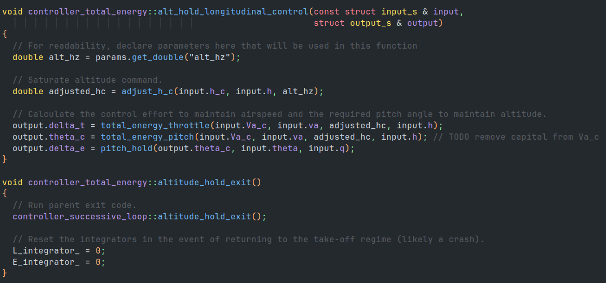

# Total Energy Controller

## Overview

The total energy control system approach (TECS) differs from the successive loop closure controller in its control of airspeed and altitude.
It does this by calculating the total energy of the system, both potential and kinetic and controlling it to the desired energy.
A more in depth treatment of of TECS see Section 6.2 in the [UAV book](https://github.com/randybeard/mavsim_public).

The TECS controller has been included in ROSplane not only to provide control of the aircraft but to also demonstrate how to easily modify the controller (see [Software Architecture](./controller-software-architecture.md) and the following section for more details).
The TECS controller calculates the desired kinetic and potential energy, using references from the commanded airspeed and altitude.
It then calculates the current kinetic and potential energies and finds the kinetic and potential errors.
It combines these errors, and the throttle control loop uses a PI loop to drive this total energy error to zero.
The energy errors are also used to find a balance error.
This is the error in the ratio of potential to kinetic energy.
Pitch is then controlled by a PI loop to drive the balance error to zero.
Essentially the throttle allows for the total energy to rise as it adds or allows drag to subtract energy from the system.
The pitch loop controls how much of that input energy is in potential versus kinetic energy

This approach can have advantages because it deals with the coupling of airspeed and altitude.
In the successive loop closure controller (SLCC), it assumes a decoupling of airspeed and altitude which can present tuning issues, though they are not insurmountable.

## Software Architecture

The TECS controller provides an excellent template on implementing a new controller.
Since the changes to the total energy controller are only in the longitudinal control and the rest are the same as the SLCC it inherits directly from `controller_successive_loop` and only overrides the longitudinal functions for each state.

|  |
|:--:|
|*Figure 1: Total Energy Controller's overriden longitudinal control for the altitude hold state.*|

## Parameters

| Parameter | Explanation | Range |
|:--:|:--:|:--:|
| e_kp | Total energy error proportional gain, used in throttle control. | $\geq 0.0$ (double) |
| e_ki | Total energy error integral gain, used in throttle control. | $\geq 0.0$ (double) |
| e_kd | Total energy error derivative gain, used in throttle control. | $\geq 0.0$ (double) |
| l_kp | Balance energy error proportional gain, used in throttle control. | $\geq 0.0$ (double) |
| l_ki | Balance energy error integral gain, used in throttle control. | $\geq 0.0$ (double) |
| l_kd | Balance energy error derivative gain, used in throttle control. | $\geq 0.0$ (double) |
| mass | The mass of the aircraft, allowing for calculation of energies. | $\geq 0.0$ (double)(kg) |
| gravity | The gravity experienced by the aircraft, allowing for calculation of potential energy. | $\geq 0.0$ (double)($\frac{m}{s}$) |
| max_alt_error | This is the maximum error in altitude that the total energy loop will use to calculate energy error. | $\geq 0.0$ (double)(meters) |
