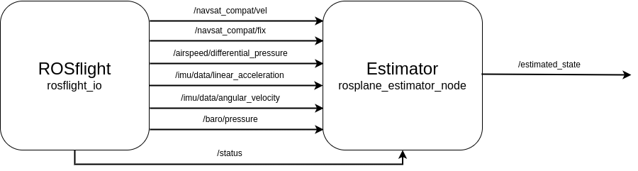

# Estimator Base

## Overview

The estimator base implements the basic ROS interfaces for the estimator.
This includes setting up subscribers, publishers and initializing parameter management.
The idea of the base class, is that all interfacing with ROS and shared resources across all inheritance levels happens or are contained in this class.

## ROS Interfaces

The estimator has the following ROS interfaces.

|  |
|:--:|
|*Figure 1: Estimator's ROS interactions.*|

The estimator has several ROS interfaces that are tracked as member variables of the `estimator_base` class.
They are summarized in the table below:

| ROS Interface | Topic | Explanation | Message Type |
|:------:|:-------:| :---: | :---: |
| 
`vehicle_state_pub_`
 | `/estimated_state` | Publishes the estimated state of the vehicle. | State.msg |
| 
`gnss_fix_sub_`
 | `/navsat_compat/fix` | Subcribes to the GNSS position information. | NavSatFix.msg |
| 
`gnss_vel_sub_`
 | `/navsat_compat/vel` | Subcribes to the GNSS velocity information. | TwistStamped.msg |
| 
`imu_sub_`
 | `/imu/data` | Subcribes to the IMU data (both Gyro and Accel). | Imu.msg |
| 
`baro_sub_`
 | `/baro` | Subcribes to the barometer pressure information. | Barometer.msg |
| 
`airspeed_sub_`
 | `/airspeed` | Subcribes to the differential pressure information. | Airspeed.msg |
| 
`status_sub_`
 | `/status` | Subcribes to the aircraft status information. | Status.msg |

!!! note 
    The NavSatFix, TwistStamped and Imu messages are from standard ROS message packages. Barometer, Airspeed and Status messages are from `rosflight_msgs`.

## Parameters

| **Parameter** | **Explanation** | **Type** | **Range** |
| :---: | :---: | :---: | :---: |
| `rho` | The density of the air. | double | ~1.225 $\frac{kg}{m^3}$ |
| `gravity` | The acceleration due to gravity. | double | ~9.81 $\frac{m}{s^2}$ |
| `estimator_update_frequency` | The frequency that the estimator will run estimations. | double | $\geq 100$ Hz |
| `gps_ground_speed_threshold` | This determines when the aircraft is moving fast enough to get a course estimate. | double | $\geq$ 0.3 $\frac{m}{s}$ |
| `baro_measurement_gate` | The maximum allowable instantaneous change in barometer pressure measurement. | double | ~1 meter |
| `airspeed_measurement_gate` | The maximum allowable instantaneous change in differential pressure measurement. | double | ~5 $\frac{m}{s}$ |
| `baro_calibration_count` | The number of barometer measurements used to do calibration. | int | $\geq 100$ |

## Modifying the Estimator

Update when full state estimator and continuous-discrete are both implemented and a swap between them works.

