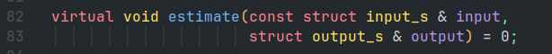
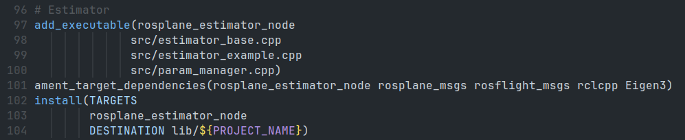

# Estimator Example

<!-- TODO: rename this to continuous discrete once full state is integrated. -->

## Overview

The `estimator_example` class implements a continuous-discrete Kalman filter as described in section 8.5 of the [UAV book](https://github.com/randybeard/mavsim_public) or 8.6 and 8.7 of volume one of the same book.
Specifically, this estimator uses algorithm 2 of chapter 8 in Volume 1.
It utilizes a two stage estimation process along with low pass filtering the inversion of a few sensor models and direct measurements.
The roll and pitch of the aircraft are estimated first.
This is called the attitude estimation step though not all of the attitude is estimated here.
The other states are then estimated as a all at once.
This is called the position estimation step, though more than just position is estimated during this step.
The estimator runs on a set timer with a configurable frequency (see Parameters section for details).

The estimator makes large use of something called a pseudo-measurement.
These measures assume that the side slip angle is zero and the corresponding wind triangle solution.
This allows us to take these measures and then find the wind in the north and east directions along with the yaw of the aircraft.
They are more fully explored in section 8.11.4 of the UAV book.

## Nomenclature

| Symbol | Meaning | Range |
|:------:|:-------:| :---: |
|$\large{\chi}$| Course | $[-\pi,\pi)$ |
|$\large{\phi}$| Roll | $[-\pi,\pi)$ |
|$\large{\theta}$| Theta | $[-\pi,\pi)$ |
|$\large{\psi}$| Yaw | $[-\pi,\pi)$ |
|$\large{h}$| Altitude | - |
|$\large{p}$| Roll Rate | - |
|$\large{q}$| Pitch Rate | - |
|$\large{r}$| Yaw Rate | - |
|$\large{V_a}$| Airspeed | $\geq 0$ |
|$\large{w_n}$| Wind North | - |
|$\large{w_e}$| Wind East | - |

## Sensor Model Inversion

The roll, pitch and yaw rates are directly measured by the rate gyro and then low pass filtered.
The low pass filter is a simple alpha filter described by:

$$
    a_{n} = a_{n-1} \alpha + (1 - \alpha) a_{measured}
$$

Where $a$ is the state.
This filter technique is used on the measurements before they are used in an estimate throughout the estimator.

The following are calculated directly from a model of the sensor:

| State | Measured Value | Model Equation | Inversion Equation |
|:--:|:--:|:--:|:--:|
| $h$ - altitude | $P$ - absolute pressure (Pa) | $P = \rho_{air} gh$ | $h = \frac{\rho_{air} g}{P}$|
| $V_a$ - airspeed | $\Delta P$ - differential pressure (Pa) | $\Delta P = \frac{1}{2} \rho_{air} V_a^2$ | $V_a = \sqrt{\frac{2}{\rho_{air} g} \Delta P}$|

These values are then used in the first step of the estimator.

## Attitude Estimation

The first step in estimating the attitude is understanding how we propagate our guess between measurements.
Our estimates are on roll angle, $\phi$, and on pitch angle, $\theta$.
These estimates are part of the state $\hat{x}_a$, where the hat over the variable indicates an estimate.

### Propagation

At each call of the estimation algorithm, the estimate from the previous time step is propagated to the next time step.
The propagation step is broken up into $N$ smaller steps to yield an estimate for the current time step.
$N$ is typically 10, meaning that the previous estimate that was updated by a measurement is updated in 10 steps instead of a single step to calculate the estimate at the current time step.
The length of each of the $N$ steps is 1/$N$ the original time step.

The attitude estimation is propagated according to the model $f$:

\begin{equation}
    f =
    \begin{bmatrix}
        \dot{\phi} = p + (q \sin{\phi} + r \cos{\phi}) \tan{\theta} \\
        \dot{\theta} = q \cos{\phi} + r \sin{\phi})
    \end{bmatrix}
\end{equation}

This propagated estimate is then used in the calculation of the Jacobian $A$.

\begin{equation}
    A =
    \begin{bmatrix}
        (q \cos{\phi} - r \sin{\phi})\tan{\theta} & \frac{q\sin{\phi} + r\cos{phi}}{\cos^2{\theta}} \\
        0 & -q \sin{\phi} - r \cos{\phi} \\
    \end{bmatrix}
\end{equation}

This Jacobian is then used to find a second-order approximation of the matrix exponential, $A_d$.

\begin{equation}
    A_d = I + \frac{T_s}{N} A + \frac{1}{2} \frac{T_s^2}{N^2} A^2
\end{equation}

Where $T_s$ is the length of a time step.
$A_d$ is then used to propagate the actual covariance of the estimate.

The process noise due to model uncertainty is defined in the matrix $Q$, but the process uncertainty due to the use of the rate gyro measurements $Q_g$, has not been adjusted for yet.
This is done with the use of the matrix $G$ which takes into account the Coriolis effects of the gyro measurements.
The measurement variance is transformed into process noise due to gyro measurements.
All of these contribute into finding the current covariance of our estimate, $P$.
This is done by the following equation:

$$P_a = A_d P A_d^\top + (Q + G Q_g G^\top) \frac{T_s^2}{N^2}$$

With this propagated estimate and covariance we are now ready for a measurement update.

### Measurement Update

A measurement update provides a check on our propagated estimate and we take this new information and fuse it into our estimate.
The Kalman filter allows us to optimally adjust our estimate, our tuned process noises, and the noise characteristics of our sensor given the measurement.
These noise characteristics are captured in a diagonal matrix, $R_{sensor}$.
The entries are the variances and for the attitude step this is defined as:

\begin{equation}
    R_{accel} = 
    \begin{bmatrix}
        \sigma_{accel, x}^2 & 0 & 0 \\
        0 & \sigma_{accel, y}^2 & 0 \\
        0 & 0 & \sigma_{accel, z}^2 \\
    \end{bmatrix}
\end{equation}

Using our estimate and a model set of equations $h$, we predict the measurements the accelerometer will produce.
We will then compare the actual and predicted measurements and optimally adjust our estimate with the new information.
Since measurements come in much faster than the model propagates the measurement step is run every time the propagated estimate is calculated.
The set of equations, $h$, that predict the 3 measurements of the accelerometer, $y$, is given by:

\begin{equation}
    h = 
    \begin{bmatrix}
        q V_a \sin{\theta} + g \sin{\theta} \\
        r V_a \cos{\theta} - p V_a \sin{\theta} - g \cos{\theta} \sin{\phi} \\
        -q V_a \cos{\theta} - g \cos{\theta} \cos{\phi} \\
    \end{bmatrix}
\end{equation}

This yields a Jacobian $C$:

\begin{equation}
    C = 
    \begin{bmatrix}
        0 & q V_a \cos{\theta} + g \cos{\theta} \\
        -g \cos{\phi}\cos{\theta} & -r V_a \sin{\theta} - p V_a \cos{\theta} + g \sin{\phi} \sin{theta} \\
        g \sin{\phi}\cos{\theta} & (q V_a + g \cos{\phi}) \sin{\theta}
    \end{bmatrix}
\end{equation}

Which is used in finding the Kalman gain $L$.
An intermediate value is calculated called $S^{-1}$.
This value is:

\begin{equation}
    S^{-1} = (R_{accel} + CPC^\top)^{-1}
\end{equation}

This intermediate value is then used to find $L$:

\begin{equation}
    L = PC^\top S^{-1}
\end{equation}

The optimal estimate is then found:

\begin{equation}
    \hat{x}_a^+ =  \hat{x}_a^- + L (y - h)
\end{equation}

Finally, we update the covariance from our new estimate:

\begin{equation}
    P^+ = (I - LC) P^- (I - LC)^\top + LR_{accel}L^\top
\end{equation}

We repeat this cycle until termination of the program.
This estimation scheme split into two parts allows for a clear set of equations and how the estimates affect one another.
We will now move on to the next portion of the estimator that estimates the rest of the states.

## Position Estimation

The position estimation step follows the same algorithm as previous.
Only new values are used for each of the matrices.
Those new entries are shown here, but reference the previous section for details on implementation.

### Propagation

The attitude estimation is propagated according to the model $f$:

\begin{equation}
    f =
    \begin{bmatrix}
        V_g \cos{\chi} \\
        V_g \sin{\chi} \\
        \dot{V_g} \\
        0 \\
        0 \\
        \dot{\psi} \\
    \end{bmatrix}
\end{equation}

Where,

\begin{equation}
    \dot{\psi} = q \sin{\phi} + r \frac{\cos{\phi}}{\cos{\theta}} \\
    \dot{V_g} = \frac{V_a}{V_g} \dot{\psi} (w_e \cos{\psi} - w_n \sin{\psi})
\end{equation}

This propagated estimate is then used in the calculation of the Jacobian $A$.

\begin{equation}
    A =
    \begin{bmatrix}
        0 & 0 & \cos{\chi} & -V_g \sin{\chi} & 0 & 0 & 0 \\
        0 & 0 & \sin{\chi} & V_g \cos{\chi} & 0 & 0 & 0 \\
        0 & 0 & -\frac{\dot{V_g}}{V_g} & 0 & -\dot{\psi} V_a \frac{\sin{\psi}}{V_g} & \dot{\psi} V_a \frac{\cos{\psi}}{V_g} & -\dot{\psi} V_a (w_n \cos{\psi} + w_e \sin{\psi}) \\
        0 & 0 & -\frac{g}{V_g^2} \tan{\phi} & 0 & 0 & 0 & 0 \\
        0 & 0 & 0 & 0 & 0 & 0 & 0 \\
        0 & 0 & 0 & 0 & 0 & 0 & 0 \\
        0 & 0 & 0 & 0 & 0 & 0 & 0 \\
    \end{bmatrix}
\end{equation}

This Jacobian is then used to find a second-order approximation of the matrix exponential, $A_d$.

\begin{equation}
    A_d = I + \frac{T_s}{N} A + \frac{1}{2} \frac{T_s^2}{N^2} A^2
\end{equation}

Where $T_s$ is the length of a time step.
$A_d$ is then used to propagate the actual covariance of the estimate.

The process noise due to model uncertainty is defined in the matrix $Q$ and is fused into the covariance.
This is done by the following equation:

$$P_a = A_d P A_d^\top + Q \frac{T_s^2}{N^2}$$

With this propagated estimate and covariance we are now ready for a measurement update.

### Measurement Update

<!-- TODO: update the documentation when the position step is refactored to happen all at once. -->

Because the GPS measures come in slower than the model propagates, the measurement step is only run when there is new GPS information.
This process is identical to the measurement update in the attitude step.
This will likely change before release, but the only difference is that it is done one measurement at a time.
This has advantages for querying the values while debugging, but is on the whole less clear and is more error prone.
The math is the same but it is carried through, and expressed as the final sum and each row calculated separately.

The measurement model, $h$ has only 6 entries instead of 7 since heading, $\psi$ is not measured.
A digital compass could be added and $h$ and $C$ expanded if desired, but control is operated on course, $\chi$, so this proves largely unnecessary.

\begin{equation}
    h = 
    \begin{bmatrix}
        p_n \\
        p_e \\
        V_g \\
        \chi \\
        V_a \cos{\psi} + w_n - V_g \cos{\chi} \\
        V_a \sin{\psi} + w_e - V_g \sin{\chi} \\
    \end{bmatrix}
\end{equation}

This yields a Jacobian $C$:

\begin{equation}
    C = 
    \begin{bmatrix}
        1 & 0 & 0 & 0 & 0 & 0 & 0 \\
        0 & 1 & 0 & 0 & 0 & 0 & 0 \\
        0 & 0 & 1 & 0 & 0 & 0 & 0 \\
        0 & 0 & 0 & 1 & 0 & 0 & 0 \\
        0 & 0 & -\cos{\chi} & V_g\sin{\chi} & 1 & 0 & -V_a\sin{\psi} \\
        0 & 0 & -\sin{\chi} & -V_g\cos{\chi} & 0 & 1 & V_a\cos{\psi} \\
    \end{bmatrix}
\end{equation}

Which is used in finding the Kalman gain $L$.

The measurement noise matrix, $R_{position}$, is defined as:

\begin{equation}
    R_{position} = 
    \begin{bmatrix}
        \sigma_{gps, n}^2 & 0 & 0 & 0 & 0 & 0 & 0 \\
        0 & \sigma_{gps, e}^2 & 0 & 0 & 0 & 0 & 0 \\
        0 & 0 & \sigma_{gps, V_g}^2 & 0 & 0 & 0 & 0 \\
        0 & 0 & 0 & \sigma_{gps, \chi}^2 & 0 & 0 & 0 \\
        0 & 0 & 0 & 0 & \sigma_{pseudo, w_n}^2 & 0 & 0 \\
        0 & 0 & 0 & 0 & 0 & \sigma_{pseudo, w_n}^2 & 0 \\
        0 & 0 & 0 & 0 & 0 & 0 & \sigma_{pseudo, \psi}^2 \\
    \end{bmatrix}
\end{equation}

An intermediate value is calculated called $S^{-1}$.
This value is:

\begin{equation}
    S^{-1} = (R_{position} + CPC^\top)^{-1}
\end{equation}

This intermediate value is then used to find $L$:

\begin{equation}
    L = PC^\top S^{-1}
\end{equation}

The optimal estimate is then found:

\begin{equation}
    \hat{x}_a^+ =  \hat{x}_a^- + L (y - h)
\end{equation}

Finally, we update the covariance from our new estimate:

\begin{equation}
    P^+ = (I - LC) P^- (I - LC)^\top + LR_{accel}L^\top
\end{equation}

We repeat this cycle until termination of the program.

## Software Architecture

To replace the estimator all that needs to be done is inherit from the `estimator_base` class and override the `estimate` method, as described in the .hpp file.

|  |
|:--:|
|*Figure 1: The member method that must be overriden to use a new estimator.*|

Next, replace `estimator_example.cpp` in the `CMakeLists.txt` with the newly created estimator file.

|  |
|:--:|
|*Figure 2: The location to replace the file for the new estimator file.*|

## Parameters

| **Parameter** | **Explanation** | **Type** | **Range** |
| :---: | :---: | :---: | :---: |
| `sigma_n_gps` | The standard deviation of gps measurements in the north axis. | double | ~0.01 meters |
| `sigma_e_gps` | The standard deviation of gps measurements in the east axis. | double | ~0.01 meters |
| `sigma_Vg_gps` | The standard deviation of gps ground speed measurements. | double | ~0.005 $\frac{m}{s}$ |
| `sigma_course_gps` | The standard deviation of gps ground course measurements. | double | ~0.00025 radians |
| `sigma_accel` | The standard deviation of accelerometer measurements. | double | ~0.025 $\frac{m}{s^2}$ |
| `sigma_pseudo_wind_n` | The standard deviation of pseudo-measurement along the north axis. | double | ~0.01 |
| `sigma_pseudo_wind_e` | The standard deviation of pseudo-measurement along the east axis. | double | ~0.01 |
| `sigma_heading` | The standard deviation of heading measurement. | double | ~0.01 radians |
| `lpf_a` | The lowpass filter cutoff frequency for the gyro and accelerometers. | double | ~50.0 Hz |
| `lpf_a1` | The lowpass filter cutoff frequency for the pressure sensors. | double | ~8.0 Hz |
| `gps_n_lim` | The limit of GPS measurements in the north direction. | double | $\geq 10000$ meters |
| `gps_e_lim` | The limit of GPS measurements in the east direction. | double | $\geq 10000$ meters |
| `roll_process_noise` | The process noise on the roll propagation. | double | ~0.0001 |
| `pitch_process_noise` | The process noise on the pitch propagation. | double | ~0.0000001 |
| `gyro_process_noise` | The process noise on the gyro inversion. | double |  ~0.13 |
| `pos_process_noise` | The process noise on the position propagation. | double | 0.1 |
| `attitude_initial_cov` | Initial covariance entry for attitude. | double | 5.0 |
| `pos_n_initial_cov` | Initial covariance entry for position north. | double | 0.03 |
| `pos_e_initial_cov` | Initial covariance entry for position east. | double | 0.03 |
| `vg_initial_cov` | Initial covariance entry for groundspeed. | double | 0.01 |
| `chi_initial_cov` | Initial covariance entry for course. | double | 5.0 Degrees |
| `wind_n_initial_cov` | Initial covariance entry for wind north. | double | 0.04 |
| `wind_e_initial_cov` | Initial covariance entry for wind east. | double | 0.04 |
| `psi_initial_cov` | Initial covariance entry for heading. | double | 5.0 |
| `num_propagation_steps` | Number of propagation steps to run between measurements. | int | 10 |
| `max_estimated_phi` | The maximum roll estimate before estimator saturation. | double | ~90.0 degrees |
| `max_estimated_theta` | The maximum pitch estimate before estimator saturation. | double | ~80.0 degrees |
| `estimator_max_buffer` | The buffer that the esimator returns the estimate to after saturation. | double | ~3.0 degrees |
