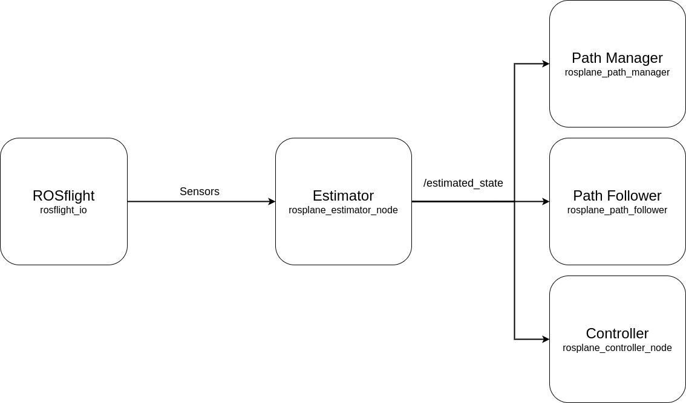
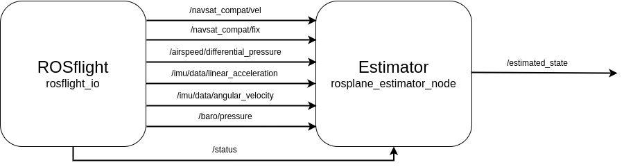

# Estimator Overview

## Overview

The estimator is a continuous-discrete Kalman Filter, a full treatment of the filter is found in section 8.5 of the [UAV book](https://github.com/randybeard/mavsim_public).
This filter essentially works by inverting a few sensor models and then using a two stage estimation of first the attitude and then the position state values.
This page will outline the states, their meaning and any general notes on the states.
For a more in depth look at which states are estimated in which way visit the [Estimator Base](./estimator-base.md) and [Estimator Example](./estimator-example.md) pages.

## ROS Interactions

The estimator takes in sensor information from `rosflight_io` computes an estimate and publishes it to the rest of ROSplane.

|  |
|:--:|
|*Figure 1: ROS network interactions for the estimator.*|

### Input

The inputs to the estimator are, accelerometer, rate gyro, barometer, differential pressure, GPS position, and GPS velocity estimates.
The table with the topic for each of the measures is below.

| Measure | Explanation | Topic |
|:------:|:-------:| :---: |
| Accelerometer | This measures the specfic force applied to the aircraft in the body frame axes (see section 7.1 in the UAV book for more details). | `/imu/data/linear_acceleration` |
| Rate Gyro | This measures the angular velocity of the aircraft around the body frame axes. | `/imu/data/angular_velocity` |
| Barometer | The barometer measures the ambient air pressure. It is calibrated on arm to establish a "zero" altitude measurement. | `/baro/pressure` |
| Differential Pressure | The differential pressure sensor, measures the difference in pressure using a pitot tube due to forward velocity. | `/airspeed/differential_pressure` |
| GNSS Position | GNSS postion gives the position of the aircraft in latitude, longitude and altitude. | `/navsat_compat/fix` |
| GNSS Velocity | GNSS velocity gives the velocity of the aircraft in meters per second in the global NED frame. | `/navsat_compat/vel` |
| Status | Indicates whether the aircraft is armed (indicating a need to initialize position and altitude estimates). | `/status` |

These topics provide the measures that are fused to create a state estimate.

|  |
|:--:|
|*Figure 1: ROS topic subscriptions and publications for the estimator.*|

## Output

There are 20 states estimated by the estimator that are published to the rest of ROSplane.
These states cover the position, orientation and aerodynamic information for the aircraft.
Below is a table of the `/estimated_state` message and what each of the fields represents.
Note that there are more than 20 states listed in the following table, but this is because either Euler angles or quaternions can be used to express orientation.
See the Frames and Derivation page for more information, or chapter 2 of the [UAV book](https://github.com/randybeard/mavsim_public).

| State | Explanation | Range/Type/Units |
|:--:|:--:|:--:|
| postion[3] | A 3 vector of the NED position of the aircraft. | $(-\infty , \infty)$ (float)(meters) |
| va | The airspeed of the aircraft. Always positive because it is the magnitude. | $(0 , \infty)$ (float)(meters/second) |
| alpha | The angle of attack of the aircraft wing. | $(-\pi, \pi)$ (float)(radians) |
| beta | The side-slip angle of the aircraft. | $(-\pi, \pi)$ (float)(radians) |
| phi | The roll angle of the aircraft. | $(-\pi, \pi)$ (float)(radians) |
| theta | The pitch angle of the aircraft. | $(-\pi, \pi)$ (float)(radians) |
| psi | The yaw angle of the aircraft. | $(-\pi, \pi)$ (float)(radians) |
| chi | The course angle of the aircraft. | $(-\pi, \pi)$ (float)(radians) |
| u | The velocity in the body x axis. | $(-\infty, \infty)$ (float)(meters/second) |
| v | The velocity in the body y axis. | $(-\infty, \infty)$ (float)(meters/second) |
| w | The velocity in the body z axis. | $(-\infty, \infty)$ (float)(meters/second) |
| p | The angular velocity about the body x axis (rollrate). | $(-\infty, \infty)$ (float)(radians/second) |
| q | The angular velocity about the body y axis (pitchrate). | $(-\infty, \infty)$ (float)(radians/second) |
| r | The angular velocity about the body z axis (yawrate). | $(-\infty, \infty)$ (float)(radians/second) |
| vg | The groundspeed of the aircraft. Always positive because it is the magnitude. | $(0 , \infty)$ (float)(meters/second) |
| wn | The global north velocity of the wind. | $(-\infty , \infty)$ (float)(meters/second) |
| we | The global east velocity of the wind. | $(-\infty , \infty)$ (float)(meters/second) |
| _ | **The following entries are optional.** | _ |
| quat[4] | A 4 vector of the quaternion describing the orientation. | $(-1 , 1)$ (float) |
| quat_valid | A flag indicating whether the data in the quat entry is valid.| True/False (bool) |
| psi_deg | The yaw angle of the aircraft in degrees. | $(-180, 180)$ (float)(degrees) |
| chi_deg | The course angle of the aircraft in degrees. | $(-180, 180)$ (float)(degrees) |
| init_lat | The latitude of the aircraft when first armed. | $(-90, 90)$ (float)(DDS) |
| init_long | The longitude of the aircraft when first armed. | $(-180, 180)$ (float)(DDS) |
| init_alt | The altitude of the aircraft when first armed. | $(0, \infty)$ (float)(meters) |

!!! note 
    More states may be estimated in the estimator than listed, these states are just those useful to other parts of ROSplane.

## Running the Estimator

The estimator is in the main `rosplane` ROS package.
The ROS executable is `rosplane_estimator_node`, yielding the run command:

`ros2 run rosplane rosplane_estimator_node`

To pass a set of parameters for the controller from a yaml file using the `--ros-args` option.

`ros2 run rosplane rosplane_estimator_node --ros-args --params-file path/to/params.yaml`

!!! note 
    Filepaths will need to be altered to work.
!!! note
    The most common way of running the estimator is through a launch file with the rest of the ROSplane pipeline running as well.
    See the ROSplane Overview in the Developer and User Guides for more details.
