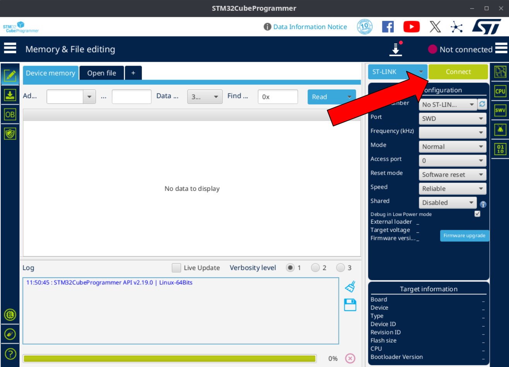

# Flight Controller Setup

!!! Note
    This page contains instructions for flashing pre-built firmware binaries.
    For instructions on building and flashing from source, see [Building and Flashing](../../developer-guide/firmware/building-and-flashing.md) in the Developer Guide.

## Compatible Hardware

Currently, the ROSflight firmware supports:

1. An in-development board from AeroVironment, the **Varmint**.
This board has an integrated Jetson Orin, but is not yet commercially available.
1. **[MRO's Pixracer Pro](https://store.3dr.com/pixracer-pro/)**, which has the same H7 processor.

!!! note "Supporting your own board"

    It is possible to write your own board support package (BSP).
    If you do create your own support package for the ROSflight firmware, please contribute back!

## Serial Port Configuration

!!! tip
    You can see which groups you are a member of by running `groups $USER` on the command line.

The following bullet point is necessary:

* Be sure your user is in the `dialout` and `plugdev` groups so you have access to the serial ports. You will need to log out and back in for these changes to take effect.
``` bash
sudo usermod -aG dialout,plugdev $USER
```

If you experience issues, you may need one or both of the next two bullet points:

* Temporarily stop the modem-manager (Sometimes, Linux thinks the device is a modem -- this command will be effective until next boot, or until you run the command again with `start` in place of `stop`)
``` bash
sudo systemctl stop ModemManager.service
```

* Add the custom udev rule so Linux handles the flight controller properly (copy the following as `/etc/udev/rules.d/45-stm32dfu.rules`)
``` bash
# DFU (Internal bootloader for STM32 MCUs)
SUBSYSTEM=="usb", ATTRS{idVendor}=="0483", ATTRS{idProduct}=="df11", MODE="0664", GROUP="plugdev"
```

!!! Tip
    You can permanently disable the ModemManager if you do not need it, then you won't have to disable it every time you reboot:
    ```
    sudo systemctl disable ModemManager.service
    ```
    Replace `disable` with `enable` to revert (i.e. if you find some other program you use needs access to it).
    Or you can uninstall it entirely from your system:
    ```
    sudo apt purge modemmanager
    ```

## Flashing Firmware

!!! warning "Needed tools"

    You will need an ST-Link STM programmer to flash the firmware.
    You can find one [on Mouser](https://www.mouser.com/ProductDetail/STMicroelectronics/ST-LINK-V2?qs=H4BOwPtf9MC1sDQ8j3cy4w%3D%3D&mgh=1&utm_id=22314976717&utm_source=google&utm_medium=cpc&utm_marketing_tactic=amercorp&gad_source=1&gad_campaignid=22304734959).

### Building the firmware

1. To build the firmware, first clone the firmware repository:
    ```bash
    git clone https://github.com/rosflight/rosflight_firmware
    ```
1. Create build directory:
    ```bash
    cd rosflight_firmware && mkdir build && cd build
    ```
1. Build using: (`board_name` should be either `varmint` or `pixracer_pro`)
    ```bash
    cmake .. -DBOARD_TO_BUILD=<board_name> && make -j
    ```

### Install STM32CubeProgrammer

We use the STM32CubeProgrammer to flash the flight controller.

1. Download the programmer [here](https://www.st.com/en/development-tools/stm32cubeprog.html#get-software).
    You may have to enter your email to download the software.
1. Install the software by following the instructions in the downloaded package.

### Flashing the Varmint

!!! danger "TODO"

    This section is still under development. Please check back soon.

1. Connect the board to the ST-Link.
1. Open STM32CubeProgrammer.
1. Plug the end of the ribbon cable into the 6-pin slot on the Varmint.
    You may have to make your own cable that connects the ST-Link to the 6-pin connector.

    !!! danger

        The Varmint has 2 6-pin connectors.
        **Do not** connect the ribbon cable to the port closest to the power wires.

1. Power on the Varmint by connecting a battery to the board.

1. Plug in the USB connector from the ST-Link to the computer. Select "Connect" in the STM Programmer.
    

1. Navigate to the programming page.

1. Select the hex file that was just built and click "Open".
    ```
    /path/to/rosflight_firmware/build/boards/varmint_h7/varmint_10X/varmint10X.hex
    ```

1. Select the appropriate options:

1. Press "Start Programming".

### Flashing the Pixracer Pro

Flashing the Pixracer Pro is a very similar process to flashing the Varmint.
The only differences are noted below:

1. The PixRacer Pro does not use the same 6-pin connector to connect to the ST-Link.
    Instead, it uses
    TODO!

1. Power on the Pixracer Pro using a USB-C port.

## LEDs

The meaning of the various LEDs is summarized in the following table. The colors of the LEDs may change depending on your specific board:

| LED           | On            | Off              | Slow Blink       | Fast Blink       |
|---------------|---------------|------------------|------------------|------------------|
| Power (Blue)  | Board powered | -                | -                | -                |
| Info (Green)  | RC control    | Offboard control | -                | -                |
| Warning (Red) | Armed         | Disarmed         | Error (disarmed) | Failsafe (armed) |
