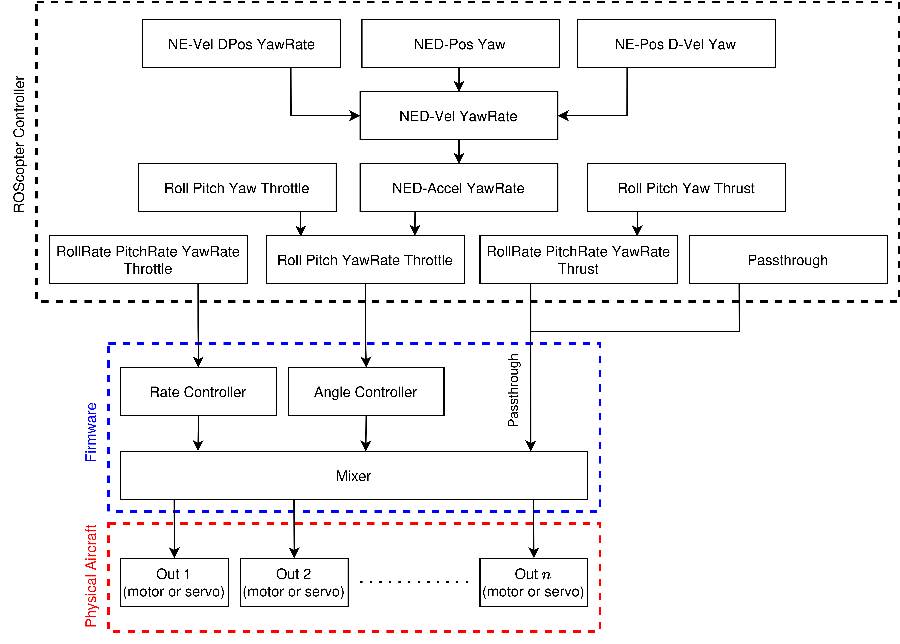

# ROScopter Architecture

This guide describes in detail each module in the default ROScopter autopilot stack.
It includes how to use and configure each module beyond the [ROSflight tutorials](../tutorials/tutorial-overview.md).

!!! tip "Getting started with ROScopter?"

    This guide **will not cover** installing or launching the simulation.
    Make sure to check out the [ROSflight tutorials](../tutorials/tutorial-overview.md) to set up ROScopter in simulation on your machine and launch basic waypoint missions.

!!! warning

    This guide assumes at least basic knowledge of ROS 2.
    See the [ROS 2 tutorials](https://docs.ros.org/en/jazzy/Tutorials.html) for more information.

## ROScopter Architecture Overview

An overview of the ROScopter architecture is diagrammed below.
Each box in the diagram represents a separate module or ROS 2 node that interfaces over the ROS 2 network using publishers, subscribers, and service calls.


|  |
|:--:|
|*Diagram of the ROScopter architecture*|

Each module is described in the following sections.

### Flow of information
As seen in [the figure](#roscopter-architecture-overview), the flow of information through ROScopter cascades from module to module, with the estimator module feeding required information to all modules.

In the default configuration of ROScopter, users supply waypoints to the `path_planner`, which then sends waypoints to the `path_manager`, which sends trajectory commands to the `trajectory_follower`.
The `controller` receives control setpoints from the `trajectory_follower` and sends those commands to the [flight control unit (FCU)](../overview.md) via the `rosflight_io` node.

!!! note

    When we refer to the "Navigation stack", we refer to the three modules that perform path-related tasks, namely the `path_planner`, `path_manager`, and `trajectory_follower`.

!!! tip

    For any ROS 2 interface definition (message/service definition, etc.), you can find the message definition using 
    ```bash
    ros2 interface show <interface type>
    ```

## Path Planner

### Responsibility
The `path_planner`'s responsibility is to define and publish a planned path consisting of waypoints.
Each waypoint is defined by a 3D location and orientation.

Thus, the `path_planner` maintains the list of all waypoints and publishes a subset to downstream nodes.
Note that the `path_planner` **does not manage** the path, meaning it does not determine how to transition from one waypoint to another.
It is simply in charge of maintaining and publishing waypoints.

### Parameters and configuration
The parameters associated with the `path_planner` are

| Parameter name | Parameter type | Description |
| :--- | :--- | :--- |
| `num_waypoints_to_publish_at_start` | `int` | Number of waypoints from plan to initially publish |

The `num_waypoints_to_publish_at_start` parameter determines how many waypoints are automatically published when a path plan is loaded.

If a given plan has 10 waypoints but the `num_waypoints_to_publish_at_start` is set to 5, then only the first 5 waypoints will be published right away.
The other waypoints will then be published sequentially using the appropriate service call listed below.

### Using the `path_planner`/implementation details
In the default configuration of ROScopter, the `path_planner` expects waypoints to be loaded using ROS 2 service calls.
This can be done by another node or manually by the user.
In our testing of the default ROScopter behavior, we usually manually load these waypoints by hand.

A planned path can be modified using the following service calls:

| Service name | Interface type | Description |
| :--- | :--- | :--- |
| `/add_waypoint` | `roscotper_msgs/AddWaypoint` | Add a single waypoint to the planned path |
| `/clear_waypoints` | `std_srvs/Trigger` | Clear all waypoints from the planned path |
| `/load_mission_from_file` | `rosflight_msgs/ParamFile` | Clear all waypoints and load a new plan from a file |
| `/print_waypoints` | `std_srvs/Trigger` | Print all waypoints in the plan to the screen |
| `/publish_next_waypoint` | `std_srvs/Trigger` | Publish the next waypoint in the plan |

!!! danger

    To avoid long descriptions, we omitted the namespace from the service calls in the documentation.
    All of the `path_planner` service servers are namespaced by `/path_planner`.

    In other words, to run the `add_waypoint` service, you would run
    ```bash
    ros2 service call /path_planner/add_waypoint ...
    ```
    **not**
    ```bash
    ros2 service call /add_waypoint ...
    ```

#### Add waypoint
The `add_waypoint` service adds a single waypoint to the path.
See the `roscopter_msgs/AddWaypoint` interface definition to see what information is contained in the service call.

#### Clear waypoints
This service clears all waypoints from the planned path.

Under the hood, this service call publishes a new waypoint that sets the `clear_waypoints` field to true.
It is the responsibility of any node subscribing to the waypoints to clear any internal list of waypoints.
For example, in order to function properly, both the `path_manager` and the ROScopter ground control station (GCS) maintain internal lists of what waypoints have been published.
These nodes need to clear the internal storage of the waypoints when the `path_planner` publishes a waypoint with the `clear_waypoints` field set true.

#### Load mission from file
This service loads a mission file to the `path_planner`.
The mission file is a YAML file containing the waypoint definitions.

This service call also clears all existing waypoints first, so the new waypoints will not be appended to the old waypoints.
If you want to append waypoints instead of clearing, use the `add_waypoints` service.

#### Print waypoints
It can be helpful during debugging to know what waypoints are currently loaded to the `path_planner`.
This service call will print the waypoints to the terminal (the terminal running the `path_planner`, not the one that calls this service).

Note that printing to the screen is automatically done when using the `load_mission_from_file` service.

#### Publish next waypoint
The `publish_next_waypoint` service server is used to publish the next unpublished waypoint in the planned path.
Note that the first <`num_waypoints_to_publish_at_start`> number of waypoints are automatically published whenever the `path_planner` gets new waypoints.

## Path Manager

### Responsibility
The responsibility of the ROScopter `path_manager` is:

1. Take waypoints published by the [`path_planner`](#path-planner) and produce a trajectory between waypoints, and
2. Monitor waypoint completion/switching to the next leg. 

!!! note

    In this section, we will refer to the path/trajectory between two waypoints as a "waypoint leg" of the mission

### Interface with ROScopter
The `path_manager` interfaces with the rest of ROScopter using publishers and subscribers.

| Subscriber name | Message type | Description |
| :--- | :--- | :--- |
| `estimated_state` | `roscopter_msgs/State` | Estimated state for the vehicle (needs position and orientation) |
| `waypoints` | `roscopter_msgs/Waypoint` | Waypoints to manage |

| Publisher name | Message type | Description |
| :--- | :--- | :--- |
| `trajectory_command` | `roscopter_msgs/TrajectoryCommand` | Output commanded trajectory |

To summarize, the `path_manager` takes in waypoints (from the `path_planner`) and the estimated state (from the `estimator`) and computes a desired trajectory, which it publishes on the `trajectory_command` topic.

### Using the `path_manager`/implementation details

Given a set of waypoints and the position of the vehicle, the `path_manager` needs to compute a trajectory to get from one waypoint to the next.
We would like trajectory setpoints $u_\text{traj}$ of the form
$$
    u_\text{traj} = [p, \dot{p}, \ddot{p}, \psi, \dot{\psi}, \ddot{\psi}]^T,
$$
where $p$ is the 3-D position, and $\psi$ is the desired heading.
The velocity and acceleration parts are essentially feed-forward terms that can be used by the downstream [trajectory follower](#trajectory-follower).

!!! note
    The following path derivation is very similar to the one in [*Small Unmanned Aircraft: Theory and Practice*](https://github.com/byu-magicc/mavsim_public), Ch. 14 by Beard and McLain.

In the default implementation of ROScopter, the path the `path_manager` produces is simply a linear interpolation between waypoints, parametrized by the path parameter $\sigma(\tau)$.
This results in a straight line in 3D space, as well as a straight "line" between desired headings at the waypoints.
Thus, the commanded position, $p^c$, and heading, $\psi^c$, setpoints at the current time is computed as
$$
    p^c = \sigma(\tau) p_i + (1 - \sigma(\tau)) p_{i-1}
$$
$$
    \psi^c = \sigma(\tau) \psi_i + (1 - \sigma(\tau)) \psi_{i-1}
$$
where $p_i$ is the waypoint at the end of the current leg, $p_{i-1}$ is the waypoint at the start of the waypoint leg, $\sigma(\tau) \in [0,1]$ is a monotonically increasing function, and $\tau = \frac{t}{T} \in [0,1]$.
Here, $t$ is the current time along the current waypoint leg, and $T$ is the total time taken to travel the waypoint leg.

We can then compute the commanded derivatives as
$$
    \dot{p}^c = \frac{1}{T}\dot{\sigma}(\tau)(p_i - p_{i-1})
$$
$$
    \dot{\psi}^c = \frac{1}{T}\dot{\sigma}(\tau)(\psi_i - \psi_{i-1})
$$
$$
    \ddot{p}^c = \frac{1}{T^2}\ddot{\sigma}(\tau)(p_i - p_{i-1})
$$
$$
    \ddot{\psi}^c = \frac{1}{T^2}\ddot{\sigma}(\tau)(\psi_i - \psi_{i-1})
$$
Note that the $\frac{1}{T}$ term shows up because $\tau = t/T$.

To compute the desired output trajectory, we then need to define $\sigma(\tau)$.
We have some freedom to choose how $\sigma(\tau)$ behaves.
If we let $\sigma(\tau) = \tau = \frac{t}{T}$, then $p^c$ would interpolate linearly in time from $p_{i-1}$ to $p_i$.
However, this would mean $\dot{p}^c$ (i.e. the velocity) would be constant, and the vehicle would have that same velocity at $p_i$, causing it to overshoot as it continued on to the next leg.
<!--TODO: This warrants a picture/gif.-->

Instead, we will define $\sigma(\tau)$ to be a 5th order [smoothstep function](https://en.wikipedia.org/wiki/Smoothstep), which smoothly interpolates time from $0$ to $1$.
The smoothstep function guarantees that the velocity and acceleration are zero at $\tau=0$ and $\tau=1$, resulting in a smooth transition between waypoint legs.

The 5th order smoothstep scaling function (and derivatives) are defined as
$$
 \sigma(\tau) = 6\tau^5 - 15\tau^4 + 10\tau^3
$$
$$
 \dot{\sigma}(\tau) = 30\tau^4 - 60\tau^3 + 30\tau^2
$$
$$
 \ddot{\sigma}(\tau) = 120\tau^3 - 180\tau^2 + 60\tau
$$

We can almost compute the desired trajectory setpoints.
The last piece to consider is how to pick $T$, the total time to travel a given waypoint path leg.
The smaller $T$ is, the faster the path parameter $\sigma(\tau)$ will transition, and the faster the vehicle will need to fly.
For good performance, we would like to pick a $T$ such that the vehicle can feasibly follow the path given some constraints.

One way to do this is to pick $T$ so that it is based off of some user-defined maximum velocity and acceleration parameters.
To do this, let's first find where the maximums of $\dot{\sigma}(\tau)$ and $\ddot{\sigma}(\tau)$ are by setting derivatives equal to zero and solving for $\tau$
$$
\frac{\partial}{\partial \tau}\dot{\sigma}(\tau) = \ddot{\sigma}(\tau) = 120\tau^3 - 180\tau^2 + 60\tau = 0 \implies \tau = \frac{1}{2} = 0.5
$$
$$
\frac{\partial}{\partial \tau}\ddot{\sigma}(\tau) = 360\tau^2 - 360\tau + 60 = 0 \implies \tau = \frac{3 - \sqrt{3}}{6} = 0.2113 
$$

Now let's compute the magnitude of the desired velocity and acceleration commands generated at these $\tau$ points.
$$
    \lVert \dot{p}^c(\tau = 0.5) \rVert = \frac{1}{T_v}\dot{\sigma}(0.5) \lVert p_i - p_{i-1} \rVert = v_\text{max}
$$
$$
    \lVert \ddot{p}^c(\tau = 0.2113) \rVert = \frac{1}{T^2_a}\ddot{\sigma}(0.2113) \lVert p_i - p_{i-1} \rVert = a_\text{max}
$$

Now we solve for $T_v$ and $T_a$ to get
$$
T_v = \dot{\sigma}(0.5) * \lVert p_i - p_{i-1} \rVert / v_\text{max}
$$
$$
T_a = \sqrt{\ddot{\sigma}(0.2113) * \lVert p_i - p_{i-1} \rVert / a_\text{max}}
$$
Note that both $v_\text{max}$ and $a_\text{max}$ are user-defined parameters.

We can then choose the biggest $T$ so that both constraints are satisfied:
$$
T = \max (T_v, T_a)
$$

!!! warning "Tuning $v_\text{max}$ and $a_\text{max}$"
    The two parameters $v_\text{max}$ and $a_\text{max}$ are highly vehicle-specific.
    The `path_manager` uses them to make sure that the commanded trajectory never produces velocity and acceleration commands higher than these parameters (as described above).

    If these parameters are set too high for downstream controllers to track, it will cause poor performance (especially when using a controller that uses the velocity and acceleration feed-forward commands in the trajectory command vector).

    For example, if these parameters are too high, then the path parameter $\sigma$ will propagate faster than downstream controllers are able to track.
    As the vehicle falls behind the commanded trajectory setpoint, the feed-forward terms (velocity and acceleration commands) will get out-of-sync with the current position of the vehicle along the trajectory.

    This is especially noticeable when the setpoint reaches the end of the waypoint path.
    The feed-forward terms are designed to slow the vehicle as it reaches the end of the waypoint path (this is the purpose of the smoothstep function).
    If the vehicle is far behind the final position when the path parameter $\sigma$ reaches it, then those feed-forward terms will cause the vehicle to slow down, even though the vehicle is still somewhere in the middle of the waypoint path.
    This results in visually poor performance.
    <!-- TODO: This is an ideal spot for a graphic/GIF that shows this behavior. -->

    The solution? Tune the $v_\text{max}$ and $a_\text{max}$ parameters appropriately.

We can now plug along and compute our desired trajectory commands at each leg.
To set up each leg,

1. Compute $T$
1. Set $t = 0$

For each waypoint leg in our path, we

1. Compute $\tau = t/T$
2. Compute $\sigma(\tau)$ and derivatives
3. Compute $p^c$, $\psi^c$ and derivatives
4. Publish trajectory command

When the vehicle arrives at the next leg, simply set up the next leg and continue.

Note that the `path_manager` publishes trajectory commands at the rate specified by the `path_update_frequency` ROS 2 parameter.

<!--TODO: Nice graphics and visuals of the path manager and trajectory follower would be nice here. Maybe that would be an interesting project for someone?-->

#### Path Manager Services
The `path_manager` offers the following service servers:

| Service name | Interface type | Description |
| :--- | :--- | :--- |
| `clear_waypoints` | `std_srvs/Trigger` | Clears the waypoints internal to the `path_manager` |
| `print_waypoints` | `std_srvs/Trigger` | Prints all waypoints received to the terminal |


!!! danger

    To avoid long descriptions, we omitted the namespace from the service calls in the documentation.
    All of the `path_manager` service servers are namespaced by `/path_manager`.

    In other words, to run the `clear_waypoints` service, you would run
    ```bash
    ros2 service call /path_manager/clear_waypoints ...
    ```
    **not**
    ```bash
    ros2 service call /clear_waypoints ...
    ```

### Parameters and configuration

The parameters associated with the `path_planner` are

| Parameter name | Parameter type | Description |
| :--- | :--- | :--- |
| `default_altitude` | `double` | Altitude of the default waypoint (see note). Should be a positive number (not in NED frame)! |
| `hold_last` | `bool` | Determines if the `path_manager` will hold at the last waypoint or if it will cycle back to the first |
| `path_update_frequency` | `double` | Rate (in Hz) at which to publish tractory setpoints |
| `waypoint_tolerance` | `double` | Distance (in m) from the target waypoint at which the waypoint is considered complete |
| `do_linear_interpolation` | `bool` | Determines if a linear time scaling or a 5th order smoothstep time scaling will be used.  |
| `max_acceleration` | `double` | Max acceleration value in m/s$^2$ (used when generating trajectory) |
| `max_velocity` | `double` | Max velocity value in m/s (used when generating trajectory) |


When no waypoints are provided to the `path_manager`, it will create a default waypoint to send to downstream tasks.
This default waypoint is at the origin (i.e. where the vehicle was armed), with an altitude determined by the `default_altitude` parameter.

The `hold_last` parameter determines whether or not the `path_manager` will hold the vehicle at the last waypoint.
If this is set to `false`, then the `path_manager` will repeatedly cycle through the waypoints once it reaches the last one.

The `path_update_frequency` parameter determines how often the `path_manager` publishes the trajectory commands.
Setting this rate does **not** determine how fast the trajectory setpoints interpolate between waypoints (see the [implementation details](#using-the-path_managerimplementation-details)).
Settings this to a high value just increases the frequency commands are published.

The last two parameters, `max_acceleration` and `max_velocity` are user-defined parameters that are **highly vehicle-specific**.
These two parameters determine the total time a given waypoint leg will take.
The `max_acceleration` parameter limits the acceleration computed by the `path_manager`.
The `max_velocity` parameter limits the velocity computed by the `path_manager`.
See the [implementation details](#using-the-path_managerimplementation-details) for more information on how they are used/defined.

## Trajectory Follower
### Responsibility
The responsibility of the `trajectory_follower` is to produce controller setpoints to follow a given trajectory.

Note that the `trajectory_follower` does not take in an entire trajectory, but rather a trajectory setpoint *at a particular instant in time*.

### Interface with ROScopter
The `trajectory_follower` interfaces with the rest of ROScopter using publishers and subscribers.

| Subscriber name | Message type | Description |
| :--- | :--- | :--- |
| `estimated_state` | `roscopter_msgs/State` | Estimated state for the vehicle (needs position and orientation) |
| `status` | `rosflight_msgs/Status` | Status message from the ROSflight firmware (needs to know when RC control is active) |
| `trajectory_command` | `roscopter_msgs/TrajectoryCommand` | Input trajectory command |

| Publisher name | Message type | Description |
| :--- | :--- | :--- |
| `high_level_command` | `roscopter_msgs/ControllerCommand` | Output commands to the downstream ROScopter controller |

To summarize, the `trajectory_follower` takes in the estimated state (from the `estimator`) and trajectory setpoints (from the `path_manager`), and computes and publishes the commands to the `controller` node.

### Using the `trajectory_follower`/implementation details
The input trajectory commands are vectors of the form
$$
    u_\text{traj} = [p, \dot{p}, \ddot{p}, \psi, \dot{\psi}, \ddot{\psi}]^T,
$$
where $p$ and $\psi$ are the desired 3-D position and heading setpoints, respectively.
The derivative terms are feed-forward terms for each setpoint.

The output of the `trajectory_follower` is controller setpoints of the form
$$
    u_\text{out} = [\phi^c, \theta^c, r^c, T^c]
$$
where $\phi^c$ and $\theta^c$ are the desired roll and pitch in radians, respectively, and $r^c$ is the desired yaw rate in radians per second.
$T^c$ is the desired thrust, in Newtons.

The trajectory follower is based off of the ["Differential flatness based control of a rotorcraft for aggressive maneuvers"](https://ieeexplore.ieee.org/document/6095098) by Ferrin, et al[^1].
We refer the reader to that paper for information on the implementation and how it works.

[^1]: J. Ferrin, R. Leishman, R. Beard and T. McLain, "Differential flatness based control of a rotorcraft for aggressive maneuvers," 2011 IEEE/RSJ International Conference on Intelligent Robots and Systems, San Francisco, CA, USA, 2011, pp. 2688-2693, doi: 10.1109/IROS.2011.6095098.

There are a number of differences in the ROScopter `trajectory_follower` not present in the work by Ferrin, et al.

1. The ROScopter `trajectory_follower` uses four PID controllers (north, east, down, and yaw) as the nominal controllers, not an LQR controller (as seen in Fig. 2 of the paper).
This means that there are 4 sets of separate PID gains for each controller.

    !!! info
        The nominal controllers (the PID controllers) have integrators.
        To avoid integrator wind-up, the `trajectory_follower` clears the integrator values when the RC safety pilot has RC override.

        The `trajectory_follower` determines if the safety pilot has control of the vehicle using the `status` message.

1. Eq. (16)[^1] requires computing $\dot{\theta}$ (note this is not $q$!). The `trajectory_follower` assumes constant acceleration over the timestep to compute this derivative.
1. Before computing $\boldsymbol{z}$ in Eq. (13)[^1], we first saturate $u_{p_3}$ to avoid instabilities near the origin for Eq. (15)[^1].

!!! note
    Saturating $u_{p_3}$ is necessary to prevent poor performance when the trajectory follower tries to track large down setpoints.

    The total desired down acceleration is computed as
    $$
    u_{p_3} = \ddot{p}^c - g
    $$
    where $g=9.81$ is gravity.

    When $\ddot{p}^c$ approaches $+g$, then $u_{p_3}$ approaches $0$, and Eq. (15)[^1] returns large values of $\theta$ for small changes in $z_1$.
    Physically, this results in large, rapidly changing pitch commands, resulting in undesireable performance.
    Note that this can happen for large nominal (PID) controller output, but also for large feedforward input.

    To fix this, we need to make sure $u_{p_3}$ does not approach $0$, or equivalently, $\ddot{p}^c$ does not approach $+g$.
    Since free-fall is also usually not desireable (i.e. $\ddot{p}^c=0$), we saturate $u_{p_3}$ so that
    $$
    u_{p_3} \in [u_\text{max}, -\infty]
    $$
    where $u_\text{max}$ is a negative number controlled by the `max_commanded_down_accel_in_gs` parameter.

    Note that the `max_commanded_down_accel_in_gs` parameter **should be a negative number**, e.g. $-0.4$.
    This means that the maximum down command is $-0.4g$.
    Since we are using the NED frame, this translates to a minimum of $0.4g$ commanded output acceleration up, so a maximum $0.6g$ actual acceleration down.

#### Trajectory Follower Services
The `trajectory_follower` offers the following service server:

| Service name | Interface type | Description |
| :--- | :--- | :--- |
| `clear_integrators` | `std_srvs/Trigger` | Clears the integrator values in the nominal PID controllers |


### Parameters and configuration
The parameters associated with the `trajectory_follower` are

| Parameter name | Parameter type | Description |
| :--- | :--- | :--- |
| `down_command_window` | `double` | If input down command to down controller is larger than this parameter, input command gets saturated to this value. |
| `gravity` | `double` | Gravity in $m/s^2$ |
| `mass` | `double` | Mass of the system in kg |
| `max_commanded_down_accel_in_gs` | `double` | Maximum down acceleration the `trajectory_follower` can command (in $g$'s). See the [implementation details](#using-the-trajectory_followerimplementation-details). |
| `tau` | `double` | Bandwidth of the dirty derivative (for the PID controllers). See the [ControlBook](https://github.com/byu-controlbook/controlbook_public). |
| `u_n_kp` | `double` | $k_p$ gain for the north PID controller |
| `u_n_ki` | `double` | $k_i$ gain for the north PID controller |
| `u_n_kd` | `double` | $k_d$ gain for the down PID controller |
| `u_e_kp` | `double` | $k_p$ gain for the east PID controller |
| `u_e_ki` | `double` | $k_i$ gain for the east PID controller |
| `u_e_kd` | `double` | $k_d$ gain for the east PID controller |
| `u_d_kp` | `double` | $k_p$ gain for the down PID controller |
| `u_d_ki` | `double` | $k_i$ gain for the down PID controller |
| `u_d_kd` | `double` | $k_d$ gain for the down PID controller |
| `yaw_to_rate_kp` | `double` | $k_p$ gain for the yaw angle to yaw rate PID controller |
| `yaw_to_rate_ki` | `double` | $k_i$ gain for the yaw angle to yaw rate PID controller |
| `yaw_to_rate_kd` | `double` | $k_d$ gain for the yaw angle to yaw rate PID controller |

!!! danger "Mass and gravity parameters"
    The `gravity` and `mass` parameters **must** be correct.
    Otherwise, the `trajectory_follower` will output incorrect controller commands.

    Make sure the `mass` parameter is the same between all other nodes.

As described in the [implementation details section](#using-the-trajectory_followerimplementation-details), there are 4 PID controllers, one for north, east, down position, and one for yaw to yaw-rate.
Each controller has a set of PID gains associated with it, and each should be tuned separately.

!!! tip
    For multirotors, the north and east configuration of the vehicle is usually symmetric, so the control gains for those two loops are likely to be very similar.

The `down_command_window` parameter saturates the input command for the down nominal (PID) controller to avoid large input commands (and thus large output commands).
In other words, if the input command is larger than `down_command_window`, then the input is saturated to this value.
This parameter exists to help stabilize the drone as it descends.

!!! warning "Important"
    The `down_command_window` parameter only applies on the descent, **not on the ascent**.
    This is because when the vehicle descends through the prop wash, the airflow can cause instability and shaking.


## Controller

### Responsibility
The responsibility of the `controller` is to

1. produce low-level commands from high-level commands
2. Maintain a state machine to manage autonomous takeoff

### Interface with ROScopter
The `controller` interfaces with the rest of ROScopter using publishers and subscribers.

| Subscriber name | Message type | Description |
| :--- | :--- | :--- |
| `estimated_state` | `roscopter_msgs/State` | Estimated state for the vehicle (needs everything) |
| `status` | `rosflight_msgs/Status` | Status message from the ROSflight firmware (needs to know when RC control is active or when the vehicle is armed) |
| `high_level_command` | `roscopter_msgs/ControllerCommand` | Input controller command |

| Publisher name | Message type | Description |
| :--- | :--- | :--- |
| `command` | `rosflight_msgs/Command` | Output commands to the downstream ROSflight firmware controller |

To summarize, the ROScopter `controller` takes in the estimated state and high-level command setpoints and computes low-level command setpoints that are sent to the ROSflight firmware on the flight control unit.
Note that the output command messages are sent to ROSflight firmware (on the [flight control unit](../overview.md)) via the `rosflight_io` node.

### Using the `controller`/implementation details
Many different control schemes exist for multirotor vehicles.
Since application code (i.e. code that you write) has slightly different outputs, the ROScopter controller has the architecture shown in the following figure.

|  |
| :---: |
| Diagram of the ROScopter controller architecture and how the cascaded controller chain interacts with the ROSflight firmware controller |

The above figure shows the cascaded architecture of the ROScopter controller.
In this diagram, the arrows represent how one controller output feeds into the next controller's input, all the way down to one of three basic control types.
For example, if the user passes control setpoints corresponding to Controller 0 (inertial-frame north, east, down position and yaw commands), Controller 0 converts them to Controller 3 inputs, which then converts to Controller 2 inputs, and so on.

The following table describes the inputs to each type of controller.

| Number | Name | Description of reference commands |
| :--- | :--- | :--- |
| 0  | NED-Pos Yaw | Inertial north, east, down (NED) positions and yaw |
| 1  | NE-Vel D-Pos YawR | Inertial N-E velocities, D position, and yaw rate |
| 2  | NED-Accel YawR | Vehicle-1 frame[^2] accelerations and yaw rate |
| 3  | NED-Vel YawR | Inertial NED velocities and yaw rate |
| 4  | NE-Pos D-Vel Yaw | Inertial N-E velocities and yaw |
| 5  | Roll Pitch Yaw Throttle | Roll, pitch, yaw, and throttle |
| 6  | Roll Pitch YawR Throttle | Roll, pitch, yaw rate, and throttle |
| 7  | RollR PitchR YawR Throttle | Roll rate, pitch rate, yaw rate, throttle |
| 8  | Pass-through | Pass-through to ROSflight firmware mixer |
| 9 | Roll Pitch Yaw Thrust | Roll, pitch, yaw, and thrust to pass-through |
| 10 | Roll Pitch YawR Thrust | Roll, pitch, yaw rate, and thrust to pass-through |
| 11 | RollR PitchR YawR Thrust | Roll rate, pitch rate, yaw rate, and thrust to pass-through |

[^2]: R. W. Beard and T. W. McLain, *Small Unmanned Aircraft: Theory and Practice*, 2012, Princeton University Press, see also https://github.com/byu-magicc/mavsim_public.

The `controller`'s cascaded architecture allows users to "insert" control commands at many different levels, depending on the needs of their application code.
Each insertion point thus produces a different *controller chain*.

!!! note
    We'll call the sequence of controllers used as a *controller chain*.

    For example, inserting at Controller 4 would have the controller chain of Controller 4 -> Controller 3 -> Controller 2 -> Controller 6.

Each insertion point is chosen via the `mode` field in the `roscopter_msgs/ControllerCommand` message.
Thus, each ROS 2 message determines which controller it inserts at.
This means that different controller chains can be chosen at runtime, and can be mixed and matched throughout the flight.

!!! example "Using different controller chains during a flight"
    Since the insertion points are chosen via the `mode` field in each ROS 2 message sent to the `controller`, controller chains can be mixed and matched throughout the flight.

    For example, in the default implementation of ROScopter, the `controller` inserts commands at Controller 4 during takeoff and Controller 10 during the other portions of the flight.

As seen in the above ROScopter `controller` diagram, the output of the `controller` node is sent directly to the ROSflight firmware via the `rosflight_io` node (note that the `rosflight_io` node is not shown in the diagram).
The output of all controller chains needs to be one of the modes that the firmware controller can accept.
Thus, the output of the ROScopter controller is one of the following output types:
$$
    u_\text{angle} = [\phi^d, \theta^d, r^d, \delta_t^d]^T
$$
$$
    u_\text{rate} = [p^d, q^d, r^d, \delta_t^d]^T
$$
$$
    u_\text{pass-through} = [Q_x^d, Q_y^d, Q_z^d, T_z^d]^T
$$
where $\phi$, $\theta$, and $\psi$ are roll, pitch, and yaw commands, $p$, $q$, $r$ are roll rate, pitch rate, and yaw rate, and $\delta_t \in [0,1]$ is the throttle setpoint.
$Q$ and $T$ are the body-frame torques and forces, respectively.

#### Controller State Machine
The `controller` node also has a simple state machine to manage safe takeoff and landing.

|  |
| :---: |
| Diagram of the `controller`'s state machine.

The `controller` state machine starts in the disarmed state until the user arms the vehicle.
Additionally, the state machine requires a valid command setpoint sent to the `high_level_command` topic.
This is determined by the `cmd_valid` field in the `roscopter_msgs/ControllerCommand` message definition.

The state machine then transitions to takeoff mode, where the vehicle will climb at a constant velocity until it reaches a particular height.
Once the vehicle reaches the desired height (within a given threshold), takeoff is considered complete and the vehicle transitions to position hold mode.

After a brief pause in position hold mode, the vehicle then enters "offboard control" mode, which means that the controller will output control commands to track the commands on the `high_level_command` topic.

During the takeoff and position hold states, the commands sent to the `high_level_command` topic are overridden.
This ensures that the vehicle is at a safe height before attempting to follow any path commands.
Note that if the `cmd_valid` field is set to `false` in messages from the `high_level_command` topic, then the offboard control state will transition to position hold.

The behavior of the state machine can be configured via [the `controller`'s parameters](#parameters-and-configuration).
This includes the takeoff down velocity, the height the controller will climb to, the threshold that the state machine considers the takeoff waypoint complete, and the time that the state machine will spend in takeoff before transitioning to offboard control mode.

### Parameters and configuration
The parameters associated with the `controller` are listed below.
Parameters that have notes/special considerations are discussed below the table.

| Parameter name | Parameter type | Description |
| :--- | :--- | :--- |
| `equilibrium_throttle` | `double` | Throttle value required to maintain hover. Between 0-1 |
| `gravity` | `double` | Gravity in $m/s^2$ |
| `mass` | `double` | Vehicle mass (in kg) |
| `max_descend_accel` | `double` | Maximum descent acceleration. **Applies to the acceleration controller** |
| `max_descend_rate` | `double` | Maximum down velocity. **Applies to the velocity PID controllers** |
| `max_pitch_deg` | `double` | Maximum pitch angle (in degrees). **Applies to the angle PID controllers.** |
| `max_pitch_rate_deg` | `double` | Maximum pitch rate (in degrees/sec). **Applies to the rate PID controllers.** |
| `max_pitch_torque` | `double` | Maximum pitch torque (in N-m). **Applies to the torque controllers.** |
| `max_roll_deg` | `double` | Maximum roll angle (in degrees). **Applies to the angle PID controllers.** |
| `max_roll_rate_deg` | `double` | Maximum roll rate (in degrees/sec). **Applies to the rate PID controllers.** |
| `max_roll_torque` | `double` | Maximum roll torque (in N-m). **Applies to the torque controllers.** |
| `max_throttle` | `double` | Maximum allowed throttle setpoint. Should be between 0-1 |
| `max_yaw_rate_deg` | `double` | Maximum yaw rate (in degrees/sec). **Applies to the rate PID controllers.** |
| `max_yaw_torque` | `double` | Maximum yaw torque (in N-m). **Applies to the torque PID controllers.** |
| `min_altitude_for_attitude_ctrl` | `double` | Minimum altitude before attitude control. Roll and pitch commands are zero when the vehicle is lower than this number. Helps to reduce crashes on takeoff. |
| `min_throttle` | `double` | Minimum throttle setpoint. Should be between 0-1 |
| `takeoff_d_pos` | `double` | Down position to achieve (in takeoff) before turning control over to the "offboard control". |
| `takeoff_d_vel` | `double` | Down velocity during takeoff (until vehicle reaches the `takeoff_d_pos` position. |
| `takeoff_height_threshold` | `double` | Radius (in m) that the vehicle must achieve around the `takeoff_d_pos` setpoint before the state machine considers takeoff to be complete. |
| `takeoff_landing_pos_hold_time` | `double` | Time (in seconds) the state machine will hold before switching to offboard control (after takeoff) or landing. Holding for a brief time before switching over helps with stability. |
| `tau` | `double` | Bandwidth of the dirty derivative (for the PID controllers). See the [ControlBook](https://github.com/byu-controlbook/controlbook_public). |

!!! danger "Max/min parameters"
    The parameters associated with max and min values (e.g. `max_descend_accel`) **only apply if the control loop associated with those parameters is run**.

    For example, the `max_descend_rate` parameter is a saturation limit on the down velocity controller, meaning that the output of the down velocity controller is saturated to never be greater than this number.
    However, if the velocity controller is not run (meaning a controller lower in [the controller chain](FIXME) is used), then the velocity controller will not run and this max velocity limit will not be respected.

    Please note which control loops you are using before tuning these parameters, as some will not be used based on where you are inserting into the control chain.

The `max_throttle` parameter is usually set to be lower than 1 to reserve some actuator effort for attitude control.
The `min_throttle` parameter is usually set to a value higher than 0 to avoid the motors "shutting off" for particular maneuvers.

!!! warning
    Make sure the `mass` parameter is correct and that it is the same between all nodes (e.g. the [`trajectory_follower`)](#trajectory-follower).

The following parameters are listed for completeness.
Each of the PID control types from the [implementation details](#using-the-controllerimplementation-details) section has 3 gains associated with it.

Note that the control loops that are used depends on where the high-level command setpoints are inserted into the controller chain.
Thus, not all of the PID gains below will need to be tuned when using ROScopter.
Make sure to check which gains are used based on where you are inserting command setpoints.

| | Parameter name | Parameter name | Parameter name |
| :--- | :--- | :--- | :--- |
| **Rate to torque** | `pitch_rate_to_torque_kd` | `roll_rate_to_torque_kd` | `yaw_rate_to_torque_kd` |
| | `pitch_rate_to_torque_ki` | `roll_rate_to_torque_ki` | `yaw_rate_to_torque_ki` |
| | `pitch_rate_to_torque_kp` | `roll_rate_to_torque_kp` | `yaw_rate_to_torque_kp` |
| **Angle to torque** | `pitch_to_torque_kd` |  `roll_to_torque_kd` | `yaw_to_torque_kd` |
| | `pitch_to_torque_ki` |  `roll_to_torque_ki` | `yaw_to_torque_ki` |
| | `pitch_to_torque_kp` |  `roll_to_torque_kp` | `yaw_to_torque_kp` |
| **Position to velocity** | `pos_n_to_vel_kd` | `pos_d_to_vel_kd` | `pos_e_to_vel_kd` |
| | `pos_n_to_vel_ki` | `pos_d_to_vel_ki` | `pos_e_to_vel_ki` |
| | `pos_n_to_vel_kp` | `pos_d_to_vel_kp` | `pos_e_to_vel_kp` |
| **Velocity to acceleration** | `vel_d_to_accel_kd` | `vel_e_to_accel_kd` | `vel_n_to_accel_kd` |
| | `vel_d_to_accel_ki` | `vel_e_to_accel_ki` | `vel_n_to_accel_ki` |
| | `vel_d_to_accel_kp` | `vel_e_to_accel_kp` | `vel_n_to_accel_kp` |
| **Yaw to yaw rate** | `yaw_to_rate_kd` | | |
| | `yaw_to_rate_ki` | | |
| | `yaw_to_rate_kp` | | |

!!! note
    Each PID gain is named according to what it takes in and what it returns.

    For example, the derivative gain for the PID loop that takes in position commands and returns velocity commands in the down direction is called `pos_d_to_vel_kd`.
