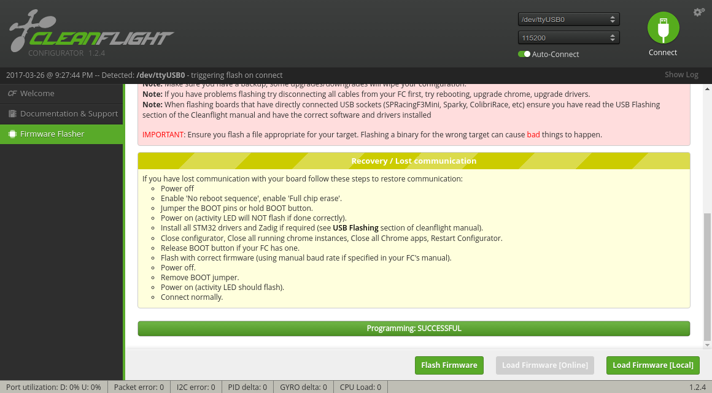

# Flight Controller Setup

!!! Note
    This page contains instructions for flashing pre-built firmware binaries.
    For instructions on building and flashing from source, see [Building and Flashing](../developer-guide/firmware/building-and-flashing.md) in the Developer Guide.

## Compatible Hardware

!!! warning "TODO"
    Updated compatible hardware when supported hardware is finalized.

## Serial Port Configuration

!!! tip
    You can see which groups you are a member of by running `groups $USER` on the command line.

The following bullet point is necessary:

* Be sure your user is in the `dialout` and `plugdev` groups so you have access to the serial ports. You will need to log out and back in for these changes to take effect.
``` bash
sudo usermod -aG dialout,plugdev $USER
```

If you experience issues, you may need one or both of the next two bullet points:

* Temporarily stop the modem-manager (Sometimes, Linux thinks the device is a modem -- this command will be effective until next boot, or until you run the command again with `start` in place of `stop`)
``` bash
sudo systemctl stop ModemManager.service
```

* Add the custom udev rule so Linux handles the flight controller properly (copy the following as `/etc/udev/rules.d/45-stm32dfu.rules`)
``` bash
# DFU (Internal bootloader for STM32 MCUs)
SUBSYSTEM=="usb", ATTRS{idVendor}=="0483", ATTRS{idProduct}=="df11", MODE="0664", GROUP="plugdev"
```

!!! Tip
    You can permanently disable the ModemManager if you do not need it, then you won't have to disable it every time you reboot:
    ```
    sudo systemctl disable ModemManager.service
    ```
    Replace `disable` with `enable` to revert (i.e. if you find some other program you use needs access to it).
    Or you can uninstall it entirely from your system:
    ```
    sudo apt purge modemmanager
    ```

## Flashing Firmware using the Cleanflight Configurator

!!! warning "TODO"
    Update flashing instructions when supported hardware is finalized. Consider switching to the Betaflight configurator since Cleanflight development has stalled.

* Download the latest version of ROSflight for your board [here](https://github.com/rosflight/rosflight_firmware/releases).
* Install the Cleanflight configurator - It is an extension to Google Chrome - [link](https://chrome.google.com/webstore/detail/cleanflight-configurator/enacoimjcgeinfnnnpajinjgmkahmfgb?hl=en)

* Load the firmware, and flash using cleanflight configurator
    * Open the configurator
    * Open firmware flasher
    * Connect your flight controller
    * Make sure that you have selected the right port (or DFU in the case of F4-based boards)
    * Select "Load Firmware (Local)"
    * Select your \*.hex file you downloaded earlier.
    * Short the boot pins on your flight controller, unplug it, and and plug back in.


* If you scroll to the bottom of the screen, you will see the green bar indicate progress as the hex is flashed to the flight controller. You should then see something like the following:



* You're done! Great job.

## Flashing Firmware from the Command Line

!!! warning "TODO"
    Update flashing instructions when supported hardware is finalized.

### F4 Boards

You can use dfu-util to flash the firmware. This is helpful if you need (or prefer) a command-line interface.

* Install the dfu-util utility

``` bash
sudo apt install dfu-util
```

* Download the latest rosflight-F4.bin file, [found here](https://github.com/rosflight/rosflight_firmware/releases)
* Put the board in bootloader mode (short the boot pins while restarting the board by cycling power)

!!! tip
    dfu-util auto-detects F4-based boards. Try `dfu-util -l` to make sure your board is in bootloader mode

* Flash the firmware to the device
``` bash
    dfu-util -a 0 -s 0x08000000 -D rosflight-F4.bin
```
