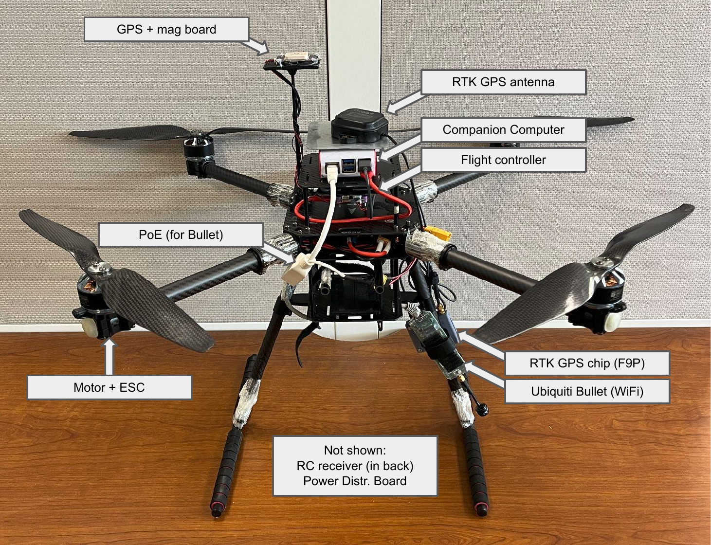
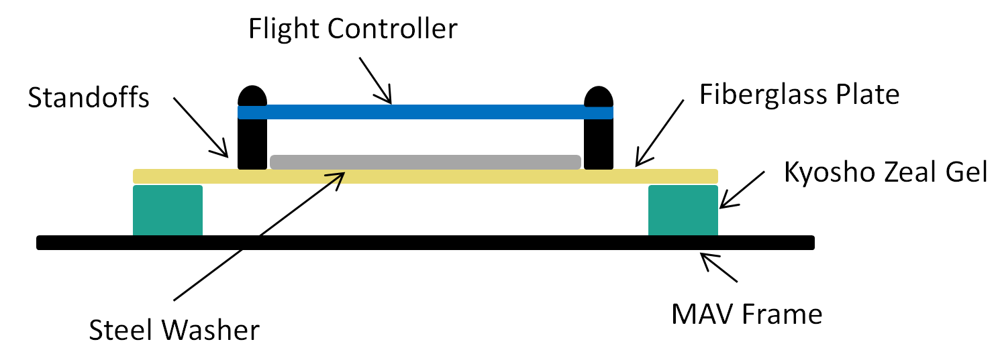
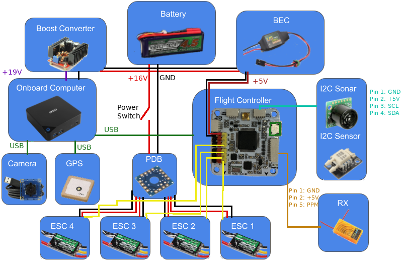

# Hardware Setup

## Parts List

To use ROSflight to its full potential, you will need the following system components.
Some components are mounted on your MAV (Miniature Aerial Vehicle), while others are on the ground.
ROSflight supports both multirotor and fixed-wing vehicle types.

*Mounted on the MAV*

1. Aircraft Frame, Motor(s), ESC(s), Battery and Propeller(s)
2. Flight Controller (FC)
3. Vibration Isolation for FC
4. Any external sensors
5. R/C Receiver
6. Companion Computer
7. Wi-Fi Antenna, or access of some kind to ground-station, wireless network (e.g. Ubiquiti Bullet)

*Ground Station*

1. Ground-Station, Wireless Network (e.g. Wi-Fi Router, Ubiquiti Rocket)
2. R/C transmitter
3. Laptop or base station computer
4. Joystick (Xbox controller)

Here's an example of a complete frame that we used to conduct all the flight tests during ROScopter development.
<figure markdown="span">
    { width="1200" loading=lazy }
    <figcaption>Example of a frame used to conduct ROScopter tests. Comprised of a HolyBro X650 frame with a mRO Pixracer Pro and Raspberry Pi 5 as the flight control unit/companion computer. This frame was used in all ROScopter development and testing.</figcaption>
</figure>

### Frame, Motors, ESCs, Battery, and Propeller

!!! tip
    The ROS2 [Aerial Working group](https://github.com/ROS-Aerial/community) is a community-driven group focused on improving aerial robotics.
    They have some great resources related to common hardware and software.

    Check out their list of [common hardware](https://ros-aerial.github.io/aerial_robotic_landscape/hardware/#).

We do not officially support any specific multirotor or airplane frame, motor, ESC, Battery or Propeller combination.
There are a lot of great resources for building your own MAV, and there are a lot of great kits out there that have all of these parts.

!!! example "Frames we use"
    While we don't officially support any frame, we have used the following hardware to do all our dev.
    Additionally, the simulation includes the parameters for these aircraft.
    If you just want to get a frame up with minimal friction, these would be good starting places.

    * Multirotor: [Holybro x650](https://holybro.com/products/x650-development-kit?srsltid=AfmBOopLegAVBOZ-RYxzQkr4x-Z6mygSw21gC6OW9bOH0Juty_WuSmy7)
    * Fixedwing: [RMRC Anaconda](https://www.readymaderc.com/products/details/rmrc-anaconda-kit?srsltid=AfmBOoqa0SNehoKxr3m8SXDUa2WNmOva6sCEYlkUAR3_aFpDS7C8nwHb)

    Unfortunately, hardware does come in and out of availability.
    If the frames we have listed are not available, ROSflight will still work great--you may just have to do some additional fine-tuning of controller gains.

If you are designing your own multirotor or airplane, you may want to look at [ecalc](https://www.ecalc.ch/), an online tool which can help you design a proper ESC/Battery/Motor/Propeller system for your MAV.

Some things to keep in mind as you design or build your MAV.

* Most kits do not include space for a companion computer, cameras, laser scanners or other sensors. Be sure to think about where these components are going to go, and how their placement will affect the CG of the MAV.
* You will likely also need to customize the power circuitry of your MAV to provide power to your companion computer at some specific voltage. Many people like to separate the power electronics (the ESCs and motors), from the computer and companion sensors. This can really come in handy if you are trying to develop code on the MAV, because you can have the computer on and sensors powered, and not worry at all about propellers turning on and causing injury as you move the aircraft about by hand. We will talk about this more when we talk about wiring up your MAV.
* Cheap propellers can cause a huge amount of vibration. Consider buying high-quality propellers, doing a propeller balance, or both. RCGroups, DIY Drones and YouTube have some awesome guides on how to do propeller balancing.
* ESCs will need to be calibrated from 2000 to 1000 us

### Flight Controller

The flight controller is the embedded microcontroller that runs `rosflight_firmware`.
See the [list of compatible hardware](./flight-controller-setup.md) for more information.

The flight controller includes an IMU and a barometer, as well as some additional sensors depending on the board.

### External Sensors

Additional Sensors you may want for your ROSflight setup include:

* Sonar/LiDAR
* GPS
* Digital Airspeed Sensor (Pitot Tube)

!!! note "Additional sensors"

    To [limit scope](../../index.md#our-vision), `rosflight_firmware` supports only a limited set of sensors.
    This means that if you want to run sensor information through the firmware and up to the companion computer via the serial connection, you may have to add drivers and logic to `rosflight_firmware`.

    In most cases, there is little reason to stream additional sensor information through the firmware.
    Since the firmware doesn't need to use any of the additional sensor data, you could plug in your new sensor directly into the companion computer.
    USB-based sensors (e.g. cameras, LiDAR, etc.) should be plugged directly into the companion computer.

### Vibration Isolation

It is really important to isolate your flight controller from vehicle vibrations, such as those caused by propellers and motors.
High vibration can [cause a lot of problems](https://daischsensor.com/what-is-vibration-rectification-error-vre-in-imu/) to sensors.

We recommend using small amounts of [Kyosho Zeal](https://www.amainhobbies.com/kyosho-zeal-5mm-vibration-absorption-gyro-receiver-mounting-gel-kyoz8006b/p1391945) to mount a fiberglass plate holding the FC to the MAV. You may also want to try adding mass to the flight control board. We have accomplished this by gluing steel washers to the fiberglass mounting plate.

You may need to experiment with the amount of gel you use, how far apart the gel is spaced, and the amount of mass added to the FC mounting plate. The interaction of these factors is difficult to predict, therefore it takes a little bit of experimentation to get it right.

We have also had good success using rubber damping balls to mount the autopilot to the frame.

### Companion Computer

The only requirements for the companion computer are:

* Runs Linux (usually an Ubuntu LTS version, but using Docker on other distributions is also an option)
* Has ROS2 installed
* Has at least one USB port
* Can be carried by the aircraft.

We have had success with the following companion computers, but by no means is this a comprehensive list; it is more by way of suggestion.

* [NVIDIA Jetson](https://www.nvidia.com/en-us/autonomous-machines/embedded-systems/)
* [MSI CUBI](https://www.msi.com/Business-Productivity-PCs/Products#?tag=Cubi-Series)
* [Intel NUC](https://www.intel.com/content/www/us/en/products/details/nuc.html)
* [Rasberry Pi 5](https://www.raspberrypi.com/products/raspberry-pi-5/)

### Wi-Fi

You will need Wi-Fi to communicate with your MAV when it is in the air.
Because ROS2 communicates over UDP, it is very easy to use ROS2 to view what is going on in your MAV while it is flying by sending commands and reading sensor data.
For most applications, a standard Wi-Fi router and dongle will suffice.
For long-range applications, you may want to look into [Ubiquiti](https://www.ubnt.com/) point-to-point Wi-Fi. (We have seen ranges over a mile with these networks.)

### RC Transmitter and Receiver

For RC Control, you will need a transmitter with between 6 and 8 channels. Any additional channels will be wasted. We require RC control for safe operation, and only support arming and disarming via RC control.

ROSflight only supports PPM (pulse position modulation) and SBUS receivers.
Individual channel PWM outputs are not supported.
Any configurations with PPM or SBUS and 6-8 channels will be sufficient.

### Laptop or Base Station Computer

You will need a laptop which can run ROS2 to communicate with the MAV over the ground station wireless network. To do this natively you'll want a recent Ubuntu LTS version, but this can also be done with Docker containers from pretty much any Linux distribution. Linux within a virtual machine can also work, but is not recommended. 

### Joystick

A joystick is used for [software-in-the-loop (SIL) simulations](../rosflight-sim/index.md). The joystick is not technically a required component because it is possible to control your MAV from the command line, but it makes things much easier. Our first recommendation is to use the same transmitter you use for hardware as a joystick by plugging it into the computer via USB. We support Taranis QX7 transmitters, Radiomaster TX16s transmitters, RealFlight controllers, and XBOX controllers. Other joysticks can be used, but you may need to create custom axis and button mappings within the ROSflight joystick utility.

!!! note "Physical vs firmware channels"
    If you do write your own mapping, remember that the channel numbers need to be configured properly on both the firmware and the transmitter.
    This means that if the RC transmitter outputs "throttle" on channel 3 on the (1 indexed on the transmitter), then the firmware needs to set `RC_F_CHN` to 2 (0 indexed).

### Battery Monitor

A battery monitor is an analog sensor that provides battery voltage and/or battery current information. This data can be used to prevent power loss in air or to measure system load. The sensor outputs an analog voltage proportional to the battery voltage and/or current through the battery. Most flight controllers come equipped with a built-in battery monitor, but if not, small PCB sensors are also available that can be connected to the flight controller.

<!-- TODO: Is this still the case? -->
For ROSflight to use a battery monitor, an appropriate multiplier must be set.
ROSflight multiplies the analog signal from the monitor by the multiplier to get the final reading. The monitor datasheet should contain the information needed to get the multiplier. For example, the datasheet for the AttoPilot 50V/90A sensor states that it outputs 63.69 mV / V. To get the original battery voltage, the multiplier must be 1/.06369, or 15.7.
The multipliers for the voltage and current are set separately, via parameters.
Check the [parameter configuration guide](../rosflight-firmware/parameter-configuration.md) for more details.

ROSflight applies a simple low-pass filter to remove noise from the voltage and current measurements.
These filters are configurable via parameters.
Check the [parameter configuration guide](../rosflight-firmware/parameter-configuration.md) for more information.
The alpha value for a given cutoff frequency \\(a\\), can be calculated with: \\( \alpha =  e ^ {-.01a} \\). As battery voltages do not typically change quickly, the default of 0.995 usually suffices.

More information on battery monitor hardware, including determining appropriate multipliers and creating a simple DIY monitor, can be found on the [OpenPilot Wiki](https://opwiki.readthedocs.io/en/latest/user_manual/revo/voltage_current.html).

## Wiring Diagram

<!-- TODO: We need to update this picture probably... -->
Below is an example wiring diagram for a multirotor using an MSI Cubi as a companion computer. This diagram also includes the motor power switch, which allows for the sensors, flight controller, and companion computer to be powered on while the motors are off. This is a safer way to test sensors, code, etc. as the motors are unable to spin while the switch is off.

Your needs will likely be slightly different than what is shown. This is meant as an example only and can be adapted to fit your needs.

## Connecting to the Flight Controller

The flight controller communicates with the companion computer over a serial link. ROSflight only supports one serial connection at a time and by default should be the serial link connected to the USB connector on the board.
