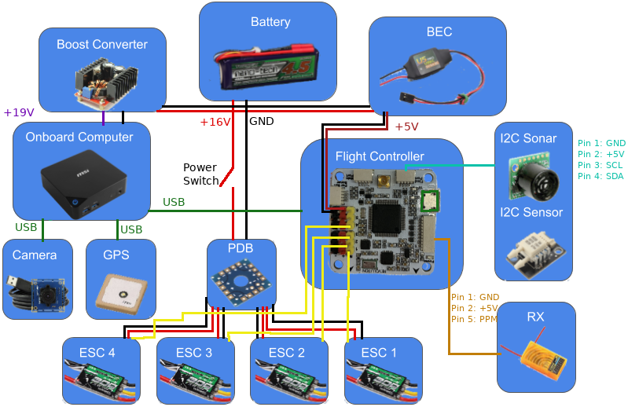
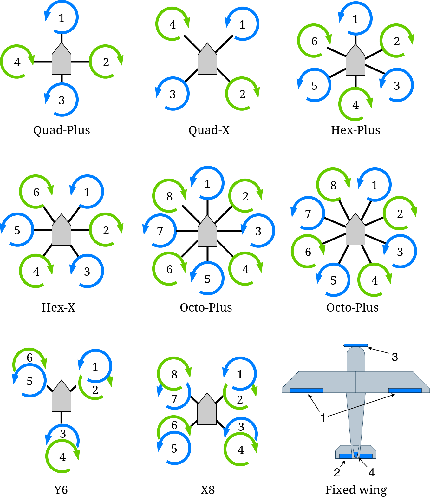
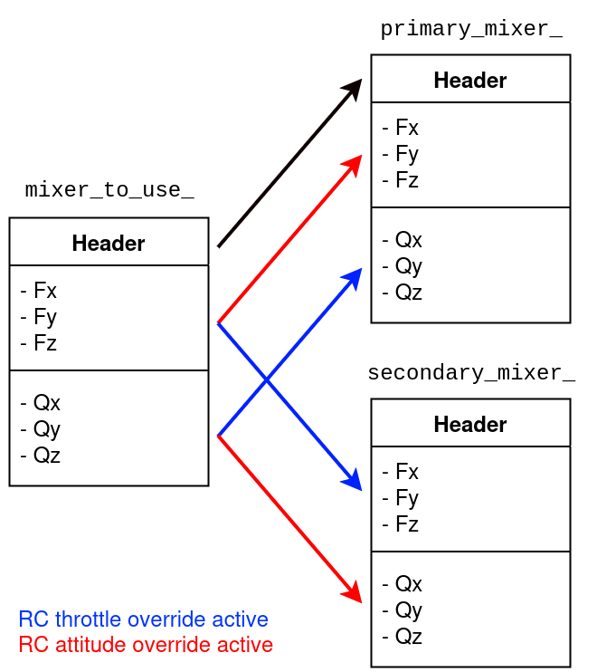

# Hardware Setup

## Parts List

To use ROSflight to its full potential, you will need the following system components.
Some components are mounted on your MAV (Miniature Aerial Vehicle), while others are on the ground.
ROSflight supports both multirotor and fixed-wing vehicle types.


*Mounted on the MAV*

1. Aircraft Frame, Motor(s), ESC(s), Battery and Propeller(s)
2. Flight Controller (FC)
3. Vibration Isolation for FC
4. Any external sensors
5. R/C Receiver
6. Companion Computer
7. Wi-Fi Antenna, or access of some kind to ground-station, wireless network (e.g. Ubiquiti Bullet)

*Ground Station*

1. Ground-Station, Wireless Network (e.g. Wi-Fi Router, Ubiquiti Rocket)
2. R/C transmitter
3. Laptop or base station computer
4. Joystick (Xbox controller)

### Frame, Motors, ESCs, Battery, and Propeller

We do not officially support any specific multirotor or airplane frame, motor, ESC, Battery or Propeller combination.
There are a lot of great resources for building your own MAV, and there are a lot of great kits out there that have all of these parts.

If you are designing your own multirotor or airplane, you may want to look at [ecalc](https://www.ecalc.ch/), an online tool which can help you design a proper ESC/Battery/Motor/Propeller system for your MAV.

Some things to keep in mind as you design or build your MAV.

* Most kits do not include space for a companion computer, cameras, laser scanners or other sensors. Be sure to think about where these components are going to go, and how their placement will affect the CG of the MAV.
* You will likely also need to customize the power circuitry of your MAV to provide power to your companion computer at some specific voltage. Many people like to separate the power electronics (the ESCs and motors), from the computer and companion sensors. This can really come in handy if you are trying to develop code on the MAV, because you can have the computer on and sensors powered, and not worry at all about propellers turning on and causing injury as you move the aircraft about by hand. We will talk about this more when we talk about wiring up your MAV.
* Cheap propellers can cause a huge amount of vibration. Consider buying high-quality propellers, doing a propeller balance, or both. RCGroups, DIY Drones and YouTube have some awesome guides on how to do propeller balancing.
* ESCs will need to be calibrated from 2000 to 1000 us


### Flight Controller

!!! warning "TODO"
    Update recommended hardware once supported hardware has been finalized.

### External Sensors

Additional Sensors you may want for your ROSflight setup include:

* Sonar
* GPS
* Digital Airspeed Sensor (Pitot Tube)

### Vibration Isolation

It is really important to isolate your flight controller from vehicle vibrations, such as those caused by propellers and motors. We recommend using small amounts of [Kyosho Zeal](https://www.amainhobbies.com/kyosho-zeal-5mm-vibration-absorption-gyro-receiver-mounting-gel-kyoz8006b/p1391945) to mount a fiberglass plate holding the FC to the MAV. You may also want to try adding mass to the flight control board. We have accomplished this by gluing steel washers to the fiberglass mounting plate.


You may need to experiment with the amount of gel you use, how far apart the gel is spaced, and the amount of mass added to the FC mounting plate. The interaction of these factors is difficult to predict, therefore it takes a little bit of experimentation to get it right.

### Companion Computer

The only requirement for the companion computer is that it runs Linux (usually an Ubuntu LTS version, but using Docker on other distributions is also an option), ROS2, has at least one USB port, and can be carried by the aircraft. We have had success with the following companion computers, but by no means is this a comprehensive list; it is more by way of suggestion.

* [NVIDIA Jetson](https://www.nvidia.com/en-us/autonomous-machines/embedded-systems/)
* [MSI CUBI](https://www.msi.com/Business-Productivity-PCs/Products#?tag=Cubi-Series)
* [Intel NUC](https://www.intel.com/content/www/us/en/products/details/nuc.html)
* [Rasberry Pi 3](https://www.raspberrypi.com/products/raspberry-pi-3-model-b/)

### Wi-Fi

You will need Wi-Fi to communicate with your MAV when it is in the air. Because ROS2 communicates over UDP, it is very easy to use ROS2 to view what is going on in your MAV while it is flying by sending commands and reading sensor data. For most applications, a standard Wi-Fi router and dongle will suffice. For long-range applications, you may want to look into [Ubiquiti](https://www.ubnt.com/) point-to-point Wi-Fi. (We have seen ranges over a mile with these networks.)

### RC Transmitter and Receiver

For RC Control, you will need a transmitter with between 6 and 8 channels. Any additional channels will be wasted. We require RC control for safe operation, and only support arming and disarming via RC control.

<!-- [comment]: # TODO: Do we actually support PPM? -->
ROSflight only supports PPM (pulse position modulation) and SBUS receivers. Individual channel PWM outputs are not supported. Any configurations with PPM or SBUS and 6-8 channels will be sufficient.

### Laptop or Base Station Computer

You will need a laptop which can run ROS2 to communicate with the MAV over the ground station wireless network. To do this natively you'll want a recent Ubuntu LTS version, but this can also be done with Docker containers from pretty much any Linux distribution. Linux within a virtual machine can also work, but is not recommended. 

### Joystick

A joystick is used for [software-in-the-loop (SIL) simulations](simulator/running-simulations-with-rosflight.md). The joystick is not technically a required component because it is possible to control your MAV from the command line, but it makes things much easier. Our first recommendation is to use the same transmitter you use for hardware as a joystick by plugging it into the computer via USB. We support Taranis QX7 transmitters, Radiomaster TX16s transmitters, RealFlight controllers, and XBOX controllers. Other joysticks can be used, but you may need to create custom axis and button mappings within the ROSflight joystick utility.

### Battery Monitor

A battery monitor is an analog sensor that provides battery voltage and/or battery current information. This data can be used to prevent power loss in air or to measure system load. The sensor outputs an analog voltage proportional to the battery voltage and/or current through the battery. Most flight controllers come equipped with a built-in battery monitor, but if not, small PCB sensors are also available that can be connected to the flight controller.

<!-- TODO: Is this still the case? -->
For ROSflight to use a battery monitor, an appropriate multiplier must be set. ROSflight multiplies the analog signal from the monitor by the multiplier to get the final reading. The monitor datasheet should contain the information needed to get the multiplier. For example, the datasheet for the AttoPilot 50V/90A sensor states that it outputs 63.69 mV / V. To get the original battery voltage, the multiplier must be 1/.06369, or 15.7. The multipliers for the voltage and current are set separately, with the `BATT_VOLT_MULT` and `BATT_CURR_MULT` parameters, respectively.

ROSflight applies a simple low-pass filter to remove noise from the voltage and current measurements. These filters are configurable via the `BATT_VOLT_ALPHA` and `BATT_CURR_ALPHA` [parameters](parameter-configuration.md). The alpha value for a given cutoff frequency \\(a\\), can be calulated with: \\( \alpha =  e ^ {-.01a} \\). As battery voltages do not typically change quickly, the default of 0.995 usually suffices.

<!-- TODO: Looks like OpenPilot was discontinued... -->
More information on battery monitor hardware, including determining appropriate multipliers and creating a simple DIY monitor, can be found on the [OpenPilot Wiki](https://opwiki.readthedocs.io/en/latest/user_manual/revo/voltage_current.html).

## Wiring Diagram

<!-- TODO: We need to update this picture probably... -->
Below is an example wiring diagram for a multirotor using an MSI Cubi as a companion computer. This diagram also includes the motor power switch, which allows for the sensors, flight controller, and companion computer to be powered on while the motors are off. This is a safer way to test sensors, code, etc. as the motors are unable to spin while the switch is off.



Your needs will likely be slightly different than what is shown. This is meant as an example only and can be adapted to fit your needs.

## Motor Layouts and Mixer

The mixer takes in the desired forces and torques from the firmware controller and computes the motor and servo outputs accordingly.
If it is not set correctly, it will likely lead to a crash.
Make sure it is set properly for your airframe!

!!! tip "Quick Start"

    For a quick start, use one of the "canned mixers".
    For a more accurate mixer, use a custom mixer.

ROSflight offers some pre-computed, "canned" mixers that can be used off the shelf for a variety of common multirotor and fixedwing airframes.
These mixers do not take into account all the parameters of your system (i.e. motor and propeller parameters), so they will be less accurate than they could be.
If you want a more accurate mixer, or have easy access to the motor and prop parameters of your system, then we recommend using a custom mixer. 

!!! note
    A mixer must be chosen for the firmware to allow arming.

The desired mixer can be chosen by setting the `PRIMARY_MIXER` parameter to one of the following values:

| # | Mixer |
|---|---------|
| 0 | ESC calibration |
| 1 | Quad + |
| 2 | Quad X |
| 3 | Hex + |
| 4 | Hex X |
| 5 | Octo + |
| 6 | Octo X |
| 7 | Y6 |
| 8 | X8 |
| 9 | Fixed-wing (traditional AETR) |
| 10 | Inverted V-tail fixedwing (like the RMRC Anaconda frame) |
| 11 | Custom mixer |

The associated motor layouts are shown below for each mixer.
The **ESC calibration** mixer directly outputs the throttle command equally to each motor, and can be used for calibrating the ESCs.



The following parameters related to the mixer are optional:

* `SECONDARY_MIXER`
* `USE_MOTOR_PARAM`
* All the custom mixer params of the form `PRI_MIXER_i_j` or `SEC_MIXER_i_j`

The following subsections have more detail on these parameters.

### Secondary Mixer 

ROSflight also has a secondary mixer that can be set using the options in the above table by setting the `SECONDARY_MIXER` param.

Offboard control commands will use the secondary mixer, while commands from the RC safety pilot will use the primary mixer.
Thus, both RC throttle and attitude override will affect the mixer, as shown in the following image.



The `mixer_to_use_` structure represents the mixer that will be used when computing the output.
The header, which includes the default PWM rate and the output type for each output channel, is always set to the same as the primary mixer.
See [Defining a Custom Mixer](#defining-a-custom-mixer) for more information.
Note that if the `SECONDARY_MIXER` param is not set, then it will default to the same value as the primary mixer.

The secondary mixer might be useful when the airframe needs a different mixer for the offboard control (from the companion computer) than for RC control (from the safety pilot).
It allows flexibility for more advanced mixing schemes while still having a functional mixer available to a safety pilot.

### Using Motor Parameters

The parameter `USE_MOTOR_PARAM` causes the firmware to compute the actuator outputs differently than if `USE_MOTOR_PARAM` is set false.
As described in _Small Unmanned Aircraft: Theory and Practice_ by Beard and McLain, the mixing matrix is formed using equations from propeller theory, resulting in a set of equations that set the desired forces and torques equal to the square of the angular speeds of the propellers.
If the motor and propeller parameters are known, then the desired voltage (and thus throttle) setting can be computed from the squared angular speeds.

If the motor and propeller parameters are not known, then some simplifying assumptions are made to compute the desired throttle settings for each motor from the desired forces and torques.
See [the report on the ROSflight mixer derivation](https://github.com/rosflight/rosflight_docs/blob/main/latex-reports/mixer.tex) for more information on the mixer derivation and assumptions.

!!! tip "Quick Start"

    If using a canned mixer, set `USE_MOTOR_PARAM=0`.

    If using a custom mixer, set `USE_MOTOR_PARAM=1` **only** if the mixer was designed with motor parameters.

The canned mixing matrices assume that `USE_MOTOR_PARAM` parameter is set to false.
Using a canned mixer matrix and setting `USE_MOTOR_PARAM=1` (i.e. specifying that you want to mix with motor and propeller parameters) will cause the outputs to be scaled incorrectly.
It is not required to use motor and propeller parameters when using a custom mixing matrix, but make sure your custom mixer makes sense.

Also, if you selected a custom mixer and used the motor parameters to generate the mixer, make sure you set `USE_MOTOR_PARAM=1`. Otherwise, the outputs will likely be scaled incorrectly.

!!! Important

    We recommend flying your firmware in simulation _before_ loading the firmware onto real hardware to make sure everything is working.

!!! Warning

    It is not recommended to use a _canned mixer for the primary mixer_ and a _custom mixer for the secondary mixer_ **when the secondary mixer needs `USE_MOTOR_PARAM=1`.**
    In other words, both `PRIMARY_MIXER` and `SECONDARY_MIXER` should use motor parameters, or neither should.

    This is important because the canned mixers make assumptions that affect the gains of the controller on the aircraft.
    This means that a canned mixer will require slightly different tuning than a custom mixer might.

### Defining a Custom Mixer

A custom mixer can be defined by:

1. Set `PRIMARY_MIXER` (required) and/or `SECONDARY_MIXER` (optional) to the desired value in the mixer table
2. Load the mixing matrix parameters for either the primary or the secondary mixer

Note that computing the parameters of the mixing matrix is done on the companion computer.

The firmware loads a custom mixer by loading all the values from parameters.
Since there are 6 inputs to the mixer (\(F_x,F_y,F_z,Q_x,Q_y,Q_z\)) and 10 possible outputs, the mixer is a 6x10 matrix and there are 60 parameters associated with each custom mixer.
For a standard quadrotor, however, most of these would be zero, since only the first 4 outputs (columns of the mixer matrix) would be used.

In addition to the parameters associated with the 6x10 mixing matrix, there are two additional sets of parameters that need to be defined for each output used, the `PRI_MIXER_OUT_i` and the `PRI_MIXER_PWM_i` parameters, which define the output type and the default PWM rate, respectively, for the `i`th output.
See the [Parameter Configuration Page](parameter-configuration.md) for more information on these parameters.

The recommended way to load a custom mixer is to first compute all the required parameters and save them to a file on the companion computer.
The parameters are named `PRI_MIXER_i_j` or `SEC_MIXER_i_j`, where `(i,j)` is the index of the parameter in the 6x10 mixing matrix.
See the [Parameter Configuration Page](parameter-configuration.md) for more information on these parameters.
A convenience script is available in the `roscopter` ROS2 package that will compute the custom mixer and save the parameter values in a format ready to load.

Once the parameters are saved to a file, load them with the ROS2 service call (make sure `rosflight_io` is running):
```ros2 service call /param_load_from_file rosflight_msgs/srv/ParamFile "{file: absolute/or/relative/path/to/saved/param/file.yaml}"```

Also make sure to save those parameters to memory with the ROS2 service call:
```ros2 service call /param_write std_srvs/srv/Trigger```

<!-- TODO: It would be good to link to the mixer derivation page wherever I put that -->

!!! Important
    Test your mixer in simulation first when making changes, to avoid accidents.

## Connecting to the Flight Controller

The flight controller communicates with the companion computer over a serial link. ROSflight only supports one serial connection at a time and by default should be the serial link connected to the USB connector on the board.

### Using Secondary Serial Links

In the case of an F4 flight controller, which has a USB peripheral, the highest bandwidth connection will be the USB connector. However, UART3 can also be used to communicate with the companion computer if you desire a more secure connection (micro USB connectors have been known to disconnect in high vibrations).

If a USB connection is detected on the USB peripheral, ROSflight will direct all communication through this port. However, if the `PARAM_SERIAL_DEVICE` parameter is set to `3` and the `PARAM_BAUD_RATE` parameter is set properly, then UART3 will be enabled when the USB connection is absent.
