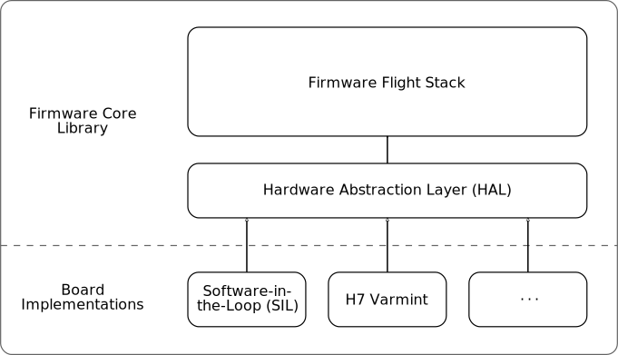

# Code Architecture

The firmware is divided into two main components: the _core library_, and a collection of _board implementations_.
This division is intended to allow the same core flight code to run on any processor or platform, either an embedded flight controller or a desktop environment for a software-in-the-loop (SIL) simulation. The interface between these two components is called the _hardware abstraction layer_ (HAL).
This architecture is illustrated in the following diagram:

## Firmware Core Library

The firmware core library consists of all the code in the `include` and `src` directories of the firmware repository.
This includes the code for what is termed the "flight stack," which consists of the core components (such as the estimator, controller, state manager, etc.) required for flight.
It also includes the interface definition for the hardware abstraction layer, which is defined by the abstract `Board` class in `include/board.h`.
The communications link (MAVLink) is also abstracted, with the interface defined by the `CommLink` class in `include/comm_link.h`.
External libraries are contained in the `lib` folder.

## Board Abstraction

The hardware abstraction implementations are contained in the `boards` directory, organized in subdirectories according to the hardware driver layer.
Each board implementation is required to provide an implementation of the hardware abstraction layer interface, which is passed by reference to the flight stack.
The Varmint implementation in the `boards/varmint` shows how this is done for an embedded flight controller.
Examples of board implementations for SIL simulation are found in the `rosflight_sim` ROS2 package available [here](https://github.com/rosflight/rosflight_ros_pkgs).

The flight stack is encapsulated in the `ROSflight` class defined at `include/rosflight.h`.
This class contains two public functions: `init()` and `run()`.
Its constructor requires two arguments: an implementation of the `Board` interface, and an implementation of the `CommLink` interface.

Each board implementation is required to implement the entire Board class.

## Comm Link Abstraction

The purpose of the comm link abstraction layer is to allow communication protocols other than MAVLink to be used if desired.
The comm link abstraction implementations are contained in the `comms` directory, organized in subdirectories by protocol.
The implementations translate between the messages that the firmware expects to send and receive, and the messages defined by the communication protocol.
Currently, only MAVLink is implemented.

## Flight Stack

The flight stack is encapsulated by the `ROSflight` class defined in `include/rosflight.h`.
It consists of a collection of _modules_.
Each of these modules is implemented as a C++ class, and encapsulates a cohesive piece of the autopilot functionality.
The following diagram illustrates these modules and the data flow between them.
Rectangular blocks represent modules in the flight stack, and ellipses represent hardware functionality implemented in the board support layer:

We'll describe each of these modules in the following sections:

### State Manager
This module is in charge of keeping track of the internal state (armed status, error codes, failsafe, etc.) of the vehicle.
While only the comm manager data flow is illustrated on the diagram, all other modules query the state manager to determine the status and act appropriately based on that status.

The operation of the state manager is defined by the following finite state machine:

The state manager also includes functionality for recovering from hard faults. In the case of a hard fault, the firmware writes a small amount of data to backup memory then reboots. This backup memory location is checked and then cleared after every reboot. The backup memory includes the armed state of the flight controller. On reboot, the firmware will initialize then, if this armed-state flag is set, immediately transition back into the armed state. This functionality allows for continued RC control in the case of a hard fault. Hard faults are not expected with the stable firmware code base, but this feature adds an additional layer of safety if experimental changes are being made to the firmware itself.

### Parameter Server
This module handles all parameters for the flight stack.
It supports the getting and setting of integer and floating-point parameters, and the saving of these parameters to non-volatile memory.
Setting and getting of parameters from the companion computer is done through the serial communication interface.
While no other data flow lines are shown on the diagram, all of the other modules interact with the parameter server.

See the [parameter configuration](../rosflight-firmware/parameter-configuration.md) page for more information on each of the ROSflight parameters and how to get and set parameters.

### Comm Manager
This module handles all serial communication between the flight controller and companion computer.
This includes streaming data and receiving offboard control setpoints and other commands from the computer.
This module primarily collects data from the sensors, estimator, state manager, and parameters modules, and sends offboard control setpoints to the command manager and parameter requests to the parameter server.

The actual communication protocol used is abstracted by the interface in [include/comm_link.h](https://github.com/rosflight/rosflight_firmware/blob/master/include/interface/comm_link.h).
A new protocol can be used by implementing a wrapper around the protocol that inherits from this interface.
Currently, only MAVLink has been implemented.
The implementation is found in [comms/mavlink/mavlink.h](https://github.com/rosflight/rosflight_firmware/blob/master/comms/mavlink/mavlink.h) and [comms/mavlink/mavlink.cpp](https://github.com/rosflight/rosflight_firmware/blob/master/comms/mavlink/mavlink.cpp).

### Sensors
This module is in charge of managing the various sensors (IMU, magnetometer, barometer, differential pressure sensor, sonar altimeter, etc.).
Its responsibilities include updating sensor data at appropriate rates, and computing and applying calibration parameters.

For some sensors, the orientation is critical.
For example, the IMU and magnetometer sensor data must be oriented in the correct frame to be interpreted correctly.
The ROSflight firmware expects that the [board implementation](#board-abstraction) handles rotating the sensor data into a board-aligned NED frame.

In some cases, the magnetometer is mounted to a different board then the main flight controller (e.g. the mRo M10034D GPS/mag board).
In this case, the ROSflight sensor driver does not orient the magnetometer data into the main autopilot-board frame (since it has no idea how the mag board is oriented relative to the autopilot board).

ROSflight also aligns IMU and magnetometer data with the vehicle NED frame before [streaming the data](#comm-manager) to the companion computer.
This is done using a rotation from the board frame to the vehicle frame.
This rotation from board to vehicle frame can be configured via [parameters](#parameter-server).

### Estimator
This module is responsible for estimating the attitude and attitude rates of the vehicle from the sensor data.

### RC
The RC module is responsible for interpreting the RC signals coming from the transmitter via the receiver.
This includes mapping channels to their appropriate functions and reversing directions if necessary.

See the [RC configuration](../hardware-and-rosflight/rc-configuration.md) page for more information on configuring the RC transmitter and parameters.

### Command Manager
The command manager combines inputs from the RC and comm manager modules to produce a control setpoint.
Its main purpose is to handle the interaction between offboard commands and the RC safety pilot, as well as to enforce the failsafe command if the state manager reports failsafe mode.

### Controller
The controller uses the inputs from the command manager and estimator to compute a control output.
This control output is computed in a generic form (\(Q_x\), \(Q_y\), and \(Q_z\) torques, and forces \(F_x, F_y,\) and \(F_z\)), and is later converted into actual motor commands by the mixer.

### Mixer
The mixer takes the outputs computed by the controller and maps them to actual motor commands depending on the configuration of the vehicle.

See the [Mixer](./mixer.md) documentation page for more information on the details of the mixer and how to configure it.
