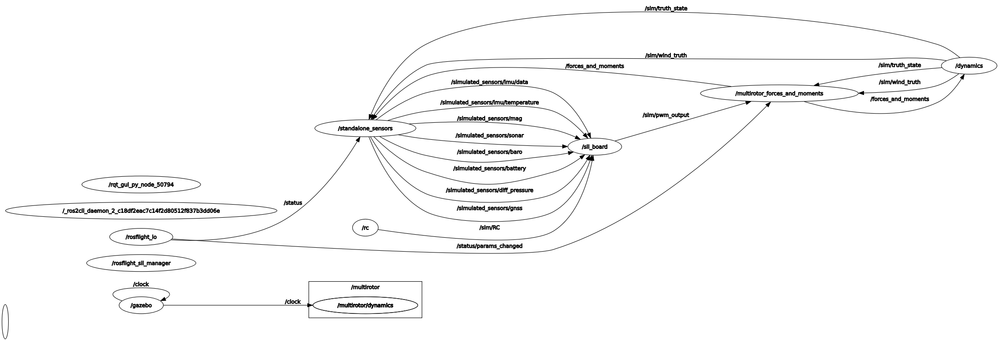

# Gazebo Sim
<figure markdown="span">
    { width="600" loading=lazy }
    <figcaption>Image of a multirotor in the Gazebo simulator.</figcaption>
</figure>

This guide contains detailed information on using [Gazebo Classic](https://classic.gazebosim.org/) with ROSflight sim.

Gazebo Classic is a (now EOL'd) robotic simulator.
It was previously supported by ROSflight, so it is supported now.
However, it currently does not work on versions of above ROS2 Humble, and should be replaced with Gazebo (the currently maintained version of Gazebo).
In this guide, we often refer to "Gazebo Classic" as Gazebo.

!!! tip "Launch parameters"

    This document describes a lot of the launch-time arguments that can be passed to the launch files to configure the simulation.
    To see a complete list of the launch-time arguments, run a launch command with
    ```bash
    ros2 launch <package_name> <launch_file_name> --show-args
    ```

!!! note

    To simulate a fixed-wing mav, just change all instances of `multirotor` in the steps below to `fixedwing`.

!!! danger
    Gazebo Classic is officially EOL as of January 2025, and **does not work with ROS2 Jazzy**.
    If you are using ROS2 Jazzy, please only use the standalond sim.
    The following instructions assume you are using ROS2 Humble.

    We have not yet upgraded to Gazebo, which is not EOL and better.
    If you would like to help in this effort, please visit the [GitHub issue](https://github.com/rosflight/rosflight_ros_pkgs/issues/166) and let us know.

## Gazebo Sim architecture
<figure markdown="span">
    { width="600" loading=lazy }
    <figcaption>ROSflight modules used when using Gazebo Sim and how they interact. See the [simulator architecture](./simulator-architecture.md) page for more information.</figcaption>
</figure>

When using Gazebo as the visualizer, ROSflight Sim uses the modules shown above.
See the [simulator architecture](./simulator-architecture.md) page for more information.

Also note that Gazebo publishes the `/clock` topic, so the `standalone_time_manager` should **not** be used with Gazebo.
Additionally, the Gazebo node only publishes this topic at ~10Hz, which is too slow for most applications (especially the sensors).
Thus, **we recommend not setting the [`use_sim_time`](simulator-architecture.md#time-manager) parameter to true when using Gazebo**, or you will get timing errors.

## Installation instructions
Installing Gazebo is done automatically for supported distros (i.e. `humble`) by following the instructions in the [installation for sim](../installation/installation-sim.md) guide.

!!! tip
    If you don't want to include any Gazebo dependencies when you build, simply remove the `gazebo_sim` folder from the `simulators` directory **before running [the `rosdep` commands](../installation/installation-sim.md)**:
    ```bash
    cd ~/rosflight_ws/src/rosflight_ros_pkgs/rosflight_sim/simulators
    rm -rf gazebo_sim
    ```

## Launching Instructions 

* Source the Gazebo Classic setup file if you haven't added it to `~/.bashrc`:
```bash
source /usr/share/gazebo/setup.sh
```
* Launch Gazebo Classic with the ROSflight SIL:
```bash 
ros2 launch rosflight_sim multirotor_gazebo.launch.py
```

* Gazebo Classic should now be running! Gazebo should open and you should see the STL of the multirotor at the origin.
<figure markdown="span">
    { width="1200" loading=lazy }
    <figcaption>Image of a multirotor in the Gazebo simulator.</figcaption>
</figure>

* You should have the following `rqt_graph`.


!!! Tip
    Run `rqt_graph` with the command `rqt_graph` in a new terminal, assuming the `-desktop` version of ROS2 was installed.

The launch file manages launching several nodes all at once, as shown in the `rqt_graph` image:

- `/rosflight_io`: Handles the communication between the companion computer and the flight controller
- `/standalone_sensors`: Simulates sensor measurements given the true state of the robot
- `/rc`: Simulates the RC safety pilot connection to the firmware
- `/sil_board`: Instantiation of the firmware
- `/gazebo`: Visualizer
- `/multirotor/dynamics`: Dynamics plugin to Gazebo Classic, computes the aerodynamic forces and moments given motor commands
- `/dynamics`: Interface node between the dynamics plugin and the rest of the `rosflight_sim` modules

For more information on each of these nodes, see the [simulator architecture](./simulator-architecture.md) page.

!!! info "Running nodes individually"
    As described in the [`standalone_sim` page](./standalone-sim.md#running-nodes-individually), you can run each of the simulator modules individually.

## Configuring the Gazebo sim
!!! Tip
    Command line arguments to launch files can be previewed by appending `--show-args` to the launch call:
    ```bash
    ros2 launch rosflight_sim multirotor_gazebo.launch.py --show-args
    ```

There are several command line arguments you can pass to customize the behavior at runtime.
Here are some important ones:

- `aircraft`: Defaults to "anaconda". This parameter controls which dynamics and parameter files get loaded, in addition to the STL file for visualization. Make sure this is set to your correct airframe!
- `use_sim_time`: By default, set false. This parameter is a parameter of all nodes in ROS2. If set to true on launch, the node will create a subscription to the `/clock` topic, and will use that as the source of time for its timers.
For Gazebo Classic, it is recommended to **leave this as false**, since Gazebo Classic publishes a `/clock` topic at 10Hz, which is too slow for most modules. If using the standalone sim, this parameter will allow you to speed up, slow down, or pause time. See the [simulation architecture](./simulator-architecture.md) page for more information.
- `use_vimfly`: Node that changes the default RC behavior to use VimFly, a program that lets you use Vim commands to fly around in the sim!
Vim, of course, is recommended for everyone, but VimFly especially if you don't have access to RC transmitter connected over USB.
See the [joystick](./simulator-architecture.md#joysticks) section for more information on what joysticks are supported.

These command line arguments should be passed using the `<argument>:=<value>` syntax.
For example,
```bash
ros2 launch rosflight_sim multirotor_gazebo.launch.py aircraft:=anaconda
```
would launch the Gazebo multirotor sim, but would use the fixedwing STL file.

## After launching

Remember that the SIL tries its best to replicate hardware.
That means you have to calibrate and set parameters in the same way you do in hardware.
If you need a reminder, please follow the [configuration and manual flight tutorial](../tutorials/manually-flying-rosflight-sim.md).

See the [Parameter Configuration](../rosflight-firmware/parameter-configuration.md) pages in this documentation for instructions on how to perform all preflight configuration before the aircraft will arm.

You can also run 
```bash
ros2 launch rosflight_sim multirotor_init_firmware.launch.py
```
to load all required parameters and perform initial calibrations for a quick simulation setup.

!!! warning

    Remember to verify that all parameters are set to the value that you would expect.
    Otherwise, the vehicle will behave erratically.

After loading parameters, you can fly autonomously by launching your GNC stack.
See the [ROScopter](../tutorials/setting-up-roscopter-in-sim.md) or [ROSplane](../tutorials/setting-up-rosplane-in-sim.md) tutorials for a reminder on how to run ROScopter or ROSplane.
