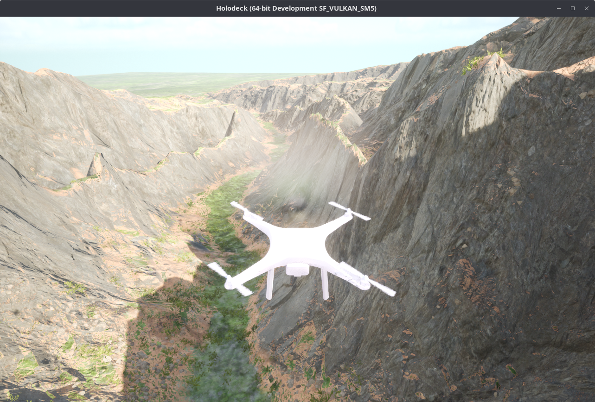
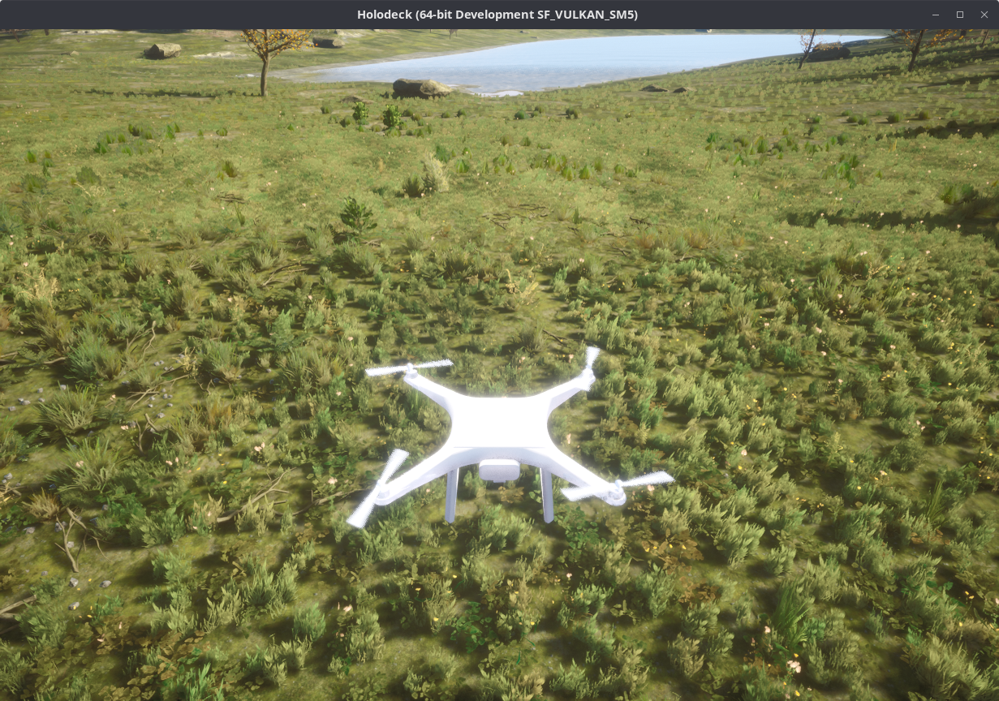

# HoloOcean Sim

<figure markdown="span">
    { width="600" loading=lazy }
    <figcaption>Image of the HoloOcean multirotor simulator in the "island" environment.</figcaption>
</figure>

[HoloOcean](https://robots.et.byu.edu/holoocean) is a photorealistic simulator built on [Unreal Engine 5](https://www.unrealengine.com/en-US/unreal-engine-5) that is developed by the BYU FRoSt Lab.

!!! tip "Launch parameters"

    This document describes a lot of the launch-time arguments that can be passed to the launch files to configure the simulation.
    To see a complete and current list of the launch-time arguments, run a launch command with
    ```bash
    ros2 launch <package_name> <launch_file_name> --show-args
    ```

!!! note

    To simulate a fixed-wing mav, just change all instances of `multirotor` in the steps below to `fixedwing`.

## HoloOcean/ROSflight sim architecture

<figure markdown="span">
    { width="600" loading=lazy }
    <figcaption>Modules used by the HoloOcean/ROSflight simulator and how they interact. See the [simulator architecture](./simulator-architecture.md) page for more information.</figcaption>
</figure>

The HoloOcean simulator uses every module in the above figure and optionally uses the `standalone_time_manager` to manage the simulation time.
See the [simulator architecture](./simulator-architecture.md) page for more information on each module.

## Installation

The `rosflight_ros_pkgs` repository only contains the launch/Python files needed interact with the HoloOcean simulator.

1. Follow the [installation for sim](../installation/installation-sim.md) guide to install the ROSflight standalone simulator.
The HoloOcean simulator uses many of the standalone simulator modules (as shown in the [above figure](#holooceanrosflight-sim-architecture).)

1. Follow the steps on the [HoloOcean installation guide](https://byu-holoocean.github.io/holoocean-docs/v1.0.0/usage/installation.html) to install HoloOcean.
    Make sure you install **version 2.2.0 or greater**.

    !!! note
        HoloOcean depends on Unreal Engine 5, and access to the UE5 code is conditioned on linking your GitHub account to your UE5 account.
        The [HoloOcean installation guide](https://byu-holoocean.github.io/holoocean-docs/v1.0.0/usage/installation.html) walks you through that process.

    !!! tip
        Install HoloOcean into a Python virtual environment to avoid "Externally managed environment" errors on Ubuntu >=24.04.
        Before installing HoloOcean, do
        ```bash
        sudo apt update && sudo apt upgrade
        sudo apt install python3-venv
        python3 -m venv ~/.holoocean_venv
        source ~/.holoocean_venv/bin/activate
        ```

        Then continue with the HoloOcean installation.

2. Install the `Land` world package used by ROSflight:
    ```python
    import holoocean
    holoocean.install("Land")
    ```

    Or as a console command:
    ```bash
    python -c "import holoocean; holoocean.install('Land')"
    ```

ROSflight should now be ready to be used with HoloOcean!
If you used a virtual environment, make sure that environment is sourced before launching any HoloOcean sim commands.

## Launching instructions

1. (Optional) Source your HoloOcean Python virtual environment
    ```bash
    source ~/.holoocean_venv/bin/activate
    ```

2. Launch using
    ```bash
    ros2 launch rosflight_sim multirotor_holoocean.launch.py
    ```

    HoloOcean should now be running! You should see something like
    <figure markdown="span">
        { width="1200" loading=lazy }
        <figcaption>Image of the HoloOcean multirotor simulator.</figcaption>
    </figure>

!!! note
    The HoloOcean/ROSflight sim uses most of the modules that the [`standalone_sim` uses](./standalone-sim.md#standalone-sim-architecture).
    The main difference between the `standalone_sim` and `holoocean_sim` is the visualization node (i.e. RViz vs. HoloOcean).
    This means that the RQT graph will be very similar to the graph produced by the `standalone_sim`.

!!! info "Running nodes individually"
    As described in the [`standalone_sim` page](./standalone-sim.md#running-nodes-individually), you can run each of the simulator modules individually.

## Configuring HoloOcean sim
The launch files for HoloOcean sim include some arguments that you can set to configure the visualization environment.
To see the options when launching the simulator, run
```bash
ros2 launch rosflight_sim multirotor_holoocean.launch.py --show-args
```

| Argument name | Description |
| :--- | :--- |
| `env` | Environment within the `Land` UE5 world to use. Options are `[default, forest, island, mountains, desert]` |
| `agent` | The type of agent to simulate. Options are `[fixedwing, multirotor]` |
| `use_sim_time` | When set `true`, sets the same parameter to `true` on all launched nodes. |

To change one of these arguments, specify the argument and its value with the `<argument>:=<value>` syntax.
For example,
```bash
ros2 launch rosflight_sim multirotor_holoocean.launch.py agent:=fixedwing
```
would launch HoloOcean with multirotor dynamics and firmware but with the fixedwing STL.

## Adding worlds and environments
Users can add worlds and environments to use in sim.
See the [HoloOcean documentation](https://byu-holoocean.github.io/holoocean-docs/v1.0.0/develop/env.html) to learn how to package a new UE5 world to use in the HoloOcean/ROSflight simulator.

## After launching

Remember that the SIL tries its best to replicate hardware.
That means you have to calibrate and set parameters in the same way you do in hardware.
If you need a reminder, please follow the [configuration and manual flight tutorial](../tutorials/manually-flying-rosflight-sim.md).

See the [Parameter Configuration](../rosflight-firmware/parameter-configuration.md) pages in this documentation for instructions on how to perform all preflight configuration before the aircraft will arm.

You can also run 
```bash
ros2 launch rosflight_sim multirotor_init_firmware.launch.py
```
to load all required parameters and perform initial calibrations for a quick simulation setup.

!!! warning

    Remember to verify that all parameters are set to the value that you would expect.
    Otherwise, the vehicle will behave erratically.

After loading parameters, you can fly autonomously by launching your GNC stack.
See the [ROScopter](../tutorials/setting-up-roscopter-in-sim.md) or [ROSplane](../tutorials/setting-up-rosplane-in-sim.md) tutorials for a reminder on how to run ROScopter or ROSplane.
