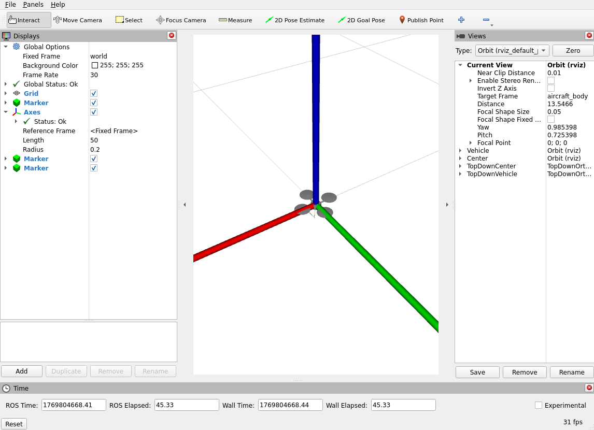
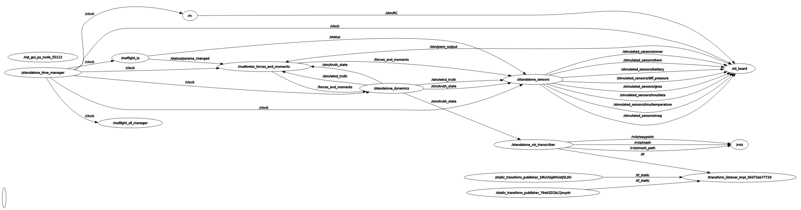

# Standalone Sim
<figure markdown="span">
    { width="600" loading=lazy }
    <figcaption>Image of the standalone simulator (using ROS2 RViz).</figcaption>
</figure>

This guide contains detailed information on the "standalone simulator", which is simply the ROSflight sim that uses [ROS2 RViz](https://docs.ros.org/en/humble/Tutorials/Intermediate/RViz/RViz-Main.html#rviz) to visualize the vehicle.

!!! tip "Launch parameters"

    This document describes a lot of the launch-time arguments that can be passed to the launch files to configure the simulation.
    To see a complete and current list of the launch-time arguments, run a launch command with
    ```bash
    ros2 launch <package_name> <launch_file_name> --show-args
    ```

!!! note

    To simulate a fixed-wing mav, just change all instances of `multirotor` in the steps below to `fixedwing`.

## Standalone sim architecture

<figure markdown="span">
    { width="600" loading=lazy }
    <figcaption>Modules used by the standalone simulator and how they interact. See the [simulator architecture](./simulator-architecture.md) page for more information.</figcaption>
</figure>

The standalone simulator uses every module described above and optionally uses the `standalone_time_manager` to manage the simulation time.
See the [simulator architecture](./simulator-architecture.md) page for more information on each module.

## Installation

The standalone simulator depends on [ROS2 RViz](https://docs.ros.org/en/humble/Tutorials/Intermediate/RViz/RViz-Main.html#rviz).
RViz and its dependencies are installed when the `ros-<ros-distro>-desktop` version of ROS2 is installed.

Otherwise, the standalone simulator only depends on the code in `rosflight_ros_pkgs`.
Check the [installation for sim](../installation/installation-sim.md) guide for more information.

## Launching instructions
- Set up ROSflight with the [software installation for sim guide](../installation/installation-sim.md) guide, making sure to install the `-desktop` package of ROS2, not the `-ros-base`.

- The standalone sim for ROSflight SIL is usually launched using this launch file:
```bash
ros2 launch rosflight_sim multirotor_standalone.launch.py
```

- The standalone sim should now be running! RViz should open with the STL of the multirotor.

    <figure markdown="span">
        { width="600" loading=lazy }
        <figcaption>Image of RViz with the multirotor STL at the origin.</figcaption>
    </figure>

- You should have the following `rqt_graph`.

    |  |
    | --- |
    | RQT graph of the nodes involved in the standalone simulator. Click on the figure to enlarge. |

    !!! Tip
        Run `rqt_graph` with `rqt_graph` in a new terminal, assuming the `-desktop` version of ROS2 was installed.

The launch file manages launching several nodes all at once, as shown in the `rqt_graph` image.
This includes the ROSflight sim nodes

- `/rosflight_io`: Handles the communication between the companion computer and the simulated flight controller
- `/standalone_sensors`: Simulates sensor measurements given the true state of the robot
- `/rc`: Simulates the RC safety pilot connection to the firmware
- `/sil_board`: Instantiation of the firmware
- `/standalone_dynamics`: Dynamics node for keeping track of the true robot state
- `/multirotor_forces_and_moments`: Computes aerodynamic forces and moments based on motor commands
- `/standalone_time_manager`: Only appears if `use_sim_time` [launch argument](#launch-arguments) is set true, and publishes to the `/clock` topic.

As well as some nodes specific to the `standalone_sim`:

- `/rviz`: Instance of the ROS2 RViz visualizer
- `/standalone_viz_transcriber`: Manages publishing `rosflight_sim` information to RViz
- 3 transform listener nodes: Manage coordinate frame transformations to RViz

For more information on each of these nodes, see the [simulator architecture](./simulator-architecture.md) page.

### Running nodes individually
If you don't want to use the launch file, you can instead run all of the nodes individually in separate terminals with the appropriate parameters.
For example, to run just the `/multirotor_forces_and_moments` node, you would run
```bash
ros2 run rosflight_sim multirotor_forces_and_moments --ros-args --params-file ~/rosflight_ws/src/rosflight_ros_pkgs/rosflight_sim/params/multirotor_dynamics.yaml
```
Check the launch files for more information on what parameters and param files get loaded by the launch file.

Also note that the `multirotor_standalone.launch.py` file actually calls 2 other launch files--one specific to the standalone sim (`standalone_sim.launch.py`) and one that launches the nodes shared by both the fixedwing and multirotor simulators (`common_nodes_standalone.launch.py`).
You can also launch those files separately if you want--just make sure to also run the forces and moments node in addition to those two sub-launch files.

!!! warning

    If you do run all nodes separately, make sure all the needed nodes are running.
    You can verify this by checking that the `rqt_graph` is the same as the above image.

    This is important since the [nodes are chained together](./simulator-architecture.md#flow-of-information) to complete a simulation loop.

## Configuring the standalone sim

The launch files for the standalone simulator include some arguments that you can set to configure the visualization environment.
To see the options when launching the simulator, run
```bash
ros2 launch rosflight_sim multirotor_standalone.launch.py --show-args
```

| Argument name | Description |
| :--- | :--- |
| `rviz2_config_file` | Configuration file loaded into RViz at launch. Helps automatically set up subscriptions, cameras, etc. |
| `sim_aircraft_file` | Path to the mesh file that will be used to visualize the vehicle. |

To change one of these arguments, specify the argument and its value with the `<argument>:=<value>` syntax.
For example,
```bash
ros2 launch rosflight_sim multirotor_standalone.launch.py rviz2_config_file:=$(pwd)/my_config_file.rviz
```
would launch RViz with the `my_config_file.rviz` configuration file.
