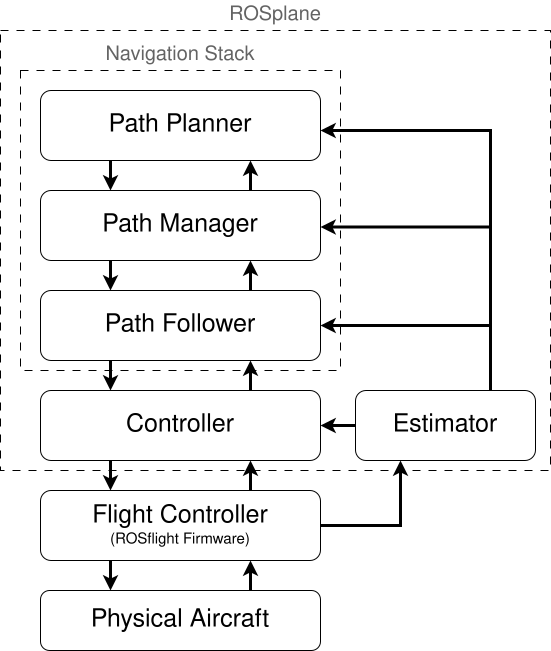

# ROSplane Overview

ROSplane is a basic fixed-wing autopilot built around ROS2 for use with the ROSflight autopilot.
It is built according to the methods published in *Small Unmanned Aircraft: Theory and Practice* by Dr. Randy Beard and Dr. Tim McLain.

As per the [ROSflight vision](../../index.md#our-vision), ROSplane is *not* a fully-featured fixed-wing autopilot.
Instead, ROSplane is a simple, lean, ROS2-based fixedwing autopilot

The core ROSplane package is a simple waypoint-following autopilot.
This includes a navigation stack, a controller, and an estimator.
This can be seen in the figure below.

|  |
|:--:|
|*Diagram of the ROSplane architecture*|

The structure of ROSplane and the nature of ROS2 interfaces allow ROSplane to be very modular, allowing you to write and integrate your own code without having to spend as much time working with interfaces and code integration. 
Since it is lean, the time to learn and understand the nature of ROSplane should be small compared to other, more featured (but more complex) autopilots.
This can improve research productivity, decrease debugging time, and improve the development of novel algorithms.

The purpose of the following pages is to provide detailed information on each of the components of ROSplane.
It is written with the intent that a user might know how to change each component of ROSplane, not only how to use it.

Note that the system components not part of ROSplane are not included in the following pages (ROSflight firmware, physical aircraft setup, etc.).

## Core Functionality

The ROSplane autopilot allows users to fly waypoint missions with an RC safety pilot.
These waypoints are defined by a 3-D location and (optionally) a desired heading at that location.
The simplicity of the ROSplane framework allows users to add their own autonomy stacks or mission requirements on top of the ROSplane stack.

The [ROSflight tutorials](../tutorials/index.md) walk users through setting up ROSflight and ROSplane in sim, all the way through flying waypoint missions.
Follow those tutorials first to get a feel for the default ROSplane behavior and workflow before you start making your own changes to the autonomy stack.

The following pages for a detailed description of each ROSplane module and its default functionality.

## Using ROSplane as-is
ROSplane's default waypoint-following functionality may be useful to some users.

For example, the `path_planner` module in the ROSplane navigation stack is responsible for compiling high-level waypoints and sending them to the `path_manager`.
The `path_planner` by default just takes in user-defined waypoints.
Instead of loading these user-defined waypoints, higher levels of autonomy (i.e., vision-based guidance, etc.) could be accommodated by building on top of the ROSplane stack by dynamically feeding the `path_planner` waypoints.

## Customizing ROSplane
ROSplane's default functionality may not be sufficient for many users.
Because of this, ROSplane has been designed to be understandable, modular, and customizable.

The [customizing ROSflight page](../customizing-rosflight.md) describes how ROSplane is meant to be modified to assist in your research.
The page also includes examples and scenarios where each node can be modified, removed, or combined to accomplish different tasks.

!!! tip "Customizing ROSplane example"
    Here's one example of how someone might customize the core ROSplane package to achieve something other than the default functionality.

    The `path_manager` node in the navigation stack in the core ROSplane package directs the `path_follower` node to follow either straight lines or circular arcs.
    However, if a project needed to follow B-splines instead, a user could implement the B-spline follower in a new ROS2 node and replace the default `path_manager` and `path_follower` nodes in ROSplane.

    Thus, the final architecture would have the `path_planner` publish waypoints to the B-spline follower, which would generate B-splines between waypoints and issue controller commands (i.e. course, airspeed, altitude) to the ROSplane controller.
    As long as the new B-spline planner node has the same in/out ROS2 interfaces (i.e. publishers/subscribers/service servers) as the previous `path_manager` and `path_follower`, the new node will slot in seamlessly with the rest of the default ROSplane stack.

## Contributing to ROSplane
If you create a new "module" when using ROSplane for your application, please contribute back!
While changes won't be included in the core ROSplane stack (see [ROSflight Vision](../../index.md#our-vision)), we hope to build a repository of modules and projects that have been created by others.
Doing this is also an effective way to share your work and help others build on it.
