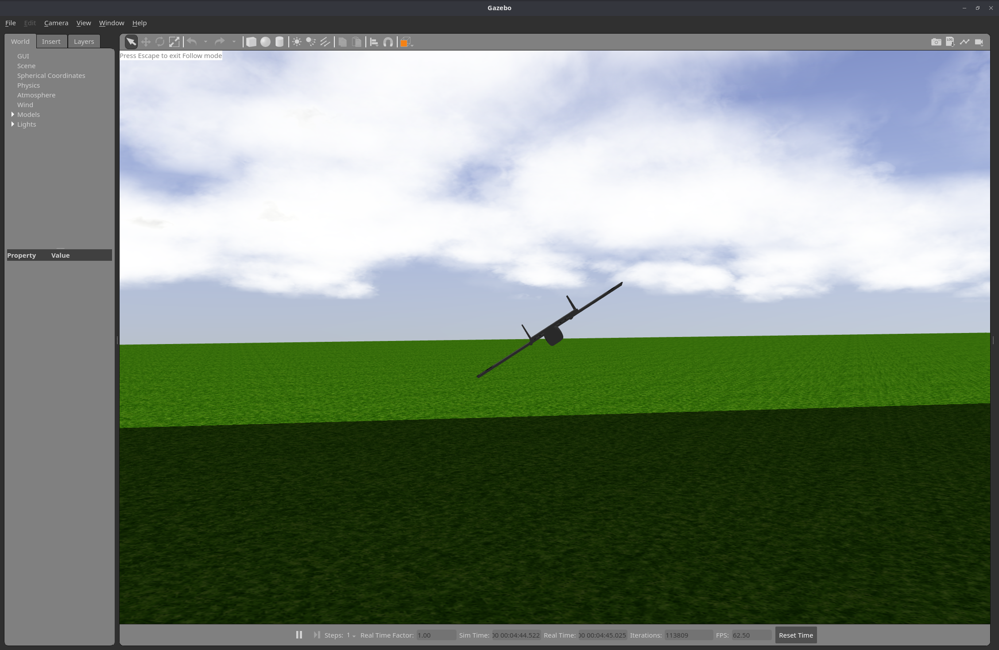
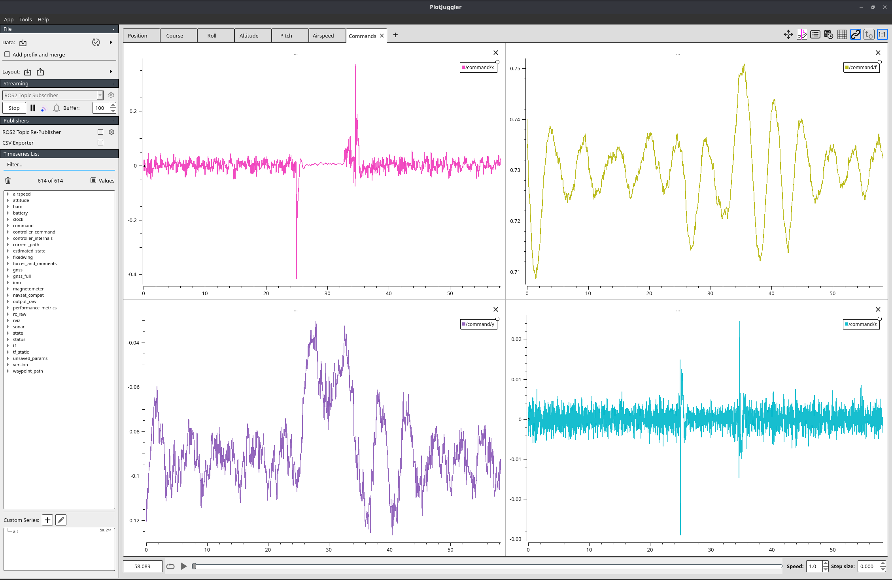
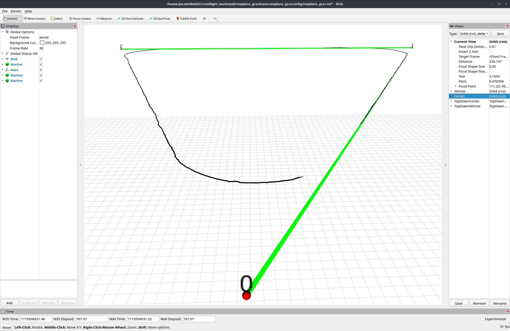

# ROSplane Setup

!!! note
    ROSplane v2.0.0-beta is now available! Check the [github repo](https://github.com/rosflight/rosplane) for the latest code.

ROSplane is a basic fixed-wing autopilot build around ROS2 for use with the ROSflight autopilot.
It is built according to the methods published in *Small Unmanned Aircraft: Theory and Practice* by Dr. Randy Beard and Dr. Tim McLain.

See [ROSplane Overview](index.md) for more general information on ROSplane.

## Requirements

ROSplane requires a working ROS2 installation on a companion computer.
ROSplane will most often be used in conjunction with the ROSflight firmware and the firmware interface (aka `rosflight_ros_pkgs`).

Follow the instructions in [the installation for sim guide](../installation/installation-sim.md) to install and set up ROS2 and `rosflight_ros_pkgs`.

## Installation

You will need to install ROSplane on the companion computer.

First, navigate to the src directory of the ROS2 workspace and clone the git repository:

```bash
cd ~/rosflight_ws/src
git clone https://github.com/rosflight/rosplane.git
```

!!! note
    Your `rosflight_ws` file structure should now look like:
    ```
    rosflight_ws
      └── src 
        ├── rosflight_ros_pkgs
        └── rosplane 
    ```

Then navigate to the top of the `rosflight_ws` directory and build:

```bash
cd ..
colcon build
```

!!! warning
    The build will fail if you have not built the `rosflight_msgs` previously or if you are not currently building it.

Next, source the `rosflight_ws` install files.
If you already added the source command to your `.bashrc` from the [ROS2 Setup](../installation/installation-sim.md) page, then you can skip this step.

```bash
# source the install file
source install/setup.bash

# add it to your .bashrc
echo "source ~/rosflight_ws/install/setup.bash >> $HOME/.bashrc"
```

Note that sourcing the `setup.bash` file in the `rosflight_ws` directory will install all ROS2 packages in any subdirectories.

## Running ROSplane SIL
A controller or a simulated controller can be used to fly the aircraft in simulation.
See the `README.md` file for the `rosflight_ros_pkgs` package for more information on RC control in simulation.



### Launching

#### Recommended Method
A convenience bash script has been included that uses tmux to launch Gazebo, an instance of the ROSflight firmware, and ROSplane.
Note that this requires tmux, so you may need to install it with `sudo apt install tmux`.
Run
```bash
./src/rosplane/rosplane/scripts/rosplane_gcs_launch.sh -s -r -a anaconda -b example_bag ~/rosflight_ws
```
from the `rosflight_ws` directory to run a simulation of ROSplane (`-s`) with a simulated RC transmitter (`-r`) and the Anaconda aerodynamic and control parameters (`-a anaconda`), and also to start recording a ROSbag of all the topics (`-b example_bag`).

See the script or run 
```bash
~/rosflight_ws/src/rosplane/rosplane/scripts/rosplane_gcs.launch.sh -h
```
for more information.

#### Alternative Method
Alternatively, you can run each of the commands in the bash script individually:
```bash
# Terminal 1 - Launches Gazebo and a simulated instance of the firmware
ros2 launch rosflight_sim fixedwing.launch.py

# Terminal 2 - Runs rosflight_io configured for SIL to interface with the firmware
ros2 run rosflight_io rosflight_io --ros-args -p udp:=true

# Terminal 3 - Launches rosplane with the Anaconda aerodynamic coefficients
ros2 launch rosplane_sim sim.launch.py aircraft:=anaconda
```

You can also replace the first two commands above with the convenience launch file that does both:
```bash
ros2 launch rosflight_sim fixedwing_sim_io_joy.launch.py aircraft:=anaconda
```
Remember to launch ROSplane if you use this method.

### Additional Setup
#### Recommended Method
If this is your first time launching ROSplane, make sure to run the convenience launch script to initialize the firmware parameters and calibrate the IMU.
```bash
ros2 launch rosflight_sim fixedwing_init_firmware.launch.py
```

#### Alternative Method
Alternatively, you can run the following commands to initialize firmware parameters and calibrate the IMU.
Firmware parameters should first be loaded using
```bash
ros2 service call /param_load_from_file rosflight_msgs/srv/ParamFile "filename: ~/rosflight_ws/src/rosflight_ros_pkgs/rosflight_sim/params/fixedwing_firmware.yaml"
```

The IMU should then be calibrated to remove the random biases generated at startup.
Note that the random number generator used to create these biases is seeded with a constant value, so this calibration should only need to be performed once.
See the code to change the way these biases are calculated.
```bash
ros2 service call /calibrate_imu std_srvs/srv/Trigger
```

After calibrating, write the parameters to a file using:
```bash
ros2 service call /param_write std_srvs/srv/Trigger
```
This command will create a directory named `rosflight_memory` where the parameters are written.
The ROSflight firmware will automatically check if the `rosflight_memory` directory is present when launched and will use those parameters if available.

!!! note
    The ROSflight firmware will only look for the `rosflight_memory` directory in the directory where the simulation launch command is run.
    You must launch `rosflight_sim` in the same directory to use the saved parameters; otherwise, reload and re-write the parameters.

### Flying in Sim
Once you have the simulation booted up, use channel 4 of a connected transmitter to arm.
If you are using a simulated transmitter, use `ros2 service call /toggle_arm std_srvs/srv/Trigger` to toggle arm/disarm.

After arming, the plane will operate under RC control.
Verify that the commands are working and that the aircraft is responding as expected.

To fly autonomously, use channel 5 to disable RC override.
If using a simulated transmitter, use `ros2 service call /toggle_override std_srvs/srv/Trigger` to toggle RC override on/off.

The plane should then take off or fly autonomously in the simulator!

!!! note
    The ROSflight firmware requires that the vehicle is armed before disabling RC override.
    Make sure that the RC override is toggled off before arming.
    This can be done using the `ros2 service call` above or an RC switch, if you have one set up.

## Running ROSplane on Hardware
Ensure `rosflight_io` is running on the companion computer, and that the flight controller is connects to the companion computer.

Launch ROSplane using
```bash
ros2 launch rosplane rosplane.launch.py
```

Arm the aircraft using channel 4 of the safety RC transmitter.
When ready to let ROSplane take control, use channel 5 of the RC transmitter to disable RC override.

!!! Warning
    Disabling RC override on hardware will turn control over to ROSplane.
    A safety pilot should ***always*** be ready to take control, especially when running untested code.

## Flying Waypoint Missions (in sim and hardware)
Autonomous waypoint missions can easily be flown using ROSplane.
The waypoints of a mission are controlled by the `path_planner` node.
These waypoints are sent to the `path_manager` node.
Low level path-following is done by the `path_follower` node.
See "Small Unmanned Aircraft: Theory and Practice" by Dr. Randy Beard and Dr. Tim McLain for more information on the architecture.
See [Path Planning](../../developer-guide/rosplane/navigation/navigation-overview.md) for more information on how to use and tune the path planner, manager, and follower.

### Adding waypoints

#### Recommended Method
ROSplane initializes with no waypoints added to the `path_planner`.
We recommend using a mission .yaml file (an example mission can be found in `rosplane/missions/fixedwing_mission.yaml`).
Loading the mission can be done using 

```bash
ros2 service call /load_mission_from_file rosflight_msgs/srv/ParamFile "{filename: <FILENAME>}"
```

where `FILENAME` is the absolute path to the mission .yaml file.
Note that the origin (0,0,0) is placed at the GNSS location where ROSplane was initialized.

!!! note
    All waypoints must include a valid `[X, Y, Z]`, `va_d`, and `lla` values.

#### Alternative Method
Alternatively, you can add a waypoint one at a time by calling the appropriate service

```bash
ros2 service call /add_waypoint rosplane_msgs/srv/AddWaypoint "{w: [X, Y, Z], chi_d: CHI_D, lla: USE_LLA, use_chi: USE_CHI, va_d: VA_D}"
```

where `[X, Y, Z]` is the NED position of the waypoint from the origin (in meters) OR the GNSS location of the waypoint (LLA), `CHI_D` is the desired heading at the waypoint, and `VA_D` is the airspeed at the waypoint.
Set the `lla` field to `true` if the waypoint `[X, Y, Z]` field is given in GNSS coordinates and `false` if given in NED coordinates.
Corners in the path are controlled by `USE_CHI`, where a value of `True` will cause ROSplane to use a Dubins path planner and a value of `False` will cause a fillet path planner to be used.
Adding waypoints can be done at any time, even after loading from a file.

Clearing waypoints can be done using 
```bash
ros2 service call /clear_waypoints std_srvs/srv/Trigger
```

### Publishing Waypoints

The `path_planner` node automatically publishes a small number of waypoints (default is 3) at the beginning of this mission.
This number is controlled by the `num_waypoints_to_publish_at_start` ROS2 parameter. 

Additional waypoints can be published using 
```bash
ros2 service call /publish_next_waypoint std_srvs/srv/Trigger
```
## ROSplane GCS / Visualization Tools

Running and tuning an autopilot requires good tools.
These are the tools we use in our workflow to test and debug the performance of our autopilot.
Let us know if you have better tools!

### Plotjuggler
[Plotjuggler](https://github.com/facontidavide/PlotJuggler) is a tool to visualize data.
It is versatile and powerful and can plot many different time series at the same time.
It allows you to directly stream ROS2 topics, making it an ideal plotting utility in the field.
We use Plotjuggler extensively to tune our control and estimation loops, and to monitor the status of the airplane.



While Plotjuggler is not a ROS application, Plotjuggler ROS packages have been created.
See the [Plotjuggler GitHub page](https://github.com/facontidavide/PlotJuggler) for more information or install the ROS2 packages with:
```bash
sudo apt install ros-$ROS_DISTRO-plotjuggler-ros
```

We also use a layout file to automatically open up the plots we are interested in.
Use the `Import Layout` button on the Plotjuggler GUI to import the `plotjuggler_layout.xml` file.

### RViz Waypoint Plotter
Rviz is a ROS2 tool that can visualize 3D information.
We use Rviz to visualize waypoints and the aircraft's performance in achieving those waypoints.



Run the Rviz publisher and Rviz configuration file with
```bash
ros2 launch rosplane_gcs rosplane_gcs.launch.py
```
to launch Rviz and the publisher node.
Note that the waypoint publisher from the `path_planner` node and the subscriber in the publisher node have been set up to work like a "latched publisher/subscriber", so you should see the most recently published 20 waypoints, even if you launched RViz after publishing the waypoints.
