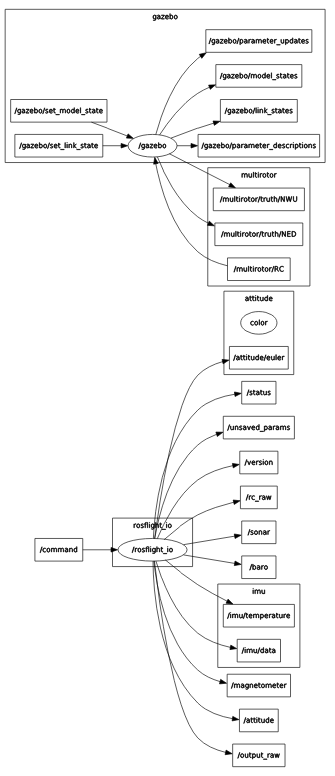

# Running Simulations in Gazebo

ROSflight comes with a useful tool allowing it to perform software-in-the-loop (SIL) simulations of the ROSflight firmware in Gazebo.

## Architecture of the SIL Simulation

To best mimic the hardware experience of ROSflight, the SIL plugin for Gazebo actually implements the firmware source code as a library. We just implemented a different "board layer" which uses gazebo instead of hardware calls for things like `imu_read()` and `pwm_write()`. Instead of a serial link over USB to the flight controller, we use a UDP connection bouncing off of localhost to communicate between `rosflight_io` and the firmware. This means the interface to the SIL plugin is identical to that of hardware. `rosflight_io` is the main gateway to the firmware in simulation, just as it is in hardware.

The following table summarizes the correlation between connections in hardware and simulation:

| Connection Type                         | Hardware     | Simulation                               |
|-----------------------------------------|--------------|------------------------------------------|
| Serial communications to `rosflight_io` | USB / UART   | UDP                                      |
| RC                                      | PPM Receiver | ROS2 `RC` topic (`rosflight_msgs/RCRaw`) |
| Motors                                  | PWM          | Gazebo Plugin                            |
| Sensors                                 | SPI/I2C      | Gazebo Plugin                            |

## Quick-Start Guide to SIL Simulation

!!! note
    To simulate a fixed-wing mav, just change all instances of `multirotor` in the steps below to `fixedwing`.

* Setup ROSflight with the [ROS2 Setup](ros2-setup.md) guide, making sure to install the `-desktop` package of ROS2, not the `-ros-base`.

* Source the Gazebo setup file if you haven't added it to `~/.bashrc`:
```bash
source /usr/share/gazebo/setup.sh
```

* Launch Gazebo with the ROSflight SIL:
```bash 
ros2 launch rosflight_sim multirotor.launch.py
```

* Gazebo should now be running, and you should have the following `rqt_graph`.


* At this point, you can't actually do anything because there is no RC connection and no `rosflight_io` to talk to the firmware. Let's start by running a `rosflight_io` node. In a separate terminal, run:
```bash
ros2 run rosflight_io rosflight_io --ros-args -p udp:=true
```

    * The `udp` parameter tells `rosflight_io` to simulate a serial connection over UDP rather than using the USB connection to hardware

Your `rqt_graph` should look something like the following image. This looks funny because ROS2 doesn't actually know that there is a UDP connection between `rosflight_io` and gazebo. There is one, though, and you can test it by echoing any of the topics published by `rosflight_io`.



* Start up a simulated RC connection. The easiest way to do this is with the ROSflight utility `rc_joy.py`. Connect a joystick to the computer (or transmitter) and run: 
    ```bash
    ros2 run rosflight_utils rc_joy.py --ros-args --remap /RC:=/multirotor/RC
    ```
    This simulates the RC connection in hardware. If everything is mapped correctly, you should now be able to arm, disarm and fly the aircraft in simulation!

!!! tip
    To start the Gazebo sim, rosflight_io node, and rc_joy.py utility all at once, run this command instead of the three commands individually:
    ```bash
    ros2 launch rosflight_utils multirotor_sim_io_joy.launch.py    
    ```

!!! note
    It is much easier to fly with a real transmitter than with an Xbox-type controller. FrSky Taranis QX7 transmitters, Radiomaster TX16s transmitters, and RealFlight controllers are also supported. Non-Xbox joysticks may have incorrect mappings. If your joystick does not work, and you write your own mapping, please contribute back your new joystick mapping!

Remember, the SIL tries its best to replicate hardware. That means you have to calibrate and set parameters in the same way you do in hardware. See the [Hardware Setup](hardware-setup.md) and [Parameter Configuration](parameter-configuration.md) pages in this documentation for instructions on how to perform all preflight configuration before the aircraft will arm. You can also run 
```bash
ros2 launch rosflight_utils multirotor_init_firmware.launch.py
```
to load all required parameters and perform initial calibrations for a quick simulation setup.
