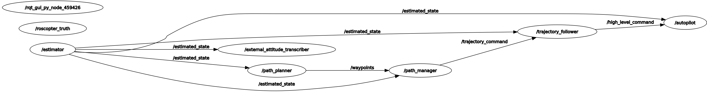
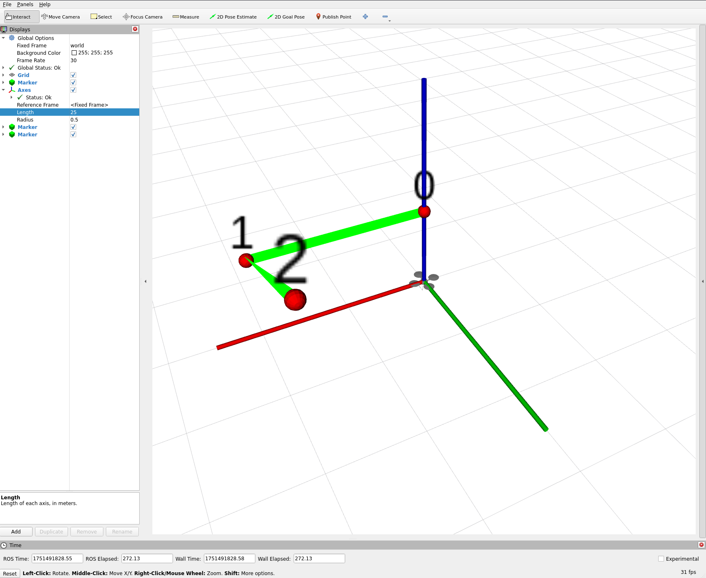

# Setting up ROScopter in Sim

This tutorial guides you through setting up ROScopter, the multirotor autopilot system, in simulation.
ROScopter provides basic autonomous flight capabilities for multirotor vehicles.

This tutorial will walk you through:

- Launching the `roscopter` autonomy stack
- Flying waypoint missions
- Some basic analysis of what is going on

## Prerequisites

- [Manually flying in ROSflight Sim](./manually-flying-rosflight-sim.md) 

## ROScopter Overview

ROScopter is a ROS2-based autopilot system designed for multirotor vehicles.

### Major System Components

- **Estimator**: EKF for state estimation
- **Controller**: Cascading PID controller with multiple control modes
- **Trajectory Follower**: Trajectory tracking between waypoints (like a path follower)
- **Path Manager**: Waypoint following and trajectory management
- **Path Planner**: High-level mission planning and execution

### Control Hierarchy
The ROScopter controller is designed so that uses can interface with it at a variety of levels.
See the `roscopter_msgs/msg/ControllerCommand` message definition for more information.

??? tip
    Use `ros2 interface show roscopter_msgs/msg/ControllerCommand` to see the message definition.

## Launching `standalone_sim`

The standalone simulator provides a lightweight simulation environment using RViz for visualization.
This is the recommended starting point for ROScopter simulation.

Launch the multirotor simulation:

```bash
# Start the standalone simulator with ROSflight firmware simulation
ros2 launch rosflight_sim multirotor_standalone.launch.py use_vimfly:=true
```

The RViz simulation environment should launch.

See the [manually flying guide](./manually-flying-rosflight-sim.md) for instructions on launching, configuring, and arming in sim.

## Launching ROScopter Autonomy Stack

The ROScopter autonomy stack is a collection of ROS2 nodes that provide autonomous flight capabilities on top of the basic simulation.

In a new terminal, run:

```bash
ros2 launch roscopter_sim sim.launch.py
```

This launch file does 2 things:

1. Launches `roscopter` autonomy stack by calling the `roscopter.launch.py` file.
This file launches most of the nodes we'll explore later.
2. Starts the `sim_state_transcriber` node.
This node publishes the truth state from the simulation as a `roscotper/msg/State` message so we can easily compare estimated and true state.

### Understanding the ROScopter Stack

Let's take a look at the nodes that we just ran:

```bash
# Check ROScopter-specific nodes
ros2 node list
```

You should see the following output:
```bash
➜  ~ ros2 node list
/autopilot
/estimator
/external_attitude_transcriber
/path_manager
/path_planner
/roscopter_truth
/trajectory_follower
```

??? info "**Node Descriptions**"
    - **`/autopilot`**: Main controller node that implements cascading PID control loops (position → velocity → attitude → rate) and manages flight modes
    - **`/estimator`**: EKF that fuses IMU, GPS, and barometer data to provide state estimation (position, velocity, attitude)
    - **`/external_attitude_transcriber`**: Converts external attitude references from the estimator to `external_attitude` messages that are sent to the firmware estimator (helps the firmware estimator not drift)
    - **`/path_manager`**: Manages waypoint sequences and generates smooth trajectory segments between waypoints
    - **`/path_planner`**: High-level mission planning node that handles waypoint loading
    - **`/roscopter_truth`**: Simulation truth state publisher that provides ground truth data for comparison with estimated state
    - **`/trajectory_follower`**: Tracks generated trajectory segments and outputs position/velocity commands to the autopilot

Let's now take a look at the topics specific to `roscopter`:
```bash
# Check ROScopter-specific topics
ros2 topic list
```

You should see the following output (note that these are topics from only the `roscopter` launch file):
```bash
➜  ~ ros2 topic list
/baro
/command
/estimated_state
/external_attitude
/gnss
/high_level_command
/imu/data
/magnetometer
/parameter_events
/rosout
/sim/roscopter/state
/sim/truth_state
/sim/wind_truth
/status
/trajectory_command
/waypoints
```

??? info "**Some Key Topic Descriptions**"
    - Messages that the `estimator` subscribes to:
        - **`/baro`**: Barometric pressure sensor data for altitude estimation
        - **`/gnss`**: GPS position and velocity measurements
        - **`/imu/data`**: IMU sensor data (accelerometer, gyroscope measurements)
        - **`/magnetometer`**: Magnetometer readings for heading estimation
    - **`/command`**: Commands sent to ROSflight firmware (see rosflight_msgs/msg/Command for details)
    - **`/estimated_state`**: Complete vehicle state from EKF (position, velocity, attitude, angular rates)
    - **`/external_attitude`**: External attitude reference sent to firmware estimator to prevent drift
    - **`/high_level_command`**: High-level control commands from `trajectory_follower` to `autopilot`
    - **`/sim/roscopter/state`**: ROScopter-formatted state message from simulation truth
    - **`/trajectory_command`**: Trajectory commands from path manager to trajectory follower
    - **`/waypoints`**: Current waypoint list and mission information

When we fly waypoint missions, we will load waypoints to the `path_planner` using a service call.
The chain of information flows from the `path_planner` to the `path_manager`, `trajectory_follower`, `autopilot`, and finally on to the firmware.
You can see this in the `rqt_graph` image (by running `rqt_graph` in a new terminal):



### Launch Ground Control Station

The ground control station will plot waypoints that we pass to ROScopter.
It can be helpful to launch this so we can see if ROScopter is actually doing what we want it to do.

```bash
# In a new terminal (source workspace first)
ros2 launch roscopter_gcs rosplane_gcs.launch.py
```

This will launch another instance of RViz that will display different information than the main simulation pane.

## Loading Missions

ROScopter supports loading waypoint missions through waypoints defined in YAML files or set through ROS services.
These waypoints will be uploaded to the `path_planner` node using the `path_planner`'s ROS2 services.

### Using Waypoint Files

Waypoints can be loaded in batch manner from a file.

Create or modify waypoint files:
```bash
# Edit the default waypoint file
vim /path/to/rosflight_ws/src/roscopter/roscopter/params/multirotor_mission.yaml
```

Example waypoint file structure:
```yaml
# WAYPOINTS
wp:
  type: 1                   # Waypoint type (0=hold, 1=go to)
  w: [0.0, 0.0, -10.0]      # Position [North, East, Down] in meters
  speed: 4.0                # Desired speed (m/s)
  psi: 0.0                  # Desired heading (radians)
  use_lla: false            # Use NED coordinates (not GPS lat/lon/alt)
wp:
  type: 1
  w: [20.0, 0.0, -10.0]
  speed: 4.0
  psi: 0.0
  use_lla: false
wp:
  type: 0                   # "Hold" waypoint
  w: [20.0, -20.0, -20.0]
  speed: 4.0
  psi: 0.0
  use_lla: false
  hold_seconds: 5.0         # Hold for 5 seconds
  hold_indefinitely: false
```

**Waypoint Parameters:**

- **`type`**: Waypoint type (0 = hold, 1 = go to waypoint)
- **`w`**: Position coordinates `[North, East, Down]` (in meters NED frame or LLA)
- **`speed`**: Desired flight speed in m/s
- **`psi`**: Desired heading in radians
- **`use_lla`**: Set to `false` for NED coordinates, `true` for GPS coordinates
- **`hold_seconds`**: Time to hold at waypoint (0.0 = no hold)
- **`hold_indefinitely`**: If `true`, holds at waypoint until manual command

Load waypoints from mission file using the service call:

```bash
# Load waypoints from the default mission file
cd /path/to/rosflight_ws/src/roscopter/roscopter/params
ros2 service call /load_mission_from_file rosflight_msgs/srv/ParamFile \
  "{filename: $(pwd)/multirotor_mission.yaml}"
```

### Setting Waypoints Manually
You can also add waypoints dynamically using the following services:

```bash
# Add a single waypoint (North=5m, East=5m, Down=-4m, Yaw=0rad)
ros2 service call /add_waypoint roscopter_msgs/srv/AddWaypoint \
  "{wp: {w: [5.0, 5.0, -4.0], psi: 0.0}, publish_now: true}"

# Clear all current waypoints
ros2 service call /clear_waypoints std_srvs/srv/Trigger

```

The structure of the `wp` field in the `roscopter_msgs/srv/AddWaypoint` service is the same as described above.
The structure of the service can be seen using:
```bash
ros2 interface show roscopter_msgs/srv/AddWayoint
```
which will output:
```bash
➜  ~ ros2 interface show roscopter_msgs/srv/AddWaypoint
# Add a Waypoint to the waypoint list

roscopter_msgs/Waypoint wp
	uint8 TYPE_HOLD = 0
	uint8 TYPE_GOTO = 1
	std_msgs/Header header
		builtin_interfaces/Time stamp
			int32 sec
			uint32 nanosec
		string frame_id
	uint8 type
	float32[3] w    #
	float32 speed   #
	float32 psi     #
	float32 hold_seconds
	bool hold_indefinitely
	bool use_lla
bool publish_now
---
bool success
string message
```

### Verify Mission Loading

You can check that the waypoints are loaded by looking at the `roscopter_gcs` RViz GUI.
You should see something like:




### Publishing Additional Waypoints

Note that the `path_planner` will publish only the first few waypoints (determined by the `num_waypoints_to_publish_at_start` parameter).
Publish the next one by calling:
```bash
ros2 service call /path_planner/publish_next_waypoint std_srvs/srv/Trigger
```
or by setting the parameter to the desired value:
```bash
ros2 param set /path_planner num_waypoints_to_publish_at_start 100
```

## Enabling Autonomous Flight

After loading missions, enable autonomous flight through `rc`'s services.

### Arm and Start Mission

```bash
# Arm the vehicle (enable motors)
ros2 service call /arm std_srvs/srv/Trigger

# Turn off RC override -- make sure it is toggled off before arming
ros2 service call /toggle_override std_srvs/srv/Trigger
```

### Monitor Flight Progress

Track autonomous flight status:

```bash
# Monitor vehicle state during flight
ros2 topic echo /estimated_state

# Watch controller commands
ros2 topic echo /controller_commands
```

### Tuning Flight Performance

It is possible that the flight performance is unstable due to the `autopilot`'s gains not being set correctly.
See [the tuning guide](./tuning-performance-in-sim.md) for more information.

## Review

You have successfully completed the ROScopter autonomous flight tutorial. You should now be able to:

- **Launch ROScopter Stack**: Start the complete autonomy stack with estimator, controller, and path management
- **Load Waypoint Missions**: Create and load waypoint missions from YAML files or via ROS services
- **Execute Autonomous Flight**: Arm the vehicle and fly autonomous waypoint missions
- **Monitor Flight Performance**: Track vehicle state and controller performance during flight
- **Understand System Architecture**: Recognize how nodes communicate and data flows through the system

## Next Steps

Once you have ROScopter running autonomously, you can:

2. **[Fixed-Wing Autonomous Flight](./setting-up-rosplane-in-sim.md)**: Explore ROSplane for fixed-wing autonomous flight
3. **[Parameter/Gain Tuning](./tuning-performance-in-sim.md)**: Use RQT plugins to tune PID controllers and optimize flight performance
4. **[Custom Applications](../../developer-guide/contribution-guidelines.md)**: Develop your own ROS2 nodes that interface with ROScopter

### Additional Resources

- [ROSflight Parameter Reference](../concepts/parameter-configuration.md): Detailed firmware parameter descriptions
- [Hardware Setup Guide](../concepts/hardware-setup.md): Preparing real hardware for flight
- [ROScopter Architecture Documentation](../concepts/roscopter-overview.md): In-depth system design and implementation details

