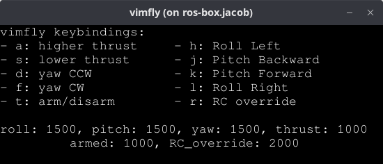

# Setting Up ROSflight Sim

The purpose of this tutorial is to walk users through launching the default ROSflight simulator.

## Prerequisites

* Install the ROSflight software (`rosflight_ros_pkgs`) by following the [Installation for sim](../installation/installation-sim.md) guide.
* Ensure you have the `-desktop` version of ROS2 installed, not the `-ros-base` version, as GUI tools are required for visualization.

## ROSflight Sim Overview

A _simulator_ includes many different modules, such as dynamic propagation, sensor creation, forces and moments computation, etc.
One of these modules is the _visualization_ module, that provides the graphical element to the simulator.

While ROSflight is designed to support different visualizers, we focus on the most basic one in these tutorials, the `standalone_sim`, which uses the [ROS2 RViz](https://docs.ros.org/en/humble/Tutorials/Intermediate/RViz/RViz-Main.html#rviz) tool.

The ROSflight simulator is organized as a collection of ROS2 nodes that each provide different functionality.
As we work through launching the sim, we'll look at some of those modules and discuss what they do.

## Simulation Architecture

The ROSflight standalone simulator consists of several key components:

- **SIL Board**: Instantiates the ROSflight firmware in software
- **Dynamics**: Simulates aircraft physics and dynamics
- **Sensors**: Simulates IMU, barometer, and other sensor data
- **Forces and Moments**: Computes aerodynamic forces based on control inputs
- **RViz**: Provides 3D visualization of the aircraft and flight path

## Launching `standalone_sim`

!!! warning
    Make sure you installed the `-desktop` version of ROS2, not the `-ros-base` version, or the GUI tools will not work.

1. Source your workspace:

    First, ensure your ROS2 environment and ROSflight workspace are properly sourced:

    ```bash
    # Replace <ros-distro> with your ROS 2 distro (e.g. "humble" or "jazzy")
    source /opt/ros/<ros-distro>/setup.bash
    source ~/rosflight_ws/install/setup.bash
    ```

    !!! tip "Shell type"

        Note that these commands will only work if you are using `bash` as your shell.
        If you are using `zsh`, make sure to change the `.bash` part of the above commands to `.zsh`.

        **Using the provided Dockerfile?**
        The Dockerfile provided and referenced in the [Docker installation section](../installation/using-docker-with-rosflight.md) uses `zsh` by default.

        **How do I check which shell I am using?**
        Use `echo $0` to check which shell you are using.

2. Launch the simulator:

    ROSflight provides launch files for different aircraft types. Choose the appropriate command based on your needs:

    #### Multirotor Simulation

    ```bash
    cd ~/rosflight_ws
    ros2 launch rosflight_sim multirotor_standalone.launch.py
    ```

    #### Fixed-Wing Simulation

    ```bash
    cd ~/rosflight_ws
    ros2 launch rosflight_sim fixedwing_standalone.launch.py
    ```

    #### With Keyboard Control (VimFly)

    For manual control using keyboard input, add the `use_vimfly:=true` parameter:

    ```bash
    # Multirotor with keyboard control
    cd ~/rosflight_ws
    ros2 launch rosflight_sim multirotor_standalone.launch.py use_vimfly:=true

    # Fixed-wing with keyboard control
    cd ~/rosflight_ws
    ros2 launch rosflight_sim fixedwing_standalone.launch.py use_vimfly:=true
    ```

    You'll notice that we `cd` into the `rosflight_ws` before launching the sim.
    This is important to deal with [parameter management that will be covered in the next tutorial](./manually-flying-rosflight-sim.md#saving-parameters-to-memory).

## Understanding the Simulation Environment

Let's look at what just happened when we launched.

### RViz Visualization

Once launched, RViz will open displaying:

- **3D Aircraft Model**: Visual representation of your aircraft
- **Coordinate Frames**: Shows the aircraft's orientation and position
- **Flight Path**: Trace of the aircraft's trajectory (though you might not be able to see this until you start flying)


If you used the launch command `use_vimfly:=true`, you should also see VimFly open up:



### Running Nodes

You can verify the simulation is running by checking the active nodes:

```bash
ros2 node list
```

You should see the following output:

```bash
/rc
/rosflight_sil_manager
/sil_board
/standalone_dynamics
/standalone_sensors
/standalone_viz_transcriber
/static_transform_publisher_P4JOkDXVuy18dk2Z
/static_transform_publisher_rJQeNeGn8gEepYGd
/vimfly
```
Note that the `static_transform_publisher` nodes will have different hashes than what is shown above.

Each of these nodes performs a different role in the sim.
Detailed information about these nodes and what they do can be found in the [simulation architecture description](../concepts/simulator-architecture.md).

You can also see a representation of the data flow by running `rqt_graph` in a new terminal.
If you don't see a similar view to what is below, click the refresh icon in the upper left.

|  |
|-----|
|RQT Graph is great, but it is not very configurable in terms of viewing options (sorry for the small image).|

The main data flow through the simulator starts with the `/sil_board`.
The `/sil_board` is the instantiation of the `rosflight_firmware` in sim--in hardware, this would be the flight controller.

The `/sil_board` listens to the `/standalone_sensors` to "read" data from the "sensors", as close as possible to how the hardware board would read the sensor data.

The `/sil_board` then computes motor commands and sends them over the `/sim/pwm_output` topic to the `fixedwing_forces_and_moments` node.
This node is responsible for computing the aerodynamic forces and moments (not gravity or collisions) given the motor commands.

The `/forces_and_moments` node then sends the computed forces and moments to the `/dynamics node`, which handles integration of the dynamics (i.e. solves $\dot{x} = f(x)$) and publishes the true state.
The `/dynamics` node handles gravity and other collision forces.

This concludes a simulation "tick", and the simulation starts again with the `/sil_board`.

For more information, see the [detailed simulation architecture description](../concepts/simulator-architecture.md).

### Topics

View the available topics to see the data flow:

```bash
# List the topics
ros2 topic list

# Echo data sent through topics
ros2 topic echo <topic_name>
```

Key topics include:

- `/rc_raw` - RC commands
- `/imu/data` - IMU sensor data
- `/attitude` - Aircraft attitude estimated by the firmware's estimator
- `/command` - Control command inputs to the firmware controller (or mixer)

## Troubleshooting

### Common Issues

??? warning "RViz Not Opening"
    - Ensure you installed `ros-<ros-distro>-desktop`, not `ros-<ros-distro>-ros-base`, where `<ros-distro>` is the ROS 2 distro you installed
    - Check that you have a display environment (not running in headless mode)

??? warning "Simulation Crashes"
    - Check parameter files for syntax errors
    - Verify all dependencies are installed: `rosdep install --from-path . -y --ignore-src`
    - Read the error messages on the launch script :)

## Review

In this tutorial, you learned how to:

- Launch the ROSflight standalone simulator for multirotor and fixed-wing aircraft
- Discover some of the simulation architecture and key components
- Troubleshoot common issues

## Next Steps

Once you have the simulator running, you can:

1. **[Firmware configuration and manual flight](./manually-flying-rosflight-sim.md)**: Configure the firmware with the necessary parameters and fly in sim with a supported controller
2. **[Autonomous flight](./setting-up-roscopter-in-sim.md)**: Integrate with the ROScopter or ROSplane autonomy stacks
3. **[Custom applications](../../developer-guide/contribution-guidelines.md)**: Use your own ROS2 nodes with ROSflight
4. **[Parameter/Gain tuning](./tuning-performance-in-sim.md)**: Use the RQT plugins to tune PID controllers and other parameters


