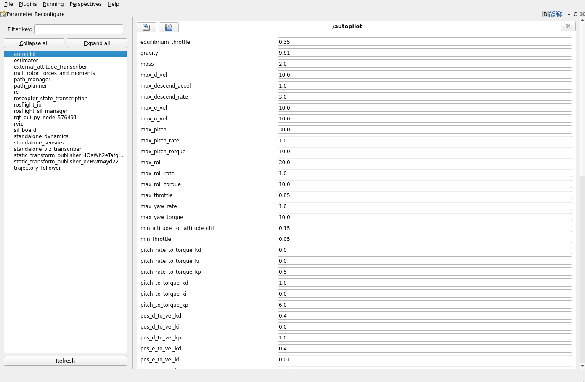

# Tuning Performance in Sim

This tutorial guides you through systematically tuning control gains for optimal flight performance in simulation.
You'll learn to use PlotJuggler, RQT dynamic reconfigure, and the signal generator to tune both firmware and high-level control loops.

!!! note
    We will be tuning the firmware and ROScopter as an example as we work through this tutorial.
    Tuning ROSplane is an identical process, just with different gains and different control loops.

This tutorial will walk you through:

- Setting up tuning tools (PlotJuggler, RQT, Signal Generator)
- Understanding the control hierarchy and what to tune
- Tuning firmware controller gains (angle control loops)
- Tuning some ROScopter gains
- Analyzing performance with data visualization

!!! note
    This guide is mainly meant to 

    - **Introduce the tools** that we use when flying with ROSflight, and
    - Help you get a feel for an **autonomy stack architecture**

    See the [improving firmware performance](../concepts/improving-firmware-performance.md) guide for more information on tuning the firmware controller and firmware estimator.

## Prerequisites

- [Setting up ROScopter in Sim](./setting-up-roscopter-in-sim.md)
- Basic understanding of PID control theory. We won't cover the PID tuning methodology.
- Some familiarity with ROScopter system architecture

## Overview

### Controller Hierarchy

ROScopter implements a hierarchical control structure with multiple nested control loops.
These control loops ultimately feed into the firmware's control loops.

This image shows a flow diagram for how information moves through the ROScopter controller to the firmware controller and then to the physical aircraft.


!!! note
    This diagram only shows the `controller` and `sil_board` nodes.
    It does not include the `trajectory_follower` node.
    We're focusing on the `controller` and `sil_board` controllers for now, but we will end up needing to tune all of the nodes to get the best performance possible.

    For more information on these nodes, see the [previous](./setting-up-roscopter-in-sim.md) guides.


Each box or "command type" in the "ROScopter Controller" and "Firmware" sections is a level where a user can insert and publish commands.
The commands then flow down through the chain from wherever the user inserted.

!!! example "Example: ROScopter controller information flow"
    For example, if I want to send north, east, and down (NED) velocity and yaw rate commands to ROScopter, I would publish commands at the `NED-Vel YawRate` level, as described in the `roscopter_msgs/msg/ControllerCommands` message type.

    The controller would then convert those to NED acceleration/Yaw rate commands, which then are sent to the roll, pitch, yawrate, throttle controller, and then to the firmware angle controller.
    The commands are then finally sent through the mixer to the motors.

### What We're Tuning

Each of the command types in the above diagram are implemented as PID control loops (with the exception of the NED-Accel command type).
Thus, to tune the controller, we'll need to tune each PID gain.

This turns out to be a lot of gains!
We are going to start by tuning the lowest levels first and gradually working our way up.
We won't do all of the loops, but we will do enough to show you how we typically do it.

We will also introduce several tools that help us keep track of all the gains.

We will tune the following loops:

1. The **firmware roll angle loops**, to introduce the firmware parameters exposed through ROSflightIO
1. ROScopter's **roll/pitch/yaw/throttle** loop so you have some hands-on experience with ROScopter's params.


## Setting Up Tuning Environment

### Launch Simulation and ROScopter

First, set up the complete simulation environment:

```bash
# Terminal 1: Launch multirotor simulation
ros2 launch rosflight_sim multirotor_standalone.launch.py use_vimfly:=true

# Terminal 2: Initialize firmware (if needed)
ros2 launch rosflight_sim multirotor_init_firmware.launch.py

# Terminal 3: Run ROScopter controller
cd /path/to/rosflight_ws/src/roscopter/roscopter/params
ros2 launch roscopter controller --ros-args --params-file $(pwd)/multirotor.yaml

# Terminal 4: Run the sim state transcriber node
ros2 run roscopter_sim sim_state_transcriber

# Terminal 5: Run the estimator
ros2 run roscopter estimator
```

Note that we are not launching the whole ROScopter autonomy stack here.
Instead, we are just launching the controller and the node that transcribes the true state (in the rosflight_msgs/msg/State format) to the roscopter_msgs/msg/State format.
We also need the estimator node.
We don't launch the whole autonomy stack since we will be using the signal generator to replace the upper levels of the autonomy stack.

### Install and Launch PlotJuggler

PlotJuggler provides real-time data visualization for analyzing control performance.
We'll use it to plot data live as we send control commands to the vehicle.

<video autoplay loop muted playsinline>
  <source src="../../images/plotjuggler.webm" type="video/webm">
  Video of PlotJuggler in sim.
</video>

Launching PlotJuggler:
```bash
# Install PlotJuggler if not already installed
sudo apt install ros-humble-plotjuggler-ros

# Launch PlotJuggler
ros2 run plotjuggler plotjuggler
```

**PlotJuggler Setup:**

1. Click "Start" → Select "ROS2 Topic Subscriber"
2. Subscribe to key topics:
   - `/imu/data` - IMU measurements
   - `/estimated_state` - State estimation
   - `/controller_commands` - High-level commands
   - `/command` - Low-level motor commands
1. Show them on the plot by clicking and dragging the data streams to the plot window.

Plotjuggler is a powerful tool.
We won't cover all the functionality here.
We'll leave it to you to plot the topics you need as we go through this tutorial.

### Launch RQT Dynamic Reconfigure

RQT is a plugin-based GUI tool distributed with ROS2 (the desktop version).
The dynamic reconfigure plugin offered by RQT allows real-time parameter adjustment.



Each of the values shown in the image above are parameters (ROS2 parameters) of the `controller` node.
ROS2 parameters make it easy to change those parameters on the fly.
See [the official documentation on parameters](https://docs.ros.org/en/humble/Tutorials/Beginner-CLI-Tools/Understanding-ROS2-Parameters/Understanding-ROS2-Parameters.html) for more information.

We have implemented all of the controller gains as ROS2 parameters.
This makes it easy to use RQT Dynamic Reconfigure to adjust and tune the controller.

Launch with:
```bash
# Launch RQT with dynamic reconfigure plugin
rqt --standalone rqt_reconfigure
```

### Launch Signal Generator

The signal generator provides systematic test inputs like square waves, step inputs, etc. to an output of choice.

```bash
ros2 run roscopter_tuning signal_generator
```

## Firmware Controller Tuning

In this section, we'll focus on tuning the **firmware roll angle loops** to introduce you to the firmware parameters exposed through ROSflightIO.

!!! tip "Firmware controller architecture"
    In the ROSflight firmware, the angle and rate loops **are not** chained, meaning that the angle loop does not feed into the rate loop.
    This means that we can tune them independently.
    We'll focus on the roll angle loop.

### Step 1: Set Initial Gains

The firmware's control loop gains for the roll angle controller are something like:
```yaml
# Roll angle controller gains
PID_ROLL_ANG_P: 0.9
PID_ROLL_ANG_I: 0.0
PID_ROLL_ANG_D: 0.2
```

These gains (with values similar to these) are already set, so you don't technically need to set them.

These get loaded at launch time to the firmware from the `/path/to/rosflight_ws/src/rosflight_ros_pkgs/rosflight_sim/params/multirotor_firmware/multirotor_commbined.yaml` file.
You can change them in the launch file and relaunch, but that is a pain.
We'll use RQT and the ROS2 parameter system to dynamically reconfigure those parameters.

To do this,

1. Navigate to RQT dynamic reconfigure plugin.
1. Select the `rosflight_io` node on the left hand side.

You should see the gains show up on the right as shown below.
These are the firmware gains that we have exposed to `rosflight_io`.
This means that when we change the `rosflight_io` ROS2 parameters (which have the same name as the firmware parameters), the `rosflight_io` node will essentially call the `param_set` service as described in the [parameter configuration guide](../concepts/parameter-configuration.md).


### Step 2: Generate Test Signals for Roll

Use the signal generator to create square wave responses specifically for roll.
We'll do this first by setting some of the parameters via RQT dynamic reconfigure plugin.

1. Select the `signal_generator` node in RQT.
1. Change the `signal_type` parameter to "square". Note that you can see the available options by hovering your cursor over the parameter name.
1. Set the `signal_magnitude` to be 0.5 (radians).
1. Set the `frequency_hz` to be 0.1 (Hz).
1. Set the `controller_mode` to be 6 (corresponds to Roll/Pitch/Yawrate/Throttle -- See the roscopter_msgs/msg/ControllerCommands message definition).
1. Set the `default_cmd4` to be 0.7 (percentage throttle -- interpreted according to the `controller_mode` param).
1. Make sure `controller_output` is 1 so that the signal generator changes output on cmd1.

Start the signal generator with:
```bash
ros2 service call /signal_generator/start_continuous_signal std_srvs/srv/Trigger
```

And pause it (when needed) with:
```bash
ros2 service call /signal_generator/pause_signal std_srvs/srv/Trigger
```

The signal generator should now be publishing commands.
Note that the signal generator actually publishes commands to ROScopter's `controller` node, which then forwards those commands to the firmware, as seen in the [overview figure](./tuning-performance-in-sim.md#controller-hierarchy).

### Step 3: Set up topics in PlotJuggler
Let's look at those commands in PlotJuggler.

1. Open PlotJuggler, and look at the "Streaming" pane on the left side.
1. Select "ROS2 Topic Subscriber" and click "Start".
1. Select the relevant topics and hit "Ok" to start streaming.
    - `high_level_command`
    - `sim/truth_state`
    - `sim/roscopter/state`
1. Click the `high_level_command` and drag the `cmd1` to the right.
1. Click the `sim`>`roscopter`>`state` and drag the `phi` field to the same plot.

You should see something like:


### Step 4: Fly the multirotor

As described in [the multirotor tutorial](./setting-up-roscopter-in-sim.md), arm the aircraft and toggle RC override off.
After doing this, the multirotor should take off by itself.

!!! note

    The ROScopter controller (`controller` node) has a state machine built in that manages takeoff.
    If the performance of the controller does not allow the takeoff sequence to be successful, you will need to manually fly it through the take off sequence.

    This is done by flying it directly up to the value of the `takeoff_d_pos` param on the `controller` node and holding it there until the `controller` node outputs "OFFBOARD CONTROLLER ACTIVE" to the terminal.

After the multirotor finishes the takeoff sequence, it should start listening to the signal generator's commands.

You should see something like:


This response is not very tight, so let's tune it.

### Step 5: Tune Roll Angle Controller

1. Open RQT and adjust the `PID_ROLL_ANG_P` and `PID_ROLL_ANG_D` commands as you like to improve the response.
1. Watch PlotJuggler output to observe the effect of changing those gains.

Here's an example of a somewhat-tuned response:


Note that I also added the estimated state to the plot as well.
The orange line is the firmware's estimated roll angle, and it tracks the command decently.
However, it has a noticeable difference between truth.
This means we should either [tune the firmware response](../concepts/improving-firmware-performance.md), or publish ROScopter's estimated state to the `external_attitude` topic.

!!! tip "External Attitude"

    We can improve the firmware's estimate by publishing ROScopter's `estimator`'s estimated state to the firmware.
    To do this, run
    ```bash
    ros2 run roscopter ext_att_transcriber
    ```
    in a new terminal.

    **This only will help if the `estimator` node is producing good outputs!**

Note that this response is not perfect--I could probably tune it more to get better response.
For reference, I changed the `PID_ROLL_ANG_P` equal to 4.0 and the `PID_ROLL_ANG_D` to 1.7 in RQT dynamic reconfigure.

## ROScopter Yaw Controller Tuning

We will tune the **roll/pitch/yaw/throttle** controller from the [overview diagram](./tuning-performance-in-sim.md#controller-hierarchy).
As seen in the figure, the roll/pitch/yaw/throttle controller feeds into the roll/pitch/yawrate/throttle controller.
Thus, the only gains we will need to tune are the ones associated with the **yaw** to **yawrate** controller.

The gains associated with the yaw to yawrate PID controller are `yaw_to_rate_kp`, `yaw_to_rate_ki`, and `yaw_to_rate_kd`.

!!! note "ROScopter Controller Passthrough Loops"

This is detailed in the roscopter_msgs/msg/ControllerCommands message definition.
    Even though the roll/pitch/yawrate/throttle loop is shown in ROScopter, it is one of the loops that is a "passthrough" loop, meaning that it forwards the commands to the firmware controller.

This process will be very similar to the [firmware controller tuning process](./manually-flying-rosflight-sim.md).
Differences in the process are noted below.

### Step 1: Set Initial Gains
Same as step 1 above, but this time, select the `controller` node in the RQT dynamic reconfigure plugin.

### Step 2: Generate Test Signals for Yaw

1. Select the `signal_generator` node in RQT.
1. Change the `signal_type` parameter to "square". Note that you can see the available options by hovering your cursor over the parameter name.
1. Set the `signal_magnitude` to be 1.0 (radians).
1. Set the `frequency_hz` to be 0.1 (Hz).
1. Set the `controller_mode` to be 5 (corresponds to Roll/Pitch/Yaw/Throttle -- See the roscopter_msgs/msg/ControllerCommands message definition).
1. Set the `default_cmd4` to be 0.7 (percentage throttle -- interpreted according to the `controller_mode` param).
1. Make sure `controller_output` is 3 so that the signal generator changes output on cmd1.

Start the signal generator as normal.

### Step 3: Set up topics in PlotJuggler

Same as above, but drag the `high_level_command/cmd3` (corresponding to yaw command) and the `sim/roscopter/state/psi` to the same plot.

### Step 4: Fly the multirotor

Same as step 4 above.

### Step 5: Tune yaw angle control

Same as step 5 above.
The gains to tune are:

- `yaw_to_rate_kp`
- `yaw_to_rate_ki`
- `yaw_to_rate_kd`

You now should have a tuned yaw to yawrate controller!

!!! tip "Extending to other control loops"

    The process for tuning the other ROScopter control loops is the same.
    First, select the loop and look at the initial gains.
    Set up the signal generator, take off, observe the response, and tune using the RQT dynamic reconfigure plugin.

!!! note
    There are no control gains for the NED-Accel/YawRate control loop.

## Using Signal Generator

The signal generator provides other useful features that we haven't yet looked at.

### Available Signal Types

```bash
# Step response - toggle on and off, not based on frequency
ros2 service call /signal_generator/toggle_step_signal std_srvs/srv/Trigger

# Pause continuous signal
ros2 service call /signal_generator/pause_signal std_srvs/srv/Trigger

# Reset continuous signal
ros2 service call /signal_generator/reset_signal std_srvs/srv/Trigger

# Single period of a continuous signal
ros2 service call /signal_generator/start_single_period_signal std_srvs/srv/Trigger
```

## Saving Tuned Parameters

### Firmware Parameters

After tuning firmware parameters, you should write the parameters to memory (so you don't have to repeat).

```bash
# Save parameters to firmware memory
ros2 service call /param_write std_srvs/srv/Trigger
```

### ROScopter Parameters

After tuning ROScopter parameters, save the changes to a YAML file.
There is a `ros2 param dump <node_name> >> <file_name>.txt` command, to dump the parameters of a node to a file, but it does not format them nicely.
The alternative is to manually enter them in the YAML file.

```bash
# Edit parameter file with final tuned values
vim /path/to/rosflight_ws/src/roscopter/roscopter/params/multirotor.yaml
```

## ROSplane Tuning

Tuning ROSplane follows a similar process with different control loops and gains.
The same tools (PlotJuggler, RQT, Signal Generator) and methodology apply to ROSplane controller tuning.

## Review

You have successfully learned to tune the firmware and ROScopter control performance.
You should now be able to:

- **Set up tuning environment**: Launch PlotJuggler, RQT, and Signal Generator
- **Tune systematically**: Follow inner-to-outer loop tuning methodology
- **Use analysis tools**: Interpret PlotJuggler data and adjust parameters accordingly

## Next Steps

1. See the [developer guide](../../developer-guide/contribution-guidelines.md) for more information on implementing your own code in ROSflight.

### Additional Resources

- [Parameter Reference](../concepts/parameter-configuration.md): Complete parameter documentation
- [Hardware Tuning Guide](../concepts/improving-firmware-performance.md): Considerations for real hardware
