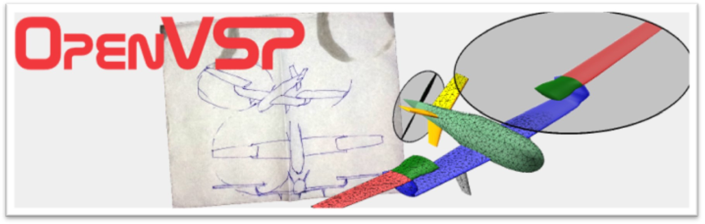

OpenVSP is a free, open-source aerodynamic modeling and analysis software tool based upon NASA aerodynamics tools. This tool is especially useful for modeling and analyzing full aircraft (including fuselage, propellers, landing gear, etc). These capabilites provide better drag estimates than many other tools such as Xflr5. OpenVSP also allows you to import background images to help with modeling your aircraft dimensions accurately and outputs a comprehensive stability coefficients file that are very helpful when analyzing aircraft. Besides these specific distinguishing factors, much of the functionality is similar to what is found in other software tools. There are many advanced modeling and analysis capabilities as well, such as structural analysis and wave drag estimates from supersonic flows. These will not be covered in this manual, but links to a series of useful resources at the end of this page may be helpful. 

Using OpenVSP, you can expect to relatively quickly produce a parametrized model of your entire aircraft that can be analyzed in a variety of flight configurations. 

The following quick-links will walk you through basic navigation of the software, step-by-step aircraft modeling and analysis instructions, a list of common errors, and a list of useful resources for users wishing to go more in depth. 

**Quick Navigation:**

* [Navigation](#navigation)
    * [File Tab](#file-tab)
    * [Edit Tab](#edit-tab)
    * [Window Tab](#window-tab)
    * [View Tab](#view-tab)
    * [Model Tab](#model-tab)
    * [Analysis Tab](#analysis-tab)
* [Making a Model](#making-a-model)
    * [Wings](#wings)
    * [Fuselage](#fuselage)
    * [Using Reference Background Images](#using-reference-background-images)
* [Aircraft Analysis](#aircraft-analysis)
    * [Basic Analysis](#basic-analysis)
    * [VSPAERO Stability Analysis](#vspaero-stability-analysis)
    * [Parasitic Drag](#parasitic-drag)
    * [Mass Properties](#mass-properties)
* [Common Errors](#common-errors)
    * [Meshing Problems](#meshing-problems)
* [References List and Helpful Links](#references-list-and-helpful-links)

### Navigation

When OpenVSP first opens on your computer, you will see an empty screen with a menu up top. The following slides will go through important menu options.

#### File Tab

The "File" tab contains navigation options to save, export, and open projects. In the "Open VSP file" box, navigate to the file you want to open and click "Accept."

#### Edit Tab

The "Edit" tab provides useful tools for setting parameter values during model creation and analysis. The most useful option in the "Edit" tab is the "Undo Parameter Change". Use this to return to previous parameter values during aircraft design and analysis.

#### Window Tab

The "Window" tab allows you to customize the viewing windows. The "Background" tool is especially useful when creating aircraft models. Import a picture or drawing of an aircraft to help with dimensioning or relative positioning. The "Background" button allows you to import images into the background to aid in aircraft dimensioning and accurate modeling.

#### View Tab

The "View" tab allows you to easily change the orientation of your model in the viewer.

#### Model Tab

The "Model" tab contains useful tools for creating a model. Click on the "Geometry" button to open the geometry browser. Select the "Geometry" button to open the Geometry browser. This is where every component of your model will be created and stored. The Geometry Browser contains a variety of useful modeling tools. These will be discussed in more detail in the modeling section.

#### Analysis Tab

In the "Analysis" tab you can find several helpful analysis tools for performing mass properties, drag, aerodynamic, and stability analyses. Use "Mass Prop" to find CG and moment of inertia calculations. Use VSPAERO for all aerodynamic and stability analyses. Use Parasite Drag for the most accurate drag estimates of your model.

### Making a Model

#### Wings

In the "Model" tab, select the "Geometry" tool to open the model geometry browser.  

 Select the geometry creation tool by clicking the drop down menu at the top of the window. After selecting your geometry item, click "add".  

 After adding a geometry item, the geometry editor tool will open and allow you to customize the geometry.  

 The general tab allows you to name your items, customize material and color properties, and assign them to specific geometry subsets.  

  

 Use the Xform tab to define the position, orientation, and other general characteristics of the wing.  

 Define the Mass and physical properties of the item in the "Mass" tab.  

 In the "Sub" tab, define subsections of the wing, such as control surfaces.  

 After creating a control surface, a "sub surface parameters" section will appear. Use these tools to define the control surface position, size, functionality etc.  

 In the "Plan" tab, define planform dimensions and other orientation details.  

 For each section of the wing, define the size dimensions.  

 Import airfoils and define airfoils for each wing section in the airfoil tab.  

 The Blending and Modify tabs have tools to blend airfoils together and edit the edge characteristics. These are more technical options that are outside of the scope of this manual.

#### Fuselage

Select the geometry creation tool by clicking the drop-down menu at the top of the window. After selecting the "fuselage" geometry item, click "add".  

 The "Xform", "Mass", and "Sub" tabs are very similar to those for wings. Use these tabs to define the position, orientation, mass, and substructures of the fuselage.  

 Go through these tabs to define the position, orientation, mass, and substructures of the fuselage.  

 In the "Design" tab, define the main characteristics of your fuselage.  

 Define the length of your fuselage and other characteristics of the shape.  

 In the "Xsec" tab, you can customize the position, orientation, and shape of each section of the fuselage.  

 In the "Skinning" tab, you can adjust the shape and curves of the outer surfaces on the fuselage.  

 The "Modify" tab allows you to further edit the sections of the fuselage by adding "chevron" shapes (used to define more complex shape contours).  

#### Using Reference Background Images

When modeling an aircraft, OpenVSP allows you to add a reference background image to help with modeling your aircraft correctly.  

 > Window > Background  

 In the "Background" pop-up window, make sure the image box is checked. Then, click on the three dots next to the "File" box to select the image you want to import.  

 Select the image you want to import and click the "Accept" button.  

 After your background image is imported, align your model with it to create accurate dimensions for your model.  

 Multiple images can be imported to aid in building your model from all angles. For instance, import top, side, and front view images to make sure your model is accurate from all perspectives.

### Aircraft Analysis

#### Basic Analysis

To run a basic aerodynamic analysis:  

 > Analysis (menu) > Aero > VSPAERO  

  

 A basic aerodynamic analysis computes the aircraft's aerodynamic state at a variety of positions and angles of attack. This is very useful for understanding the basic characteristics (lift, drag, static margin) of the aircraft. It does not involve any control surfaces and thus does not compute stability and control derivatives.  

 Click on the "Advanced" tab at the top and define the analysis settings.  

 In the "Overview" tab, define the rest of the analysis settings, then click "Launch Solver" at the bottom.  

 When the analysis is finished, a results manager tab will open. On the "Load Dist." tab, you can see charts portraying a variety of aerodynamic coefficients across the span of the wing.  

 The "Convergence" tab shows the precision of the coefficient calculations.  

 The "Sweep" tab allows you to compare relationships between aerodynamic coefficients.  

 After an analysis is completed, OpenVSP will produce several files with information with the analysis outputs. These files will appear in the same folder that you saved your original project in. The most useful file produced from the Basic Analysis is the "Polar" file that contains each coefficient calculated at each point of the analysis sweep.  

 After opening the polar file, you will see a list of all the analysis iterations (each point along the defined sweep) and the corresponding aerodynamic coefficient outputs.  

 In my analysis, I defined the sweep from 0-5 deg angle of attack. A useful analysis could be looking at the change in lift coefficient with alpha.

#### VSPAERO Stability Analysis

A stability analysis allows you to calculate the stability and control derivatives of your aircraft.  

 > Analysis > Aero > VSPAERO  

 In the "Overview" tab, set up the main settings of the analysis.  

  

 You should actuate only one group of control surfaces per stability analysis. For this reason, you will most likely need to run several stability analyses.  

  

 Example: have one stability analysis with ailerons activated to get the aileron control derivatives, and another analysis to get the elevator control derivatives.  

 In the Advanced tab, make sure the run mode is set to "Steady" and the advanced flow conditions are appropriate for your flight situation. (default units are in SI)  

 In the "Control Grouping" tab, select specific control surfaces to assign to control groups for the analysis.  

 After defining all of the analysis settings, return to the "Overview" tab and click the "Launch Solver" button at the bottom of the window.  

 When the analysis is finished, a results manager tab will open. On the "Load Dist." tab, you can see charts portraying a variety of aerodynamic coefficients across the span of the wing.  

 The "Convergence" tab shows the precision of the coefficient calculations.  

 The "Sweep" tab allows you to compare relationships between aerodynamic coefficients.  

 After an analysis is completed, OpenVSP will produce several files containing the analysis outputs. These files will appear in the same folder that you saved your original project in. The most useful files produced from the stability analysis are the (.stab) file and the (.flt) file.  

 The .stab file contains all of the main aircraft dimensions and the dimensional and non-dimensional stability derivatives of the aircraft.  

 The .flt file contains the stability derivatives arranged in a more explicitly defined list. The values are the same as the .stab file; however, the CD\_o value is different. This seems to be the more accurate drag value, and may include other sources of drag not accounted for in the .stab file.  

*** IMPORTANT NOTE ***  In the ROSplane parameters, C_D_p is "parasitic drag", NOT drag from roll rate. Make sure to take this into account when building your model and inputting values into your .yaml file. 

#### Parasitic Drag

Parasitic drag can be analyzed using the drag analysis tool in the Analysis tab. This tool allows you to estimate the drag produced by the aircraft's components.  

 > Analysis > Aero > Parasite Drag  

 
 Make sure the analysis settings are accurate, then calculate the drag.  

#### Mass Properties

The mass properties tool provides information about the mass distribution and center of gravity of your model.  

 > Analysis > Mass Prop.  

 Click the "Compute" button and the mass and inertia values should appear in the boxes below.  

 After performing a mass properties analysis, the slidesd model of the geometry will appear on the model viewer.  

  

 To go back to viewing the original model, select "MeshGeom" in the geometry list and then click either "NoShow" or "Delete".  

  

 Then drag select all of the geometry parts of your aircraft and click "Show".  

### Common Errors

#### Meshing Problems

If you encounter meshing problems, use the mesh diagnostics tool to identify and resolve issues with the mesh.  

  

 OpenVSP uses a panel and vortex lattice method to calculate the aerodynamic forces, moments, and coefficients. If there are any problems with the meshing of your model, these calculations may result in extreme values.  

  

 Any mesh problems can be identified by asymptotic behavior on the plots.  

### References List and Helpful Links

* [OpenVSP Documentation](https://vspu.larc.nasa.gov/training-content/chapter-5-advanced-openvsp-techniques/)
* [Google groups](https://groups.google.com/g/openvsp/c/Pb93zCFufJA/m/mRHC0fD7CQAJ)
* [Example Videos](https://www.bing.com/videos/riverview/relatedvideo?q=using+openvsp+to+find+stability+derivatives&mid=797311886965F9F42A1A797311886965F9F42A1A&FORM=VIRE)
* [Example Research Papers (Barrella)](http://wpage.unina.it/danilo.ciliberti/doc/Barrella.pdf)
* [Example Research Papers (Vincenti)](http://wpage.unina.it/danilo.ciliberti/doc/Vincenti.pdf)
* [Example Research Papers (VT)](https://vtechworks.lib.vt.edu/server/api/core/bitstreams/db1aa291-5e0f-446a-bf5a-6d5e570a2719/content)

